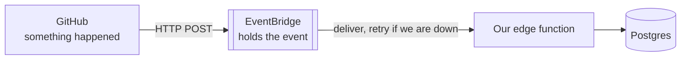
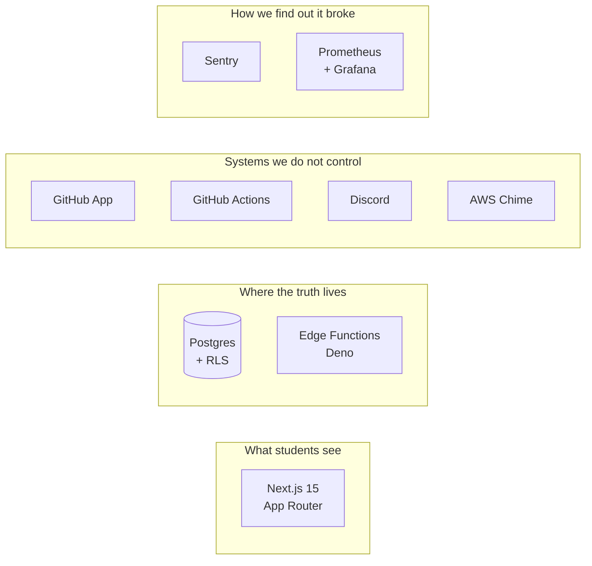
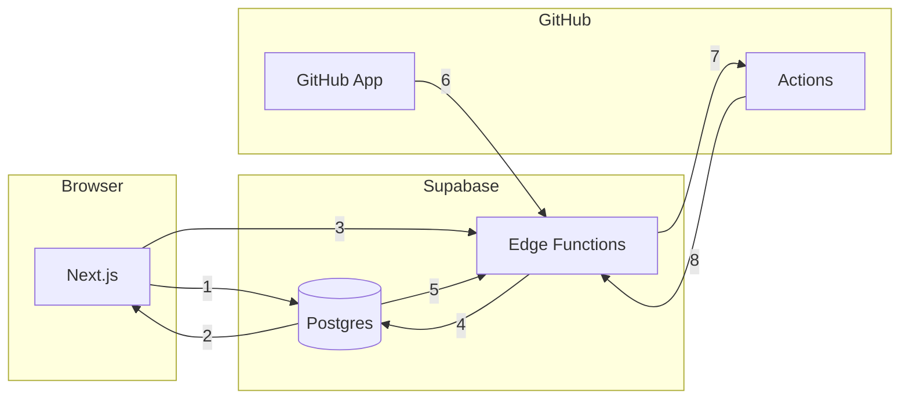
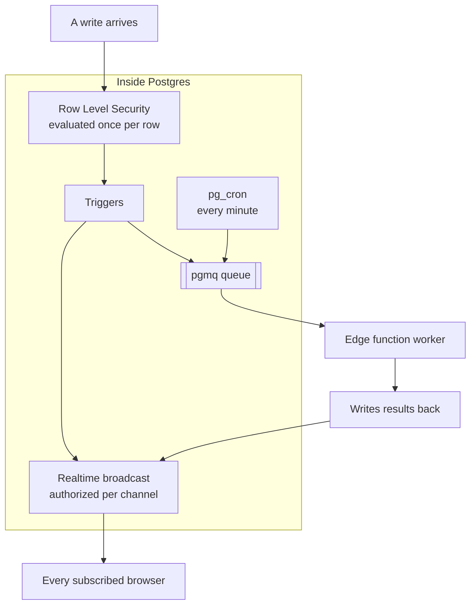
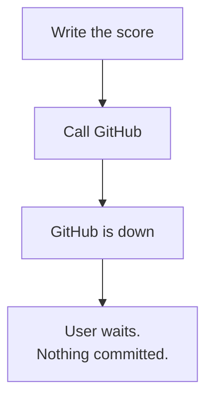
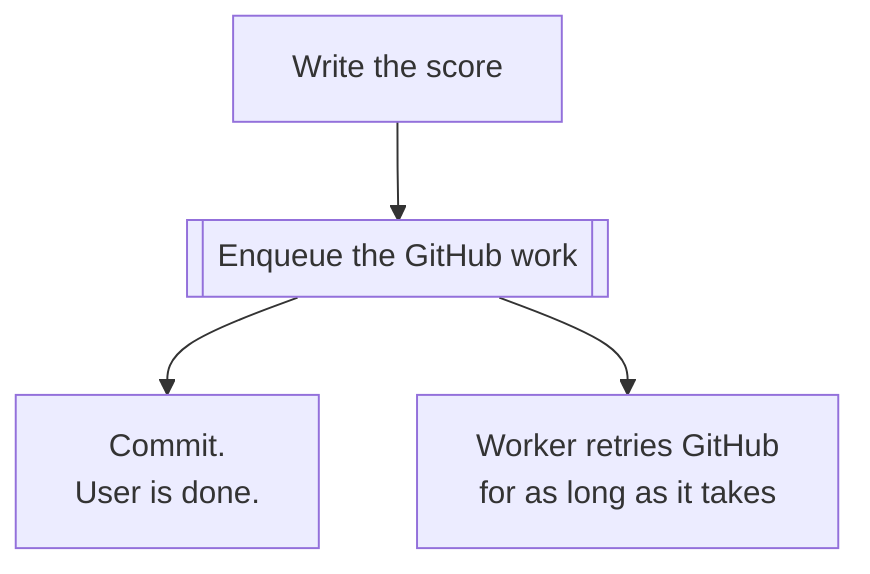
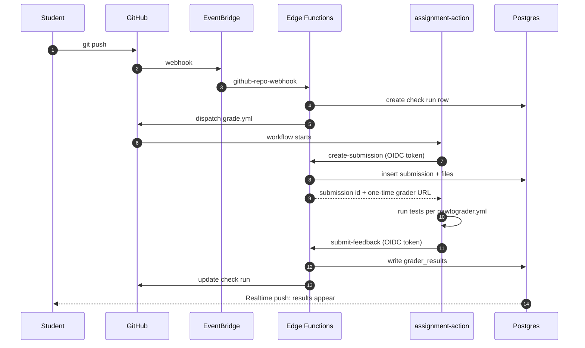
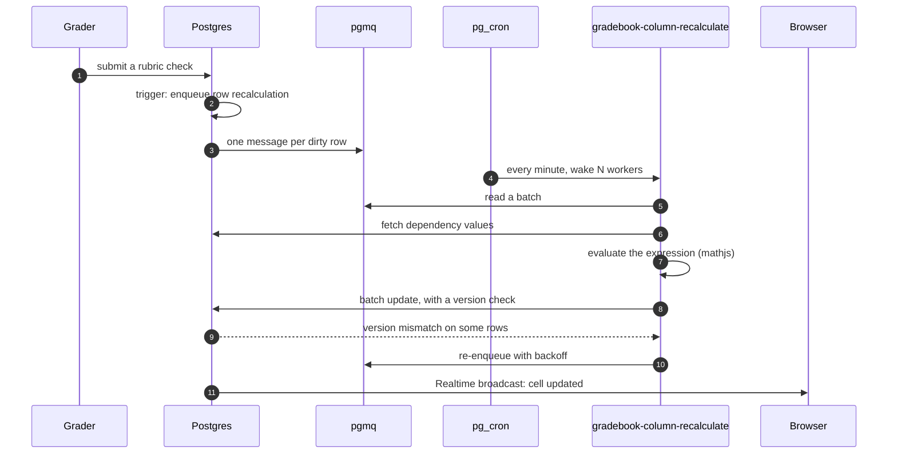

import RevealJS, { Slide } from '@site/src/components/RevealJS';
import Img from '@site/src/components/Img';

<RevealJS transition="slide">

{/* ============================================ */}
{/* COVER IMAGE */}
{/* ============================================ */}

<Slide>

  

<aside className="notes">
**Session:** Wed Sep 9 · Course Intro + Pawtograder Architecture I · 65 min

**Structure (The deal → The product → The vocabulary → The stack → The debt → Your slate):**
- Arc 1: The Deal (~8 min) — what this course is, how it's graded, the weekly rhythm, the AI posture
- Arc 2: The Product and Its Users (~7 min) — what Pawtograder does, who depends on it, how big it is
- Arc 3: The Vocabulary (~8 min) — the six infrastructure building blocks, then a real slide each on "what is a database" and "why is there an EventBridge". Lifted from CS 3100 `l21-serverless`
- Arc 4: The Stack (~24 min) — the thesis, then diagrams as evidence: inventory, communication, inside Postgres, then autograding and gradebook recalculation as sequences. Closes on the roadmap slide, which tells anyone feeling behind that every box has a date
- Arc 5: Where Complexity and Debt Live (~5 min) — one map slide, and the debt talked over it rather than listed on it
- Arc 6: The Project Slate (~9 min) — projects pinned to areas of the system
- Arc 7: Before Thursday (~3 min) — the one thing they must do tonight
- Takeaways (~2 min)

**Narrative spine:** You're joining a product that predates you, that real people use this semester, and that ships its first official release in January 2027. Today is the map: what it does, how it's built, where it hurts, and which part of it you might own.

**The architectural thesis is the spine of Arc 4**, and it's stated on a slide before any diagram appears:
1. **The database is the application** — the logic lives in the database, and the database enforces security on the data.
2. **We want the application to be sequentially consistent** — one coherent order of events; what you just did is what you see.
3. **Consistency is hard when you have to wait** — so everything crossing the boundary gets a queue, in both directions. We never block on GitHub (outbound), and GitHub never blocks on us: a durable event bus buffers inbound webhooks indefinitely, and a real status page tells humans what happened.

Every diagram in Arc 4 is evidence for one of those three. Say so, and say it again in the takeaways. Students who leave with those three sentences can predict most of the codebase; students who leave with a component list can't.

**Timing risk:** this now adds to about 69 minutes for a 65-minute room, deliberately — Arc 3's length depends entirely on who is sitting in front of you, and you won't know until you ask.

**Arc 3 is the variable.** If most of the room took CS 3100 with you, they have seen the building-blocks grid and the arc takes four minutes. If you have co-op returners and transfers, it takes twelve and is worth every one of them. Ask first (see the TODO on that slide).

**Arc 4 now runs 10 slides and it is over-provisioned on purpose. The designated overflow is one slide:**
- **"Sequence: How a Gradebook Cell Gets Its Value"** — the richest slide in the deck and the easiest to promise for later. Skip it and say one sentence instead.

**"How They Talk" is no longer the cut candidate** — it was rebuilt with numbered arrows and a legend, and now runs about four minutes instead of eight. Keep it.

**Never cut the two claim-3 slides** (outbound and inbound). They're the part of the thesis a student can't reconstruct by reading the repo.

**Cut order beyond that**, in this sequence: shorten the debt talk over the complexity map to two bullets, then drop the "Data Access: Prefer RPCs" slide. **Protect Arc 6** — bids are due 9/17 and this is the only session that explains the areas of the system.

**Two things must not be cut, whatever the clock says:**
- **Arc 3, the vocabulary.** A student who doesn't know what a database is gets nothing from five architecture diagrams. It's load-bearing for the map.
- **The roadmap slide that closes Arc 4.** It costs 90 seconds and it's what stops a first-generation-to-this-material student from concluding the course isn't for them.

**The anti-intimidation thread runs through the whole deck**, deliberately, in four places: the fragment on the learning-objectives slide ("describe" and "map" are the verbs), the small right-aligned `full session: <date>` pointers under the technical slides, the roadmap table at the end of Arc 4, and the "nobody has read all of it" line back in Arc 2. If you only land one, land the roadmap.

**Tone note:** Be honest about the debt. The pitch of this course isn't "come work on our nice codebase," it's "this is what inheriting a real system feels like, and you'll get good at it."

> **Transition:** Reminders first, then what we're doing today.
</aside>

</Slide>

{/* ============================================ */}
{/* REMINDERS */}
{/* ============================================ */}

<Slide>

## Reminders

<div style={{fontSize: '0.8em', textAlign: 'left'}}>

- **RELEASED:** The Ticket Hunt. Due Wed Sep 16
- **RELEASED:** Onboarding: Gradebook Column Groups. Due Thu Sep 24
- **RELEASED:** Project Bids. Due Thu Sep 17

</div>

<aside className="notes">
Keep this to 60 seconds. Deadlines and returning feedback only — questions about a specific assignment go to clinic or Discord.

Day one caveat: nothing is due yet, so this slide is really just "the hunt and the column-groups assignment are both live, start reading code."

> **Transition:** Now, today.
</aside>

</Slide>

{/* ============================================ */}
{/* TITLE */}
{/* ============================================ */}

<Slide>

# CS 4535: Software Design & Delivery

## Course Intro + Pawtograder Architecture I

<p style={{marginTop: '2em', fontSize: '0.8em', color: '#666'}}>
  &copy;2026 Jonathan Bell, CC-BY-SA
</p>

<aside className="notes">
**Framing:** Every other software course you've taken started from an empty directory. This one doesn't. You're walking into a running system with users, history, and consequences.

**TODO:** Introduce yourself and the staff. Say how long Pawtograder has existed and roughly how many students have been graded through it — the number is the credibility hook for the whole semester.

**What this session unblocks:** They can't bid on a project (due 9/17) until they know what the areas of the system are. That's the real job of today.

> **Transition:** Here's what you'll be able to do after today.
</aside>

</Slide>

{/* ============================================ */}
{/* LEARNING OBJECTIVES */}
{/* ============================================ */}

<Slide>

## Learning Objectives

<p style={{fontSize: '0.85em', textAlign: 'left'}}>
After this session, you'll be able to:
</p>

<ol style={{fontSize: '0.75em', textAlign: 'left'}}>
  <li>Describe the major components of the Pawtograder stack and how one request flows through them</li>
  <li>Map the project slate onto areas of the system</li>
  <li>State what you need working before Thursday</li>
</ol>

<div className="fragment" style={{backgroundColor: 'rgba(42,157,143,0.12)', padding: '0.5em', borderRadius: '8px', fontSize: '0.7em', marginTop: '0.8em'}}>

**Notice what is not on that list.** You don't need to understand any of this deeply today — <strong>"describe"</strong> and <strong>"map"</strong> are the verbs. Every box on today's diagrams gets its own session later.

</div>

<aside className="notes">
**Land the fragment before you go any further.** Some of the room has never seen a row-level security policy, an event bus, or a Prometheus scrape, and forty minutes of architecture diagrams is exactly how you lose them quietly.

Say it in your own words, but say all three parts:
- Today is orientation. The verbs are "describe" and "map," not "implement."
- Nobody is expected to follow the details, and nothing today is assessed.
- Every single piece has a session with its name on it — you'll see the schedule near the end.

**Time allocation:**
- Arc 1: The Deal (~8 min)
- Arc 2: The Product and Its Users (~7 min)
- Arc 3: The Vocabulary (~8 min) — prerequisite for objective 1
- Arc 4: The Stack (~24 min) — objective 1
- Arc 5: Where Complexity and Debt Live (~5 min) — objective 1, honestly
- Arc 6: The Project Slate (~9 min) — objective 2
- Arc 7: Before Thursday (~3 min) — objective 3

Only three objectives today, on purpose. Day one is oriented toward one deliverable and one deadline.

> **Transition:** Let's start with the deal.
</aside>

</Slide>

{/* ============================================ */}
{/* SPINE STATEMENT                              */}
{/* ============================================ */}

<Slide>

## The Question This Course Answers

<p style={{fontSize: '1.05em', marginTop: '1em'}}>
When you join a company, you inherit a product that predates you. Lots of features. Lots of code. Lots of technical debt.
</p>

<p className="fragment" style={{fontSize: '0.95em', marginTop: '1em'}}>
Some teams sink under that weight. The best teams leave the codebase better than they found it — and ship.
</p>

<p className="fragment" style={{fontSize: '0.95em', marginTop: '1em', fontWeight: 'bold', color: '#2a9d8f'}}>
That difference is a skill. This semester you practice it on a product with real users and a real release date.
</p>

<aside className="notes">
**This is the central claim of the course.** Everything else — the tech talks, the game days, the demo days — is in service of it.

**The constraint that makes it real:** Pawtograder's first official release is January 2027. That's not a course-imposed deadline; it's the actual product deadline, and it will shape what you're allowed to ship in December.

**Say the uncomfortable part:** Real students are using this system this semester. A bad merge isn't a lost grade, it's somebody's office hours queue going down during finals week.

> **Transition:** So here is the deal for the semester.
</aside>

</Slide>

{/* ============================================ */}
{/* ARC 1: THE DEAL (~8 min)                     */}
{/* What the course is and how it's graded      */}
{/* ============================================ */}

<Slide>

## The Deal

<div style={{display: 'grid', gridTemplateColumns: '1fr 1fr', gap: '1em', fontSize: '0.72em', marginTop: '0.5em'}}>

<div style={{backgroundColor: 'rgba(42,157,143,0.12)', padding: '0.6em', borderRadius: '8px'}}>

**What you get**

- A production codebase with real users
- Latitude to choose where you focus
- A GitHub history that's evidence, not homework
- Any AI tooling you want

</div>

<div style={{backgroundColor: 'rgba(231,111,81,0.15)', padding: '0.6em', borderRadius: '8px'}}>

**What you owe**

- Work that ships, behind a flag if it's not done
- Reviews that make someone else's code better
- Showing up — this is a studio, not a lecture
- Ownership when what you shipped breaks

</div>

</div>

<p className="fragment" style={{fontSize: '0.85em', marginTop: '0.8em', fontWeight: 'bold', color: '#2a9d8f'}}>
I define the minimum for an A. You decide the minimum for your goals.
</p>

<aside className="notes">
That last line is the philosophy of the course and it will be tested in week 3 when someone asks "is this enough?" The answer is: enough for what you said you wanted.

**TODO:** Decide whether to say out loud here that the course is 4 credits and what that implies about weekly hours. Students will do the arithmetic anyway.

> **Transition:** And there's room here for more than one kind of engineer.
</aside>

</Slide>

<Slide>

## A Wide Range of Backgrounds Welcome

<p style={{fontSize: '0.82em'}}>
Real products need more than people who write features.
</p>

<div style={{fontSize: '0.75em', textAlign: 'left'}}>

They need people who talk to users, design interfaces, write documentation, set up monitoring, optimize queries, wrangle CI, and figure out why the thing that worked yesterday doesn't.

</div>

<div className="fragment" style={{backgroundColor: 'rgba(100,150,255,0.12)', padding: '0.6em', borderRadius: '8px', fontSize: '0.72em', marginTop: '0.8em'}}>

The student who runs usability studies, synthesizes findings, and ships the resulting redesign is doing real engineering. So is the one who profiles the gradebook and rewrites the query layer. **The difference is where you focus, not whether your work counts.**

</div>

<aside className="notes">
**Why this slide exists on day one:** Self-selection. Some students who would thrive here will drop after seeing "Supabase" and "RLS" on the syllabus because they assume it's a backend course.

**TODO:** A concrete example from a past student would land better than the abstraction. Do you have one from CS 4530 or from Pawtograder contributors?

> **Transition:** Here's how that gets graded.
</aside>

</Slide>

<Slide>

## Grading: Four Bands, No Points

<table style={{fontSize: '0.6em'}}>
<thead>
<tr><th>Band</th><th>Means</th><th>Letter</th></tr>
</thead>
<tbody>
<tr><td><strong>Pass</strong></td><td>Trusted to contribute under review</td><td>B</td></tr>
<tr><td><strong>Credit</strong></td><td>Trusted to exercise judgment, not just execute</td><td>A&minus;</td></tr>
<tr><td><strong>Distinction</strong></td><td>Trusted to own what ships (four of five)</td><td><strong>A</strong></td></tr>
<tr><td><strong>High Distinction</strong></td><td>Trusted to extend the system</td><td>A, and a letter with something in it</td></tr>
</tbody>
</table>

<p style={{fontSize: '0.7em', marginTop: '0.5em', textAlign: 'left'}}>
Each band is a published list of things you've demonstrably done. Every band requires the one below it. You declare which you're working toward on <strong>Oct 1</strong>, and you can change it either way until Dec 3.
</p>

<p className="fragment" style={{fontSize: '0.78em', marginTop: '0.6em', fontWeight: 'bold', color: '#e76f51'}}>
There's no way to reach an A while being weak at one of the eight outcomes.
</p>

<aside className="notes">
**Lead with what is gone.** No points, no weighted average, no category you can be weak in and average your way past. Students have never seen this and won't believe it until you say it twice.

**Say where Pass sits, because it is the thing they will misread.** Completing Pass means you shipped to production, reviewed six PRs, wrote three postmortems, taught a reading, and cut a vertical slice in onboarding. That is a B: it is the work the course asked for and you did all of it. Credit and Distinction are what you add on top. Nobody gets a C for doing the whole course.

**Land the fragment.** Pass is the comprehensive band: it requires all eight learning outcomes at minimum standard, and Credit, Distinction and High Distinction each require everything below. So there's no route to an A that skips operations, or code review, or talking to a user. A thousand points couldn't do that, because points average.

**The question you will get:** "so what do I actually have to do?" Answer: read the band lists in the syllabus, they're published and they're the whole contract. Don't recite them here.

**The second question you will get** is whether High Distinction is worth chasing when Distinction already earns an A. Say the honest thing: everyone who asks gets a reference letter, and always has. What High Distinction changes is what the letter can truthfully say.

**Cite the source if anyone asks** whether this is invented: task-oriented portfolio assessment, Cain, Grundy and Woodward, European Journal of Engineering Education 43(4), 2018. It's not a local experiment.

> **Transition:** The calendar has two very different halves.
</aside>

</Slide>

<Slide>

## What That Means In Practice

<div style={{fontSize: '0.72em', textAlign: 'left'}}>

Almost nothing here is a submission. You're graded from the things professional work produces anyway: pull requests, review threads, commit history, design notes, postmortems, dashboards.

</div>

<div className="fragment" style={{backgroundColor: 'rgba(42,157,143,0.12)', padding: '0.6em', borderRadius: '8px', fontSize: '0.72em', marginTop: '0.8em'}}>

In December you write a **Learning Summary Report**: the band you're claiming, and a link to the artifact that satisfies each requirement. I verify the claim rather than re-grading the work, because the work was already reviewed when it happened.

</div>

<p className="fragment" style={{fontSize: '0.72em', marginTop: '0.7em'}}>
Which makes the report quick to write if you did the work, and unwritable if you didn't.
</p>

<aside className="notes">
**This is the slide that answers "how do I know where I stand."** Three checkpoints, Oct 14, Nov 5 and Dec 3. At each one you get a written per-student judgment: on track for your declared band, yes or no, and why. Promise them bluntness now so it's not a shock in November.

**Say why the checkpoints are blunt.** A lenient midpoint isn't kindness. It moves the bad news to a week when nobody can act on it.

**Attendance is the one thing that is not a band requirement.** It's a gate: it earns nothing on its own and it caps your letter regardless of which band you complete. Point at the table in the syllabus and move on.

> **Transition:** The calendar has two very different halves.
</aside>

</Slide>

<Slide>

## Two Phases, Two Rhythms

<div style={{display: 'grid', gridTemplateColumns: '1fr 1fr', gap: '1em', fontSize: '0.7em', marginTop: '0.5em'}}>

<div style={{backgroundColor: 'rgba(100,150,255,0.12)', padding: '0.6em', borderRadius: '8px'}}>

**Weeks 1–3: Onboarding**

- Lecture every session
- **The Ticket Hunt:** file two, triage two. Due 9/16
- **Column Groups:** everyone builds the same feature, alone. Due 9/24
- Bids due 9/17 · teams announced 9/24

</div>

<div style={{backgroundColor: 'rgba(42,157,143,0.12)', padding: '0.6em', borderRadius: '8px'}}>

**Weeks 4–14: Studio**

- **Mon:** standup + clinic
- **Wed:** tech talk or student presentations
- **Thu:** team work, game day, or demo day
- Demos every two weeks. Game days unannounced.
- **You will hold two roles:** a project team and a cross-project function

</div>

</div>

<div className="fragment" style={{backgroundColor: 'rgba(255,200,100,0.2)', padding: '0.5em', borderRadius: '8px', fontSize: '0.72em', marginTop: '0.8em', border: '2px solid rgba(255,180,0,0.5)'}}>

**Feature freeze is Mon Nov 23.** Weeks 13–14 are hardening, documentation, and ops playbooks for the January handoff. Nothing new lands after the freeze.

</div>

<aside className="notes">
**Flag the async week now (Oct 2–13):** instructor at OOPSLA/ISSTA. Three async sessions and a two-week sprint they plan on Oct 1. Students who miss this announcement lose two weeks.

**Game days:** say only that they exist and are graded on response, not on being unbroken. Don't explain the mechanics; the surprise is the pedagogy.

**The two-roles bullet needs 30 seconds and no more.** Every student is on a project team and also on one cross-project function (release and CI, accessibility, observability, or docs and handoff), one member per project team. The function is a standing responsibility, not a second project. Detail lands at studio kickoff on Sep 28. Today they only need to know it exists, because it changes how they read the slate. If anyone asks why: it is how TUM runs iPraktikum, it is roughly Team Topologies, and it is how most companies they will join are organized, including the failure modes.

> **Transition:** One more piece of the deal: AI.
</aside>

</Slide>

<Slide>

## Use the AI You Want

<p style={{fontSize: '0.82em'}}>
There's no AI restriction in this course. Use anything.
</p>

<div className="fragment" style={{fontSize: '0.75em', textAlign: 'left', marginTop: '0.7em'}}>

**And you are not on your own with it.** We'll teach it and we'll study it together:

<ul>
  <li>A session on agents and workflows — context, sub-agents, human-as-coordinator</li>
  <li>A standing forum channel for what is working and what isn't</li>
  <li>Clinic time for "my agent produced this, how should I determine if I can trust it?"</li>
</ul>

</div>

<p className="fragment" style={{fontSize: '0.78em', marginTop: '0.7em', fontWeight: 'bold', color: '#2a9d8f'}}>
Nobody has this figured out. The practice changes every week, so sharing what you learn <em>is</em> part of the course.
</p>

<aside className="notes">
**Deliberate contrast with CS 3100**, where AI is restricted in weeks 1–5 because the skill being built is the typing. Here the skill is judgment, integration and accountability — and the agent doesn't change any of those.

**But "use anything" is not a policy, it is an abdication if we stop there.** Three things we actually provide:
- **Instruction:** the async agents talk on Wed 10/7 (s12) — structuring context, decomposing across sub-agents, judging when an agent is the wrong tool.
- **A forum:** a channel for sharing prompts, setups, failures. Treat it as a lab notebook, not a help desk.
- **Clinic:** bring agent output you're unsure about. "Should I trust this?" is a legitimate use of clinic time.

**Say the honest thing:** this is changing faster than any syllabus can track. What worked in September may be wrong by November. That's why the sharing is the curriculum and not a footnote.

**Practical hook, worth 20 seconds:** the repo ships `CLAUDE.md` and `AGENTS.md`. Students who point their agent at those get dramatically better results than students who don't — good context beats good prompting, and it's the first concrete lesson in this course's AI posture.

**Then the accountability line** — don't soften it:

> "The agent wrote it" isn't a defense at a demo day. You shipped it.

**TODO:** Name the actual forum channel here once Discord is set up.

> **Transition:** That's the deal. Now — the product.
</aside>

</Slide>

{/* ============================================ */}
{/* ARC 2: THE PRODUCT AND ITS USERS (~7 min)    */}
{/* ============================================ */}

<Slide>

## What Pawtograder Is


<aside className="notes">
**Do not narrate all eight features.** They have used the product; they know what it does from the outside. The point of this slide is the *breadth* — that this isn't one CRUD app, it's eight products sharing a database, which is exactly why the architecture looks the way it does.

**The bit they do not know:** the three user classes have genuinely different needs and genuinely different blast radii. Breaking a student view annoys 500 people; breaking an instructor grading view stops a course from returning grades.

> **Transition:** Here's the part that matters for how you'll behave this semester.
</aside>

</Slide>

<Slide>

## The Users Are In the Building Right Now

<p style={{fontSize: '0.75em', textAlign: 'left'}}>
Pawtograder is running these courses <strong>this semester</strong>:
</p>

<div style={{fontSize: '0.95em', textAlign: 'center', margin: '0.5em 0', fontWeight: 'bold', letterSpacing: '0.02em', color: '#4A90A4'}}>

CS 2000 · 2100 · 3100 · 3650 · 4530 · 5001 · 5004 · 5008 · 5010

</div>

<div className="fragment" style={{backgroundColor: 'rgba(255,200,100,0.2)', padding: '0.6em', borderRadius: '8px', fontSize: '0.8em', marginTop: '0.4em', border: '2px solid rgba(255,180,0,0.5)', textAlign: 'center'}}>

**…and CS 4535.**

You'll submit this course's work through the system you're about to change. And your projects merge into our class deployment pipeline.

</div>

<div className="fragment" style={{backgroundColor: 'rgba(231,111,81,0.15)', padding: '0.5em', borderRadius: '8px', fontSize: '0.7em', marginTop: '0.5em'}}>

So production holds real student work, real grades, and real FERPA-protected records — including yours. A whole session on that: **Mon 9/14**.

</div>

<aside className="notes">
**Land the list, then pause before the fragment.** Ten courses across the undergraduate core, systems, and the graduate align sequence. Read a few of the numbers out loud and let the room recognize their own transcript in it.

**Then the fragment, which is the actual point of the slide.** They aren't building software for a hypothetical user. They're building it for themselves, their roommates, and the class they're sitting in. A bad Thursday deploy is somebody's 5001 assignment.

**Say the blast radius plainly** — it's the most effective thing on this slide:
- Break a student view and you've annoyed several thousand people across ten courses.
- Break an instructor grading view and a course can't return grades that week.
- Break it in December and you've done it during finals.

**This is also why the ops and review discipline is graded so heavily.** Feature flags, rollback plans and monitoring aren't bureaucracy here; they're the difference between an experiment and an incident.

**The double-edged part, worth 20 seconds** and it sets up two of the projects: being your own user is a gift for empathy and a trap for assumptions. You're a fourth-year CS student with a fast laptop and a mouse. Many users aren't — which is exactly what the usability and accessibility projects exist to find out.

**But say the payoff too**, or this lands as pure threat: this is the rare course where the work doesn't go in a drawer in December. Ship something in October and your friends are using it in October.

**TODO:** Fill in the actual total enrollment across those ten courses. One number — "about N students this term" — does more work than the whole list does. Also sanity-check the list against the fall term before class; the slide is only credible if it's exactly right.

> **Transition:** So how big is the thing you just inherited?
</aside>

</Slide>

<Slide>

## What You Just Inherited

<div style={{display: 'grid', gridTemplateColumns: '1fr 1fr 1fr', gap: '0.8em', fontSize: '0.7em', marginTop: '0.5em'}}>

<div style={{backgroundColor: 'rgba(100,150,255,0.12)', padding: '0.6em', borderRadius: '8px'}}>

**~300k**
lines of TypeScript

**417**
database migrations

**62**
Supabase Edge Functions

</div>

<div style={{backgroundColor: 'rgba(42,157,143,0.12)', padding: '0.6em', borderRadius: '8px'}}>

**129**
page routes

**255**
React components

**46**
Playwright E2E specs

</div>

<div style={{backgroundColor: 'rgba(231,111,81,0.15)', padding: '0.6em', borderRadius: '8px'}}>

**1**
production deployment

**1**
release date that's not negotiable

**0**
people who have read all of it

</div>

</div>

<p className="fragment" style={{fontSize: '0.82em', marginTop: '0.8em', fontWeight: 'bold', color: '#2a9d8f'}}>
Nobody reads it all. You read the part you own, and you learn how to find the rest.
</p>

<aside className="notes">
**This is the most important slide in Arc 2.** The numbers are there to provoke the correct reaction: you can't understand this system by reading it.

**Counts are from the current main** — regenerate before class if it has been a while. The "0 people" line includes me, and saying so out loud is the point.

**The skill this course teaches, stated plainly:** navigating a system larger than your working memory. That's the actual professional skill, and it's why the course isn't "here is a small project, build it."

> **Transition:** Before the map, ninety seconds on what the pieces of a map even are.
</aside>

</Slide>

{/* ============================================ */}
{/* ARC 3: THE VOCABULARY (~8 min)               */}
{/* Lifted from CS 3100 l21-serverless           */}
{/* Skip only if the room is already fluent       */}
{/* ============================================ */}

<Slide>

## Before the Diagrams: The Vocabulary

<p style={{fontSize: '0.78em'}}>
Cloud platforms give you a standard set of parts. Every architecture diagram you'll see this semester is made of these six, and nothing else.
</p>

<div style={{display: 'grid', gridTemplateColumns: 'repeat(3, 1fr)', gap: '0.6em', fontSize: '0.52em', marginTop: '0.7em'}}>

<div style={{padding: '0.5em', border: '2px solid #9370DB', borderRadius: '8px', textAlign: 'center'}}>

**Database**

Structured data you can query

*ours: Postgres*

</div>

<div style={{padding: '0.5em', border: '2px solid #4A90A4', borderRadius: '8px', textAlign: 'center'}}>

**Object storage**

Files too big for a database

*ours: Supabase Storage*

</div>

<div style={{padding: '0.5em', border: '2px solid #FF9800', borderRadius: '8px', textAlign: 'center'}}>

**Queues and event buses**

Work that waits its turn

*ours: pgmq, EventBridge*

</div>

<div style={{padding: '0.5em', border: '2px solid #4CAF50', borderRadius: '8px', textAlign: 'center'}}>

**Cache**

A fast copy of hot data

*ours: Upstash Redis*

</div>

<div style={{padding: '0.5em', border: '2px solid #f44336', borderRadius: '8px', textAlign: 'center'}}>

**API gateway**

One front door, with a lock

*ours: the Supabase gateway*

</div>

<div style={{padding: '0.5em', border: '2px solid #666', borderRadius: '8px', textAlign: 'center'}}>

**Observability**

Logs, metrics, traces

*ours: Sentry, Prometheus*

</div>

</div>

<p className="fragment" style={{fontSize: '0.72em', marginTop: '0.6em', fontStyle: 'italic'}}>
Plus one more: <strong>serverless compute</strong> — code that runs on demand and then disappears. Ours are the edge functions.
</p>

<p style={{fontSize: '0.58em', marginTop: '0.4em', textAlign: 'right', fontStyle: 'italic', color: '#4A90A4'}}>
Every one of these six gets its own session — schedule at the end of today
</p>

<aside className="notes">
**Lifted from CS 3100 `l21-serverless`, "Infrastructure Building Blocks."** If your section took 3100 with you they have seen this grid; say so, and move faster.

**Why this arc exists at all:** the next four slides name Postgres, edge functions, pgmq, EventBridge, Realtime and Prometheus in the space of about a minute. A student who isn't sure what a database *is* stops following at slide one and never says so.

**Do not lecture the grid — name each box in one sentence and move.** Eight minutes for this whole arc.

**The framing that makes it stick:** these are design patterns for infrastructure. You don't build them, you rent them and compose them. The pattern is the same whether the system is a monolith or serverless; what changes is who operates it.

**Two boxes get their own slide** because they're the two students actually stumble on: what a database is, and why there's an event bus in front of our webhooks. The other four are one sentence each.

**TODO:** Ask on day one who has taken 3100 and who is coming from co-op or another program. That answer tells you whether this arc takes 4 minutes or 12.

> **Transition:** Start with the one that everything else leans on.
</aside>

</Slide>

<Slide>

## What a Database Actually Is

<p style={{fontSize: '0.75em'}}>
Somewhere to put data that survives a restart — and, more importantly, somewhere you can <strong>ask questions</strong> of it. The right kind depends entirely on the questions.
</p>

<div style={{display: 'grid', gridTemplateColumns: '1fr 1fr 1fr', gap: '0.7em', fontSize: '0.52em', marginTop: '0.5em'}}>

<div style={{padding: '0.6em', border: '2px solid #9370DB', borderRadius: '8px'}}>

**Relational (SQL)**

Rows, columns, and relationships between tables. Powerful queries, real transactions, rigid schema.

*Postgres, MySQL*

```sql
SELECT s.*, a.title
FROM submissions s
JOIN assignments a
  ON s.assignment_id = a.id
WHERE s.student_id = ?
```

</div>

<div style={{padding: '0.6em', border: '2px solid #4A90A4', borderRadius: '8px'}}>

**Document (NoSQL)**

JSON-shaped blobs. Flexible schema, fast to start, weak at questions that span records.

*MongoDB, Firestore*

```javascript
{
  student: "alice",
  scores: [85, 92, 78]
}
```

</div>

<div style={{padding: '0.6em', border: '2px solid #FF9800', borderRadius: '8px'}}>

**Key-value**

Fetch by key. Blazing fast, no queries at all.

*Redis, DynamoDB*

```
GET user:12345
SET session:abc {...}
```

</div>

</div>

<div className="fragment" style={{display: 'grid', gridTemplateColumns: '1fr 1fr', gap: '0.8em', fontSize: '0.58em', marginTop: '0.5em'}}>

<div style={{padding: '0.5em', border: '2px solid #9370DB', borderRadius: '8px'}}>

**Why Postgres, reason 1: our questions are relational**

"Every submission by this student, across every assignment, with the assignment title."

That's a join, and joins are what SQL is for.

</div>

<div style={{padding: '0.5em', border: '2px solid #e76f51', borderRadius: '8px'}}>

**Reason 2: it can enforce the rules itself**

Postgres has **row-level security** — a policy attached to the table.

"A student sees only their own submissions" becomes a property of the rows, not something every query has to remember.

</div>

</div>

<p className="fragment" style={{fontSize: '0.68em', marginTop: '0.5em', fontWeight: 'bold', color: '#2a9d8f'}}>
Reason 2 is the bigger one, and it shapes almost everything else you'll see today.
</p>

<p style={{fontSize: '0.58em', marginTop: '0.3em', textAlign: 'right', fontStyle: 'italic', color: '#4A90A4'}}>
Full session: <strong>Mon 9/14</strong> — Architecture II: Supabase, RLS &amp; Student-Data Privacy
</p>

<aside className="notes">
**Adapted from CS 3100 `l21-serverless`, "Databases: Structured Data Persistence."**

**Lead with the query, not the technology.** The choice follows from the questions you need to ask. Our questions — submissions by student, averages by section, who hasn't submitted — are all relationships between students, courses, assignments and submissions. A document store makes you fetch everything and filter in application code.

**The tradeoff, said once:** relational gives you powerful queries and transactions at the cost of a rigid schema. Document gives you a flexible schema at the cost of query power. Key-value gives you speed and nothing else.

**Note that we use all three.** Postgres is the database, Redis is a cache, and there's plenty of `jsonb` inside Postgres. "Pick one" isn't the lesson; "pick per job" is.

**Reason 2 is the one to spend time on, and it is the point of putting this slide in the deck at all.**

The usual way to answer "can this person see this row?" is a `WHERE` clause somewhere in application code — which means every query has to remember, every new client has to remember, and one forgotten check is a data leak. Row-level security inverts that: the policy lives on the table, so the database answers the question whether or not the caller thought to ask it.

**Make it concrete without teaching it yet:** the same `SELECT` runs by a student and by an instructor and comes back with different rows. Nothing in the application changed.

**Say plainly that this is why we picked Postgres**, not just that Postgres happens to have it. Given the data we hold — real grades for ten courses — we wanted authorization to be a property of the data rather than a convention in the code. That's a design decision with a cost, and they'll meet the cost on Monday: the check runs *once per row*, so a policy that calls a function is a performance cliff.

**This is deliberate foreshadowing of claim 1 of the architectural thesis**, two arcs from now ("the database is the application, and it enforces security on the data"). Plant it here and the thesis slide lands as a confirmation rather than a surprise. Don't explain RLS mechanics yet — that's Monday's whole session.

> **Transition:** Second one. Something has to happen when GitHub wants to tell us something.
</aside>

</Slide>

<Slide>

## Webhooks, Queues, and Why There Is an EventBridge

<div style={{fontSize: '0.53em', marginTop: '0.3em'}}>



</div>

<div style={{display: 'grid', gridTemplateColumns: '1fr 1fr', gap: '0.8em', fontSize: '0.55em', marginTop: '0.5em'}}>

<div style={{padding: '0.5em', border: '2px solid #4A90A4', borderRadius: '8px'}}>

**A webhook** is just an HTTP POST that someone else sends *you*, when something happens on their side. No magic. GitHub calls us; we didn't ask.

</div>

<div style={{padding: '0.5em', border: '2px solid #FF9800', borderRadius: '8px'}}>

**A queue or event bus** sits in the middle and holds the message. The sender is done once it's accepted; delivery is somebody else's problem.

</div>

</div>

<p className="fragment" style={{fontSize: '0.68em', marginTop: '0.5em', color: '#e76f51'}}>
So: if we're deploying when a student pushes, a raw webhook is lost forever. GitHub gives up quickly. <strong>EventBridge keeps trying long after GitHub would have stopped and we pay for the privilege.</strong>
</p>

<p style={{fontSize: '0.58em', marginTop: '0.4em', textAlign: 'right', fontStyle: 'italic', color: '#4A90A4'}}>
Comes back on <strong>Thu 9/24</strong> (Monitoring) and <strong>Thu 10/22</strong> (Game Day 1)
</p>

<aside className="notes">
**Adapted from CS 3100 `l21-serverless`, "Message Queues: Asynchronous Communication."** The queue idea is the same; the specific instance is ours.

**Define the word before using it.** "Webhook" is spoken twenty times this semester and never defined. It's an inbound HTTP POST you didn't initiate. That's the whole concept.

**Then the actual reason we have an event bus**, which is the answer to "why not just let GitHub call us directly?":
- GitHub retries a failed webhook for a limited window, then drops it.
- A deploy, a bad migration, or a cold start can easily outlast that window.
- A dropped push means a submission that was never graded, and no error anywhere — nobody is watching GitHub's delivery log.
- EventBridge decouples GitHub's delivery from our availability, and its redelivery window is much longer.

**Worth stating:** our `github-repo-webhook` function only accepts the EventBridge envelope, not a raw GitHub POST. That surprises people who try to curl it.

**The general principle, which is the transferable bit:** a queue converts "you must be up right now" into "you must be up eventually." That's the same retry-and-backoff idea, but bought rather than built — and you'll meet it again inside Postgres, where pgmq does exactly this for gradebook recalculation.

**Plant the flag here:** this is claim 3 of the architectural thesis, two slides away. Say "hold that thought" rather than explaining it now.

**Callback:** ask them to remember this slide on Game Day 1, where the failure is precisely an event that never arrived and produced no error.

> **Transition:** That's the vocabulary. Now the actual map.
</aside>

</Slide>

{/* ============================================ */}
{/* ARC 4: THE STACK (~24 min)                   */}
{/* Objective 1 — the thesis, then evidence      */}
{/* ============================================ */}

<Slide>

## Pawtograder Has One Architectural Thesis

<div style={{fontSize: '0.72em', textAlign: 'left', marginTop: '0.5em'}}>

<div style={{padding: '0.6em', borderLeft: '4px solid #9370DB', backgroundColor: 'rgba(147,112,219,0.1)', borderRadius: '4px', marginBottom: '0.5em'}}>

**1. The database is the application.**
The logic lives in the database, and the database enforces security on the data.

</div>

<div className="fragment" style={{padding: '0.6em', borderLeft: '4px solid #4A90A4', backgroundColor: 'rgba(74,144,164,0.1)', borderRadius: '4px', marginBottom: '0.5em'}}>

**2. We want the application to be sequentially consistent.**
One coherent order of events. What you just did is what you see.

</div>

<div className="fragment" style={{padding: '0.6em', borderLeft: '4px solid #FF9800', backgroundColor: 'rgba(255,152,0,0.12)', borderRadius: '4px'}}>

**3. Consistency is hard when you have to wait.**
So everything crossing the boundary gets a queue, in both directions. The outside world is allowed to be on fire — and so are we.

</div>

</div>

<p className="fragment" style={{fontSize: '0.75em', marginTop: '0.6em', fontWeight: 'bold', color: '#2a9d8f'}}>
Every diagram for the rest of today is one of these three claims.
</p>

<aside className="notes">
**Give them the thesis before the diagrams, not after.** Five architecture diagrams with no thesis is trivia. The same five diagrams as evidence for three claims is an argument they can actually hold on to — and can disagree with, which is better.

**Claim 1 is a real position, not a description.** Most teams put logic in the application tier and treat the database as storage. We did the opposite, deliberately. Say that it's a choice, that it has costs, and that they'll feel both this semester:
- **Upside:** authorization can't be forgotten, because it's not in the code path — it's in the rows. Business rules can't be bypassed by a second client.
- **Cost:** the logic is in SQL, in 417 migrations, and it's harder to read, test and refactor than TypeScript. You can't understand a feature by reading only the TypeScript.

**Claim 2 is what users actually demand**, even though they would never use the phrase. A grader saves a rubric check and expects the total to be right. An instructor releases grades and expects every student to see the same thing.

**Claim 3 is the interesting one**, and it's the one that explains the shape of the whole system — every queue, every worker, every retry. It gets two slides, because it runs in both directions: we never block on GitHub, and GitHub never blocks on us.

**How to use this slide later:** when a student asks "why is this an edge function and not a server action," or "why is there a queue here," point back at this slide. Nearly every "why is it like this?" resolves to one of the three.

> **Transition:** Claim one. And it's stranger than it sounds.
</aside>

</Slide>

<Slide>

## The Stack: Everything In Play

<div style={{fontSize: '0.6em'}}>



</div>

<aside className="notes">
**Level 0: the inventory. No arrows yet, on purpose.**

**They now have the vocabulary from Arc 3, so this slide is just naming our specific instances of it.** Don't re-explain the categories — point at each box and say which building block it is:
- **Next.js** — the whole frontend, one app, App Router
- **Postgres** — the database, but also more than that (two slides from now)
- **Edge Functions** — the serverless compute. Deno, and only for talking to the outside world
- **GitHub App + Actions** — repos, and the machine that actually runs autograding
- **Discord** — help-request and regrade notifications
- **Chime** — video in the office hours queue
- **Sentry + Prometheus/Grafana** — the observability box, answering "what threw?" and "what is trending?"

**The grouping is the argument.** Column 3 is the stuff that can break without us doing anything, and column 4 is the only reason we would notice. That framing pays off at s07 and on every game day.

**Three minutes, maximum.** If Arc 3 landed, this slide is fast; if you find yourself re-teaching a category here, Arc 3 was too fast.

> **Transition:** Now the interesting part — who talks to whom, and how.
</aside>

</Slide>

<Slide>

## How They Talk

<div style={{fontSize: '0.5em'}}>



</div>

<ol style={{fontSize: '0.55em', textAlign: 'left', columnCount: 2, columnGap: '2em', paddingLeft: '1.5em', marginTop: '0.3em'}}>
  <li><code>rpc()</code> — most reads and writes</li>
  <li>Realtime broadcast — nothing polls</li>
  <li><code>functions.invoke()</code></li>
  <li>service-role available, prefer user-role</li>
  <li><code>pg_cron + pg_net</code> — the database calls out</li>
  <li>webhook, via EventBridge</li>
  <li>dispatch <code>grade.yml</code></li>
  <li>OIDC-authenticated callback</li>
</ol>

<p style={{fontSize: '0.52em', marginTop: '0.4em', fontStyle: 'italic', color: '#666'}}>
Left off on purpose: Discord and Chime hang off the edge functions, Sentry collects exceptions from both tiers, Prometheus scrapes the functions.
</p>

<aside className="notes">
**Eight numbered arrows, three boxes. Point at numbers, not at labels** — that's the whole reason the labels moved into the legend.

**Narrate four of the eight, as evidence for the thesis. Skip the rest:**
- **1 and 2 together** — `rpc()` down, Realtime back up. That round trip is 90% of the app, and nothing polls. Claim 1: the work happens in the database.
- **5** — `pg_cron + pg_net`, the database calling the edge functions. This is the one that surprises everyone. Claim 1 again: the DB is also the scheduler.
- **6** — the webhook arrives through EventBridge, never from GitHub directly. Claim 3, inbound.
- **8** — the grading callback is OIDC-authenticated, so we trust what the repo proves rather than who called us.

**Then the question:** which of these eight can fail silently? Take two answers and don't resolve it. It's the setup for s07 and Game Day 1.

**Timing gate:** you should leave this slide by about 11:05, and it should take about four minutes now.

**The four things left off the diagram are in the footnote**, deliberately — they were what made the earlier version unreadable, and they're all "one function talks to one vendor," which needs no picture. The inventory slide already showed them.

> **Transition:** Two of those arrows point into the database. Let's go inside it.
</aside>

</Slide>

<Slide>

## The Database Is the Application

<div style={{fontSize: '0.55em'}}>



</div>

<p className="fragment" style={{fontSize: '0.72em', marginTop: '0.5em', fontWeight: 'bold', color: '#e76f51'}}>
Authorization, business logic, queueing, scheduling and fan-out all live in Postgres. Not in the app.
</p>

<p style={{fontSize: '0.58em', marginTop: '0.3em', textAlign: 'right', fontStyle: 'italic', color: '#4A90A4'}}>
Full session: <strong>Mon 9/14</strong> — Architecture II: Supabase, RLS &amp; Student-Data Privacy
</p>

<aside className="notes">
**This is the slide that reframes the whole codebase for them.** Students arrive assuming the Next.js app is the system and the database is storage. It's the other way around.

Four claims, in order:
1. **RLS is authorization**, and it runs per row inside the query — Monday's whole session.
2. **Triggers are business logic.** A rubric check landing is what enqueues a recalculation.
3. **pgmq is a queue living in the database**, and `pg_cron` is the thing that wakes workers up.
4. **Realtime broadcast is the fan-out**, and it's itself authorized per channel.

**Consequence worth stating plainly:** you can't understand a feature here by reading only the TypeScript. The migrations are load-bearing.

**Claim 1, restated as the thing they should remember:** authorization isn't a code path you could forget to call. It's a property of the rows.

> **Transition:** That's claim one. Claim two is what we want in exchange — and claim three is what stops us having it.
</aside>

</Slide>

<Slide>

## Consistency Is Easy Until You Have To Wait

<div style={{display: 'grid', gridTemplateColumns: '1fr 1fr', gap: '1.2em', marginTop: '0.3em'}}>

<div>

<p style={{fontSize: '0.62em', textAlign: 'center', fontWeight: 'bold', color: '#e76f51', margin: '0 0 0.2em 0'}}>
Block on the outside world
</p>

<div style={{fontSize: '0.46em'}}>



</div>

</div>

<div>

<p style={{fontSize: '0.62em', textAlign: 'center', fontWeight: 'bold', color: '#2a9d8f', margin: '0 0 0.2em 0'}}>
Commit, then enqueue
</p>

<div style={{fontSize: '0.46em'}}>



</div>

</div>

</div>

<p className="fragment" style={{fontSize: '0.72em', marginTop: '0.5em'}}>
The transaction only depends on Postgres. Postgres is up, so <strong>we</strong> are up — and the work that needs GitHub happens whenever GitHub comes back.
</p>

<p className="fragment" style={{fontSize: '0.72em', marginTop: '0.4em', fontWeight: 'bold', color: '#e76f51'}}>
GitHub had a worldwide outage on August 17. Grading kept queueing.
</p>

<p style={{fontSize: '0.58em', marginTop: '0.3em', textAlign: 'right', fontStyle: 'italic', color: '#4A90A4'}}>
Queues, retries and dead letters in depth: <strong>Thu 9/24</strong> — Monitoring &amp; Incident Response
</p>

<aside className="notes">
**This is claims 2 and 3, and it is the most useful slide in the deck for predicting how the codebase looks.**

**Layout note:** the two lanes are deliberately two separate diagrams in a two-column grid, so they sit side by side for direct comparison. A single mermaid graph with two subgraphs stacks them vertically, which loses the contrast — don't merge them back.

**Define sequential consistency in one sentence, without the formalism:** everyone sees the same one order of events, and a read reflects the writes that came before it. A grader saves a rubric check; the total is correct on the next read. No "refresh and hope."

**Then the tension, which is the whole point.** Inside one Postgres transaction, that guarantee is nearly free — that's what a database is *for*. The moment a request has to call GitHub, Discord, Chime or AWS, you're choosing:
- **Wait** — and your consistency now depends on somebody else's uptime, their rate limits, and their p99.
- **Enqueue** — commit what you own, hand the rest to a queue, and let a worker retry.

**We enqueue. That is why the system looks the way it does** — pgmq inside Postgres, `pg_cron` waking workers, EventBridge in front of the webhooks, circuit breakers per GitHub org, dead-letter queues behind the gradebook.

**The live example, and it is genuinely recent:**
- **Aug 17, 2026:** GitHub had a worldwide outage starting about 9:40 AM EDT — website, API, Actions, Pull Requests, plus SAML/OIDC auth and SCIM. Root cause was traffic hitting a new peak while a component in their Central US data center failed to scale.
- **Sep 1, 2026 — nine days ago:** commit-processing delays and degraded Pull Request performance.
- Neither of those is hypothetical, and neither is under our control. The design question isn't "how do we stop GitHub failing" but "what do our users experience while it does."

**TODO — check `githubstatus.com` on your way to class.** If GitHub is degraded that morning, open with it. It's the best possible cold open for this slide and it costs nothing.

**The honest caveat, worth 30 seconds:** async isn't free. You have traded a blocking failure for an *eventual* one, and eventual failures are much harder to see. That's the exact setup for Game Day 1, where CI has been dead for hours and nothing logged an error.

> **Transition:** That's us surviving them. Now the mirror image — them surviving us.
</aside>

</Slide>

<Slide>

## And We Are Allowed To Be On Fire Too

<p style={{fontSize: '0.75em'}}>
The same trick, pointed inward. Nothing outside should have to wait on <em>us</em> either.
</p>

<div style={{display: 'grid', gridTemplateColumns: '1fr 1fr', gap: '0.9em', fontSize: '0.6em', marginTop: '0.6em'}}>

<div style={{padding: '0.6em', border: '2px solid #FF9800', borderRadius: '8px'}}>

**For machines: a durable buffer**

GitHub's webhooks land on an event bus, never on us directly.

- Buffers and retries with backoff
- Dead-letter queue for what still fails
- Durable audit trail, and replay
- Smooths a burst of pushes into a rate we can take

We can be down for a deploy, a migration, or a bad afternoon. The events wait.

</div>

<div style={{padding: '0.6em', border: '2px solid #4A90A4', borderRadius: '8px'}}>

**For humans: an honest status page**

A real page, served instead of the app.

- `HTTP 503` with a `Retry-After` header
- Title, message and an ETA, set per window
- Refreshes itself, so nobody sits reloading
- Runs on its own replicas — it survives what took the app down

Users find out what happened and when we're back.

</div>

</div>

<p className="fragment" style={{fontSize: '0.68em', marginTop: '0.5em', fontWeight: 'bold', color: '#e76f51'}}>
And we choose honest downtime over a half-working app: a read-only database is "unavailable, but unpredictably so."
</p>

<p style={{fontSize: '0.58em', marginTop: '0.3em', textAlign: 'right', fontStyle: 'italic', color: '#4A90A4'}}>
Planned windows and rollback: <strong>Thu 9/17</strong> · incident response: <strong>Thu 9/24</strong>
</p>

<aside className="notes">
**This is the second half of claim 3, and it is the half students never think about.** Everyone can see why *we* should not block on GitHub. Almost nobody asks what GitHub experiences when *we* are the broken one.

**The machine channel.** GitHub's webhooks go to an EventBridge bus, and the bus talks to `github-repo-webhook` — never GitHub straight to us. The bus buffers, retries with backoff, dead-letters what won't go, keeps an audit trail, and lets us replay. It also smooths bursts, so a wave of `push` and `workflow_run` events can't flatten the function.

**Worth being concrete about the security shape**, because it explains the code: there are two secrets guarding two different hops. `GITHUB_WEBHOOK_SECRET` verifies GitHub's HMAC at the ingress. `EVENTBRIDGE_SECRET` guards the last hop — the function checks that header and does *not* re-verify the GitHub signature. That's why you can't point the GitHub App's webhook URL at the function and why curling it fails.

**The human channel.** During a planned window the web-host ingress is repointed at the maintenance Service. That page has its own replicas with topology spread, precisely so it stays up during the node drain that took the app down. It answers 503 with `Retry-After`, and the title, message and ETA are set per window.

**Then the design argument, which is the actually interesting part** — from `docs/operations/planned-maintenance.md`:
- The tempting move is to stay up read-only against the standby. For us that's a trap.
- Nearly every real user action is a **write**: submitting, autograder result writes, grade and regrade saves, help-queue updates, even auth and session writes.
- Read-only means those fail *scattered across the UI* — some pages load, then an action 500s with `cannot execute INSERT in a read-only transaction`.
- That's more confusing than being cleanly down, and it generates **more** support load, not less.
- So: honest downtime. Short window, clear page, come back whole with reads and writes together.

**The transferable lesson, and say it in these words:** availability isn't a number, it's what your users experience. "Up but lying" is worse than "down and honest."

**TODO:** the page's support info is whatever you put in the per-window message. Decide whether you want a standing Discord or support link baked into the template before January.

> **Transition:** Enough claims. Two real jobs, end to end.
</aside>

</Slide>

<Slide>

## Sequence: How Autograding Works

<div style={{fontSize: '0.5em'}}>



</div>

<p style={{fontSize: '0.58em', marginTop: '0.3em', textAlign: 'right', fontStyle: 'italic', color: '#4A90A4'}}>
CI in depth: <strong>Wed 9/16</strong> · what it tests: <strong>Wed 9/23</strong>
</p>

<aside className="notes">
**Read this as the thesis in action.** Every write lands in Postgres immediately; everything that needs GitHub is a separate hop that's allowed to fail and be retried. That's claim 3 with fourteen steps attached.

**Three edge functions are hiding behind "Edge Functions":** `github-repo-webhook`, `autograder-create-submission`, `autograder-submit-feedback`. Say the names — students will grep for them.

**The five beats worth pausing on:**
- **Step 5:** *we* dispatch the workflow. The student's push doesn't trigger `grade.yml` on its own.
- **Step 7:** the action authenticates with a GitHub OIDC token, which proves which repo the commit came from.
- **Step 9:** it gets back a **one-time URL** to download the private grader repo. That's how the solution stays secret.
- **Step 10:** grading is driven by `pawtograder.yml` in the grader repo.
- **Step 14:** nothing polls. Again.

**The honest aside:** `create-submission` unzips the student repo inside an edge isolate with a 256MB heap cap. A student who commits `node_modules` or a Gradle cache kills the worker mid-request. That class of failure is exactly what this course is about.

> **Transition:** Now the one that generates the most support tickets.
</aside>

</Slide>

<Slide>

## Sequence: How a Gradebook Cell Gets Its Value

<div style={{fontSize: '0.5em'}}>



</div>

<p style={{fontSize: '0.58em', marginTop: '0.3em', textAlign: 'right', fontStyle: 'italic', color: '#4A90A4'}}>
Queues, retries and dead letters again on <strong>Thu 9/24</strong> — Monitoring
</p>

<aside className="notes">
**Why this diagram and not a simpler one:** this is the most-complained-about part of the product, and every complaint is really about this pipeline.

**The expression language is mathjs** plus custom functions — `mean`, `sum`, `countif`, `drop_lowest`, `case_when`. `mean` weights by `max_score`; missing counts as zero unless excused; an override beats a computed score. Those semantics are why "my grade is wrong" tickets are hard.

**Steps 8 through 10 are the interesting failure mode.** Updates carry an optimistic version. Lose the race, get re-enqueued with backoff, and after too many attempts the row lands in a dead-letter queue. A row can sit flagged as recalculating with nothing scheduled to pick it up — that bug was real.

**Say the number out loud:** a class of 500 students with 40 columns is 20,000 cells, and a change to one column recalculates every dependent column for every student. That's the whole performance story in one sentence.

**This is where sequential consistency gets expensive, and that is the point of showing it.** Claim 2 says a grader's save should be immediately correct everywhere. Delivering that across 20,000 cells means optimistic versioning, backoff, and a dead-letter queue — the machinery in steps 8 through 10. The guarantee isn't free; this diagram is the invoice.

**Treat this as the backup slide.** If you're past 11:12, skip it and say the one sentence instead: "the same queue pattern runs inside Postgres for the gradebook, and it's the hardest part of the system." Then point at the roadmap slide.

> **Transition:** One convention falls out of all of this, and it will shape your first PR.
</aside>

</Slide>

<Slide>

## Data Access: Prefer RPCs

<div style={{fontSize: '0.75em', textAlign: 'left'}}>

For data operations, reach for a **Postgres RPC** before a server action or an edge function.

</div>

<div style={{display: 'grid', gridTemplateColumns: '1fr 1fr', gap: '1em', fontSize: '0.68em', marginTop: '0.8em'}}>

<div style={{backgroundColor: 'rgba(42,157,143,0.12)', padding: '0.6em', borderRadius: '8px'}}>

**RPC in Postgres**

- Runs next to the data
- Authorization already applies
- One round trip
- The default for reads and writes

</div>

<div style={{backgroundColor: 'rgba(100,150,255,0.12)', padding: '0.6em', borderRadius: '8px'}}>

**Edge function**

- For integrations that call out: GitHub, Discord, AWS
- Not a general data path
- Deno, so no `@/` alias and no Node imports

</div>

</div>

<p className="fragment" style={{fontSize: '0.75em', marginTop: '0.8em'}}>
Types come from the schema. After a migration, run <code>npm run client-local</code> — never hand-edit the generated types.
</p>

<aside className="notes">
**Frame this as a consequence, not a rule.** If the database is the application, then data access belongs in the database — an RPC runs next to the data with authorization already applied. A server action that queries Supabase directly moves logic back out into the app tier, which is the thing claim 1 rejects.

**Why it is on the day-one deck at all:** it's the single convention most first PRs violate. A student adds a route handler that queries Supabase directly, and review sends it back.

**The Deno gotcha is worth 20 seconds:** files under `supabase/functions/` are Deno. The `@/*` path alias doesn't work there. Students lose an afternoon to this exactly once.

**Do not** get into TableController here. It comes up when they touch the frontend, and s06 has the room for it.

> **Transition:** That's the whole map. Before we go anywhere else — a word to anyone who feels behind.
</aside>

</Slide>

<Slide>

## Today Is the Map. The Detail Comes Later.

<div style={{fontSize: '0.55em', textAlign: 'left'}}>

| What you saw today | Where it gets a whole session |
|---|---|
| Databases, RLS, student-data privacy | **Mon 9/14** — Architecture II |
| CI/CD, feature flags, trunk-based development | **Wed 9/16** — Software Processes & Continuous Delivery |
| Migrations, dark launches, rollback | **Thu 9/17** — Reliably Releasing Software |
| E2E, visual acceptance and load testing | **Wed 9/23** — Testing |
| Sentry, Prometheus, Grafana, writing alerts | **Thu 9/24** — Monitoring & Incident Response |
| Infrastructure as code, drift, DevOps | **Thu 10/1** — Tech Talk: IaC & DevOps |
| Agents, context, sub-agents | **Wed 10/7** — Tech Talk: Agents & Workflows |
| Risk registers, release readiness | **Wed 11/18** — Tech Talk: Risk & Release Readiness |
| All of it, under time pressure | **Game days** — 10/22, 11/5, 11/19 |

</div>

<p className="fragment" style={{fontSize: '0.78em', marginTop: '0.5em', fontWeight: 'bold', color: '#2a9d8f'}}>
Today's only job is that the picture makes sense. If you can point at a box and say roughly what it does, you're exactly where you should be.
</p>

<aside className="notes">
**This slide is the antidote to the last twenty minutes.** Some of the room has just watched five architecture diagrams go by and quietly concluded they're behind. They aren't. Say so directly.

**Deliver it as reassurance, not as a syllabus reading.** Don't read the table aloud — put it up, let them scan it, and make the point out loud:

> "Nothing on the left is something you were supposed to absorb today. Every row has a date next to it. Today I only wanted you to see how the pieces connect."

**Then the honest version of the same point:** none of us understood this system on day one either. The thing you're practising this semester is working usefully inside a system you only partly understand — which is the actual job, and is why "describe" and "map" were the verbs on the objectives slide.

**Do NOT cut this slide.** It costs 90 seconds and it's the difference between a student who asks a question in clinic on Monday and one who quietly assumes this course isn't for them. If you're short on time, cut the gradebook sequence instead and point at this table.

**Callback:** this pairs with the fragment on the learning-objectives slide. If you skipped that one, land it here instead.

> **Transition:** That's the happy path. Now the part the brochure leaves out.
</aside>

</Slide>

{/* ============================================ */}
{/* ARC 5: WHERE COMPLEXITY AND DEBT LIVE (~5)   */}
{/* Be honest. This arc is why they trust you.   */}
{/* ============================================ */}

<Slide>

## Complexity Is Not Evenly Distributed


<aside className="notes">
**The claim:** size and difficulty are different axes. `components/` is big and boring. `lib/` is smaller and is where people get hurt.

**TODO — this is the slide that needs your judgment, not mine.** The colors above are my inference from reading the repo. Correct them. Which three or four regions do you actually consider hazardous, and why? Candidates from the code: the gradebook query language, the realtime controller hierarchy, the autograder submission path, and the RLS policy surface.

**Then connect it forward, but honestly:** some of these hot regions have a project pointed at them and some don't. The gradebook and the ops surface are hazardous *and* off the slate this term — say so. "We know, and we chose not to send a team at it in a release semester" is a more credible thing to hear than a slate that claims to cover everything.

---

**THE DEBT TALK LIVES HERE — deliberately no slide for it.** Say it over this map, off the cuff, pointing at regions. A bulleted list of your own product's failings on screen reads as an apology; the same words spoken over a diagram read as candour. Nothing here is a secret and nothing here is an accident — it's what shipping under a deadline with student labour produces.

Raw material, in your words, as much or as little as you want:
- **417 migrations with no squash point** — schema history is effectively append-only.
- **Gradebook performance** degrades with class size, and it fails at both ends: the query layer and the 1000-row React table.
- **RLS policies that call functions** — correct, and a performance cliff. Monday's whole session.
- **Local dev fragility** — the pinned CLI version, stale Docker volumes, audit partitions. They meet this tomorrow.
- **Uneven test coverage** — 46 Playwright specs against 129 routes.
- **Observability gaps** — failures that produce no error anywhere. This is the Game Day 1 premise.

**The line worth landing, whatever else you cut:** every codebase they'll ever join looks like this, and the ones that claim otherwise are lying or new.

**Why this matters more than it looks:** students who believe you're being straight with them about the state of the system will bring you a real problem in week 6 instead of hiding it. This is the two minutes that buys you the semester.

> **Transition:** Which brings us to what you might own.
</aside>

</Slide>

{/* ============================================ */}
{/* ARC 6: THE PROJECT SLATE (~9 min)            */}
{/* Objective 2 — this arc is why bids work      */}
{/* ============================================ */}

<Slide>

## Seven Projects, Seven Parts of the System

<div style={{fontSize: '0.55em', textAlign: 'left'}}>

| Project | Where it lives | What you'd be doing |
|---|---|---|
| **Usability Strike Force** | `app/`, `components/` | Studies with real users, then shipping the redesign |
| **Accessibility Strike Force** | student pages, `tools/a11y-judge/` | WCAG AA against real screen readers, then fixing what fails |
| **Office Hours Reconceptualization** | help queue, Realtime, Chime | Full product redesign, research through deploy |
| **Docusaurus Integration** | `plugins/`, public APIs | Schedule sync, embedded polls, search across two ecosystems |
| **Paper Exam Generation & Grading** | mostly new code | Variant generation, barcodes, scan ingest, OCR, grader UX |
| **GitHub → Forgejo Migration** | GitHub App, repo automation, CI | Provisioning, permissions, a migration path for live courses |
| **Coder Workspaces Integration** | auth, provisioning, grading actions | SSO and one-click cloud dev environments |

</div>

<p className="fragment" style={{fontSize: '0.75em', marginTop: '0.5em'}}>
Every project spans the full lifecycle. None of them is only frontend or only backend.
</p>

<aside className="notes">
**This slide is the whole reason today happens before 9/17.** Bids are ranked preferences; teams are announced 9/24.

**Give each project about 60 seconds and do not improvise.** With a small cohort, not every project on this slide will get a team — say that out loud early, because otherwise a student falls in love with one that never runs. Teams are 3–4 people, one team per project, and the bid decides which projects survive. The honest pitch for each:
- **Usability:** the product works and isn't pleasant. Fixing that requires talking to users, which most engineers won't do.
- **Accessibility:** WCAG AA on student pages, tested against *real* assistive technology rather than a linter. The NVDA and VoiceOver lanes in `tools/a11y-judge/` pass today but still need a resync ladder to walk a page cleanly — so the work is both fixing pages and making the oracle honest. Frame it as a testing problem, not a compliance checklist.
- **Office hours:** designed under assumptions that no longer hold. Real greenfield design inside a live system.
- **Docusaurus:** the least glamorous, the most reusable — this very site is the client.
- **Paper exams:** a Gradescope replacement. The biggest scope on the slate: document generation, image processing, handwriting OCR, grader UX. Say out loud that it's the most likely to under-deliver, and that real courses want it anyway.
- **Forgejo:** GitHub Classroom is deprecated, so this is the strategic one. Account provisioning, permissions automation, CI, and a path that doesn't break courses mid-semester.
- **Coder:** one-click cloud dev environments, aimed at intro courses where local setup is the barrier. If you found Thursday painful, this is you fixing it for CS 2000.

**The two projects that are NOT here**, and students who read the old planning notes will ask: gradebook performance and operations. Both are hazardous, both matter, and neither gets a team in a release semester. Saying that plainly is more credible than pretending the slate covers everything.

**Name the team size on the slide when you know the roster: 3–4 people per team, one team per project.** Students bid far more sensibly once they know how many projects can actually run — with a small cohort that's two or three of the seven, and saying so is kinder than letting them discover it on Sep 24.

> **Transition:** Two dates, then one thing to do tonight.
</aside>

</Slide>

<Slide>

## What Happens Next

<div style={{fontSize: '0.78em', textAlign: 'left'}}>

- **Wed Sep 16** &mdash; Ticket hunt due. The pool you build is the pool we all draw from.
- **Thu Sep 17** &mdash; Project bids due. Ranked preferences across the slate.
- **Thu Sep 24** &mdash; Teams announced. Column groups due.
- **Mon Sep 28** &mdash; Studio kickoff: charters, backlog, estimation.
- **Thu Oct 1** &mdash; Declare your target band.

</div>

<div className="fragment" style={{backgroundColor: 'rgba(100,150,255,0.12)', padding: '0.6em', borderRadius: '8px', fontSize: '0.72em', marginTop: '0.8em'}}>

Between now and 9/17 you'll have run the app locally, filed a ticket or two from the hunt, and read code in at least two of those seven areas. **Bid on the basis of that, not on the basis of this slide.**

</div>

<aside className="notes">
**The framing matters:** bids are informed by the week's work, not by the pitch. Students who hunt in an area they're curious about make much better bids.

> **Transition:** So — tonight.
</aside>

</Slide>

{/* ============================================ */}
{/* ARC 7: BEFORE THURSDAY (~3 min)              */}
{/* Objective 3                                  */}
{/* ============================================ */}

<Slide>

## Before Thursday

<p style={{fontSize: '0.85em', fontWeight: 'bold', color: '#e76f51'}}>
Come to Thursday with Pawtograder running on your laptop.
</p>

<div style={{fontSize: '0.72em', textAlign: 'left', marginTop: '0.6em'}}>

- Clone `pawtograder/platform`
- Node 22 (use `nvm`), and **Docker installed and running**
- Read the README's local-dev section — don't improvise
- Get as far as you can; **being stuck is a fine outcome**, being stuck silently is not
- Post where you got stuck in Discord

</div>

<div className="fragment" style={{backgroundColor: 'rgba(255,200,100,0.2)', padding: '0.5em', borderRadius: '8px', fontSize: '0.72em', marginTop: '0.8em', border: '2px solid rgba(255,180,0,0.5)'}}>

Thursday is a **working session**, not a lecture. If you arrive with nothing installed, you'll spend it downloading Docker instead of shipping.

</div>

<aside className="notes">
**Be blunt about this.** The single biggest predictor of a bad week 2 is arriving Thursday with an empty laptop.

**Say that you expect breakage** and that Thursday exists to fix it collectively. Students who think they're supposed to succeed alone won't post in Discord.

**TODO:** Confirm the Discord invite is in the syllabus and on this slide before class.

> **Transition:** Three things to take away.
</aside>

</Slide>

{/* ============================================ */}
{/* KEY TAKEAWAYS                                */}
{/* ============================================ */}

<Slide>

## Key Takeaways

<div style={{fontSize: '0.75em', textAlign: 'left'}}>

1. **The database is the application.** The logic lives there, and it enforces security on the data.
2. **We want sequential consistency, so nothing waits on anyone else.** Commit what we own, queue what leaves the building, buffer what arrives — and when we're down, say so honestly.
3. **Complexity is concentrated, and the debt is not a secret.** Working well inside it is the skill this course grades.

</div>

<p className="fragment" style={{fontSize: '0.8em', marginTop: '1em', fontWeight: 'bold', color: '#2a9d8f'}}>
Tonight: get it running. Thursday: ship something.
</p>

<aside className="notes">
**Takeaways 1 and 2 are the thesis, deliberately repeated.** If they remember nothing else from today, those two sentences let them predict most of the codebase — and let them ask a sharper question when something doesn't fit.

Close on the fragment. Don't add a fourth takeaway.

> **Transition:** Tomorrow we all get our hands dirty.
</aside>

</Slide>

{/* ============================================ */}
{/* UP NEXT */}
{/* ============================================ */}

<Slide>

## Up Next

<div style={{fontSize: '0.85em', textAlign: 'left'}}>

**Thu Sep 10 — Working Session: Local Dev & the Contribution Workflow**

Today was the map. Tomorrow you get the keys: the app running locally, and a first ticket claimed.

</div>

<div style={{fontSize: '0.75em', textAlign: 'left', marginTop: '1em'}}>

**Before then:**

- **The Ticket Hunt** &mdash; due Wed Sep 16
- **Onboarding: Gradebook Column Groups** &mdash; due Thu Sep 24
- **Project Bids** &mdash; due Thu Sep 17

</div>

<aside className="notes">
Close on the transition, not the reminders — students should leave knowing what today was for.
</aside>

</Slide>

</RevealJS>
