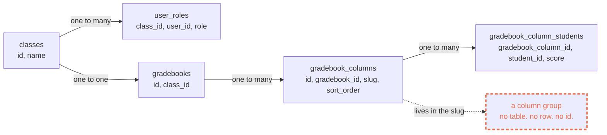

import RevealJS, { Slide } from '@site/src/components/RevealJS';
import Img from '@site/src/components/Img';

<RevealJS transition="slide">

{/* ============================================ */}
{/* COVER IMAGE */}
{/* ============================================ */}

<Slide>

  

<aside className="notes">
**Session:** Mon Sep 14 · Architecture II: Supabase, RLS & Student-Data Privacy · 65 min

**Structure, in order: what you're modeling, what a query costs, what a policy is, what a policy costs, build the group table, why any of this is law.**
- Arc 1, What Are We Modeling? (~13 min plus 5 for discussion). Nouns, keys, a live look at the database in Studio, normalization, denormalization. Assumes no database course.
- Arc 2, What a Query Costs (~13 min). Pages, the storage hierarchy, the buffer cache, indexes, and why an index fits in memory when the table cannot. All numbers measured.
- Arc 3, Authorization Is a Predicate (~5 min). The policy rewrite, then one reference slide of policy gotchas to gloss over.
- Arc 4, What a Policy Costs (~6 min). The measurement, predicted before it is shown. Two slides here are self-study.
- Arc 5, Now Build the Group Table (~18 min: 7 sketching, 4 comparing, the rest debrief). They design it first; I debrief second.
- Arc 6, Why Any Of This Is Law (~3 min). FERPA, compressed to a policy statement.
- Takeaways and the band claim (~4 min)

**Narrative spine:** Authorization in this system is a predicate the database staples onto every query you write, and it runs once per row. There is no code path anybody could forget to call. That makes it a correctness feature and a performance feature at the same time, and the column-groups migration due on the 24th is where they write their first one.

**The session has two halves.** Arc 1 is what you represent. Arcs 2 through 4 are what representing it costs. Arc 5 is where they do both at once, on the thing they hand in.

**Three claims, stated on the spine slide and referred back to by name:**
1. A query's cost is the number of pages it touches.
2. A policy is a predicate evaluated once per row, so a policy's cost is rows times predicate.
3. Therefore a function call inside a policy is a loop you wrote without noticing.

Arc 5 is the payoff: every design decision in their assignment is an application of one of the three, plus the denormalization trade from Arc 1.

**Arc 1 assumes no prior database course, and that is deliberate.** Several people in this room have never written a schema. It teaches four things and no more: nouns become tables, the many side carries the key, say each fact once, and then say one of them twice on purpose. Everything else about modeling is out of scope today.

**Every number on these slides was measured**, on Postgres 16.14 with `shared_buffers=512MB`, single-threaded. Setup scripts, raw output and the two things I got wrong on the first pass are in `lecture-slides/_s03-measurements/`. If a student asks "is that your laptop or production," the answer is a container on my laptop, and the ratios are the point, not the absolute milliseconds. Say that before they ask.

**Twelve students, and the experience gap is the widest it will be all term.** Some just finished OOD. Some have done two co-ops at Visa and have shipped against a production database. A lecture pitched at either end loses the other end, so this session is built as a seminar with three discussion beats rather than a talk with questions at the end.

**The pairing principle, and it is the thing that makes the split work rather than hurt:** each half of the room is genuinely the expert somewhere today, and the beats are placed so that both get a turn.

- **Arc 1 rewards recent design coursework.** Finding the nouns, deciding what is an object and what is a field, working out who owns what. It is the harder half of the column-groups assignment, and industry experience confers no particular advantage at it. Let the room discover that in Discussion 1 rather than announcing it.
- **Arcs 2 through 4 reward having watched a system under load.** Anyone who has seen a query get slower as a table grew, or met an access-control bug in anger, has something here that a slide cannot supply. Invite those stories; do not assume who has one.
- **Arc 5 is where they design before I explain.** Seven minutes of pseudocode first, so the debrief answers questions they have already argued about.

**Students pair themselves.** Six pairs, and you do not need to engineer who sits with whom. What makes the beats work is the report-out norm rather than the pairing: take every pair, and ask for the answer from whichever of the two is less sure.

**Run sheet for 65 minutes.** Discussion always overruns with a room this small and engaged, so these are the marks to steer by, not a script:

| Mark | What should be happening |
|---|---|
| 0:00 | Reminders, title, objectives, how today works |
| 0:05 | Arc 1, five slides. **Open Studio live** on the third |
| 0:18 | **Discussion 1**: entity or attribute (5 min, pairs) |
| 0:23 | Arc 2, storage and indexes |
| 0:36 | Arc 3, RLS mechanics. Gloss the reference slide |
| 0:41 | Arc 4, the measurement. Predict before you reveal |
| 0:47 | Arc 5 opens. Two minutes on what they're building |
| 0:49 | **Sketch it in pseudocode** (7 min, pairs) |
| 0:56 | Somebody's shipped migration, held next to their sketch (4 min) |
| 1:00 | Three debrief slides on where sketches usually differ |
| 1:05 | FERPA, takeaways, the band claim. Out at 1:08 |

**As written this now runs about 68 minutes, three over.** The Studio demo is worth the three and I would rather you cut than rush it. Cheapest three minutes, in order: drop the second fragment on "What an Index Buys", compress the three Arc 5 debrief slides to a sentence each, and let the FERPA slide be read rather than talked over.

**If you are behind at 0:49, protect the pseudocode exercise and take it out of the debrief.** The three debrief slides can each be a sentence, because by then the room has already argued its way to most of them. Presenting four decisions at people who have not tried to make them is the version of this arc that does not work.

**Never cut:** "Now Say It Twice, On Purpose" (Arc 1), the policy-cost measurement (Arc 4), and in Arc 5 the pseudocode exercise and the constraint debrief.

**Three slides are marked self-study on the slide itself** and are not in the run sheet: the two in Arc 4 on reading query plans and on Pawtograder's own RLS history, and the PR checklist in Arc 5. They are the right things to read alone, and the notes on the closing slide remind you to point at them in one sentence on the way past.

**Changed from the outline:** the FERPA learning objective is now a policy statement at the end rather than an arc, per the direction on the original outline. If you want it back as an objective, it needs six minutes taken out of Arc 2.

**Preparation:** have the seeded gradebook open in Supabase Studio on 54323 in a second window. Arcs 1 and 5 are both much better if you can point at actual rows in `gradebook_columns` while talking about what is missing from them.

> **Transition:** Reminders first, then what we're doing today.
</aside>

</Slide>

{/* ============================================ */}
{/* REMINDERS */}
{/* ============================================ */}

<Slide>

## Reminders

<div style={{fontSize: '0.8em', textAlign: 'left'}}>

- **Weekly office hours:** Mon 1-2p, Thurs 9:30-10:30a, WVH 326
- **Discussion also on Discord:** Join via Pawtograder
- **DUE Wed Sep 16:** The Ticket Hunt. 2 filed, 2 triaged
- **DUE Thu Sep 17:** Project Bids
- **DUE Thu Sep 24:** Onboarding: Gradebook Column Groups

</div>

<p className="fragment" style={{fontSize: '0.75em', marginTop: '1em'}}>
If local dev still isn't running, that's today's problem, not next week's. Deliverable 1 is a migration, and a migration needs Path B.
</p>

<aside className="notes">
Keep this to 60 seconds. Deadlines and returning feedback only. Questions about a specific assignment go to clinic or Discord.

**The fragment is the one that matters.** The handout says local dev should be running by today. Today is the day that stops being advice. Take a show of hands, and put anyone whose hand stays down in front of a staff member before they leave the room.

> **Transition:** Now, today.
</aside>

</Slide>

{/* ============================================ */}
{/* TITLE */}
{/* ============================================ */}

<Slide>

# CS 4535: Software Design & Delivery

## Architecture II: Supabase, RLS & Student-Data Privacy

<p style={{marginTop: '2em', fontSize: '0.8em', color: '#666'}}>
  &copy;2026 Jonathan Bell, CC-BY-SA
</p>

<aside className="notes">
**Framing:** On day one I said the database is the application, and that authorization lives in the rows rather than in a code path. Today is the session that cashes that in.

**The hook, in one sentence:** the migration you hand in on the 24th has to carry row-level security, and there is no way to write good RLS without knowing what a query costs. So we do both, in that order.

> **Transition:** Here's what you'll be able to do after today.
</aside>

</Slide>

{/* ============================================ */}
{/* LEARNING OBJECTIVES */}
{/* ============================================ */}

<Slide>

## Learning Objectives

<p style={{fontSize: '0.85em', textAlign: 'left'}}>
After this session, you'll be able to:
</p>

<ol style={{fontSize: '0.72em', textAlign: 'left'}}>
  <li>Turn a domain concept into tables and keys, and say when to store a fact twice on purpose</li>
  <li>Say what a query costs, in pages, and what an index changes about that</li>
  <li>Explain how Postgres evaluates a row-level security policy: once per row, inside the query</li>
  <li>Predict both effects of a policy change: what a user can now see, and what it costs to ask</li>
  <li>Design the schema, policies and constraints for the column-groups table you hand in on the 24th</li>
  <li>Recognize an authorization bug during code review</li>
</ol>

<aside className="notes">
**Time allocation:**
- Arc 1 (~13 min, plus 5 for discussion). Objective 1
- Arc 2 (~13 min). Objective 2
- Arc 3 (~5 min). Objectives 3 and 6
- Arc 4 (~6 min). Objectives 3 and 4
- Arc 5 (~2 min framing, 7 sketching, 4 comparing, 5 debrief). Objective 5, and it re-uses all of them
- Arc 6 (~3 min). The policy statement

**Six objectives is too many for 65 minutes and you should say so out loud**, in the same breath as saying that objective 5 is the only one they are graded on this month. The other five are the parts you need in order to do 5. That framing is true and it stops the first half feeling like five unrelated topics.

**Objectives 1 and 2 are both new relative to the outline**, and they are new for the same reason. A student who does not know what a foreign key is cannot design the group table, and a student who does not know why touching 224,000 pages is slow cannot tell a good policy from a bad one. Every RLS mistake in this codebase is either a modeling mistake or a page-count mistake wearing a security hat.

**If you are running the Room B branch** (see the cover notes), objective 1 still stands. You are just asserting it in two slides instead of demonstrating it in four.

> **Transition:** Start with the thing you're actually building a database about.
</aside>

</Slide>

{/* ============================================ */}
{/* HOW TODAY WORKS                              */}
{/* ============================================ */}

<Slide>

## How Today Works

<div style={{fontSize: '0.72em', textAlign: 'left'}}>

Today needs two kinds of thinking, and they are not the same skill:

</div>

<div style={{display: 'grid', gridTemplateColumns: '1fr 1fr', gap: '1em', fontSize: '0.64em', marginTop: '0.7em'}}>

<div style={{backgroundColor: 'rgba(42,157,143,0.12)', padding: '0.6em', borderRadius: '8px'}}>

**Deciding what things are**

Is a group a thing, or a property of a thing? A design question. No SQL required to have an opinion.

</div>

<div style={{backgroundColor: 'rgba(100,150,255,0.12)', padding: '0.6em', borderRadius: '8px'}}>

**Knowing what they cost**

What happens to that decision when the table has 105,000 rows in it and ten courses share a database.

</div>

</div>

<p style={{fontSize: '0.7em', marginTop: '0.7em', textAlign: 'left'}}>
Three working breaks. Grab a partner for those. Some slides are marked <em>self-study</em> and we won't cover them in the room.
</p>

<p className="fragment" style={{fontSize: '0.72em', marginTop: '0.5em', fontWeight: 'bold', color: '#e76f51'}}>
The assignment due on the 24th needs both of them.
</p>

<aside className="notes">
**The slide names two skills. It does not tell anyone which one they have.** Resist the urge to improvise that on your feet: this room's backgrounds range from a spring OOD course to two co-ops, and announcing who is supposed to be good at what is both presumptuous and often wrong about the individual in front of you. The fragment says the useful part, which is that almost nobody arrives equally strong at both.

**What the framing buys you, said this way:** the person who has shipped services does not get to coast through the modeling half, and the person who has never written a schema has a real contribution in the first twenty minutes. Both of those are true without anyone being labeled.

**They pair themselves.** Six pairs, no seating plan, no commentary on who went with whom.

**Set the norm for the breaks now:** both people talk, and the report-out comes from whichever of the two is less sure. With twelve people you can take all six report-outs in ninety seconds, so there is no reason to sample.

**Do not present the self-study slides as optional extras.** Two of the three are the best stretch material in the deck, and the closing slide's notes carry the one-sentence pointer to them.

> **Transition:** Start with the thing we're building a database about.
</aside>

</Slide>

{/* ============================================ */}
{/* ARC 1: WHAT ARE WE MODELING? (~10 min)       */}
{/* Objective 1                                  */}
{/* ============================================ */}

<Slide>

## Start With the Nouns

<div style={{fontSize: '0.7em', textAlign: 'left'}}>

Before any SQL. What things exist in the world this product is about?

</div>

<div style={{fontSize: '0.66em', textAlign: 'left', marginTop: '0.6em'}}>

- A **class**. CS 4535, Fall 2026
- **People** in it, each with a **role**: student, grader, instructor
- A **gradebook**. One per class
- **Columns** in it: Assignment 1, Lab 3, Exam 2
- A **score**: one student, one column, one number
- A **group** of columns. "The labs." "The exams."

</div>

<p className="fragment" style={{fontSize: '0.76em', marginTop: '0.8em', fontWeight: 'bold', color: '#e76f51'}}>
Five of those six are tables. The sixth is a naming convention and a memo.
</p>

<aside className="notes">
**Do this out loud before you show the list.** Ask the room to name the things in a gradebook. They will get class, student, assignment, grade within thirty seconds. Write them on the board as they say them. Then show the slide and let them find the one they said in plain English but that has no row anywhere.

**This is domain modeling, and it is the actual skill under the assignment.** Not "design a schema." Work out what things exist, then decide which of them the database is going to know about. The handout says it in one line: "a group is a real concept, and it's written down nowhere. Instructors talk about it and the UI renders it, but it exists in everyone's head and in a naming convention."

**For the students who have never taken a database course**, and there are several in this room, say the reassuring thing now: you already know how to do the hard half. You can list the nouns in a domain you understand. The rest of this arc is three rules for turning that list into tables, and there are only three.

**Do not let this become a lecture on entity-relationship modeling.** Twelve minutes, four slides, all of it anchored on the gradebook they have open on their laptops.

**Ask the second question too, because it is the one that matters for the writeup:** is a group a *thing*, or is it a *property of a column*? Both are defensible designs and they lead to different tables. A student who has not noticed that this is a choice has not started the assignment yet.

> **Transition:** So how does a noun become a table?
</aside>

</Slide>

<Slide>

## A Noun Becomes a Table. A Relationship Becomes a Key.

<div style={{fontSize: '0.52em'}}>



</div>

<div style={{fontSize: '0.64em', textAlign: 'left', marginTop: '0.3em'}}>

Three rules, and that is all of them. One row per thing. **The "many" side carries the other one's `id`.** That column is a *foreign key*, and Postgres refuses to store one that points at nothing.

</div>

<aside className="notes">
**Read the arrows out loud in English.** One class has one gradebook. One class has many people in roles. One gradebook has many columns. One column has many scores, one per student. Every arrow is a column holding the other table's `id`.

**The rule students get wrong, so say it twice:** the foreign key lives on the *many* side. A column knows which gradebook it belongs to. A gradebook does not carry a list of its columns. There is no list. You find the columns by asking for every row whose `gradebook_id` matches, which is what a join is.

**Name the thing a foreign key buys you**, because it is the first appearance of a theme that runs to the end of the session: the database refuses to store a reference to a row that does not exist. That is a rule you write once and cannot forget to apply. Same shape as RLS, same shape as the composite foreign key in the second Arc 5 debrief.

**Then point at the dashed box.** Every solid box is a thing Postgres knows about and can be asked questions about. The dashed one is a thing only humans and one TypeScript function know about. That asymmetry is the assignment.

**The question to leave hanging:** what can you do with a solid box that you cannot do with a dashed one? Answers: query it, constrain it, secure it, give it properties, and change it without a deploy. Failure mode 10 in my own notes on this assignment is exactly this. The grouping is unqueryable from SQL, so no report, export or edge function can reason about it.

**If the room is comfortable here, this arc can be two slides instead of four.** Ask.

> **Transition:** Before the next rule: you don't have to take my word for any of this.
</aside>

</Slide>

<Slide>

## You Can Just Look At It

<div style={{fontSize: '0.58em', textAlign: 'left'}}>

Supabase Studio ships with your local stack. Nothing to install. <code>localhost:54323</code>

</div>

<div style={{display: 'grid', gridTemplateColumns: '1fr 1fr', gap: '0.6em', marginTop: '0.4em'}}>

<div>

<div style={{fontSize: '0.46em', marginTop: '0.2em'}}>**Table editor.** Every table, every row. 89 records in <code>gradebook_columns</code>, and no group column anywhere.</div>
</div>

<div>

<div style={{fontSize: '0.46em', marginTop: '0.2em'}}>**Policies.** Every rule protecting every table, as a list you can read. These two are the ones yours has to sit beside.</div>
</div>

</div>

<p className="fragment" style={{fontSize: '0.6em', marginTop: '0.4em', fontWeight: 'bold', color: '#2a9d8f'}}>
A schema isn't a thing you have to hold in your head. It's a thing you can open.
</p>

<aside className="notes">
**This slide exists because databases are intimidating and clicking around one is not.** Thursday's session promised that today assumes they can use Studio. This is where that gets paid off, and it is worth three minutes even though the deck is tight.

**Do it live rather than reading the screenshots.** Have Studio already open on `localhost:54323` in a second window. Click into `gradebook_columns`, scroll the 89 rows, and point at the columns: `id`, `class_id`, `name`, `slug`, `sort_order`. Then say the thing this whole session is for: there is no group column. The nouns from two slides ago are on the screen, and the one with a dashed box around it is still missing.

**The `skill-*` rows are visible in the screenshot and they are worth ten seconds**, because they are the shape that defeats the current display. Twelve `Skill #N` columns and three expectation aggregates. That is a small version of the CS 2100 case that part two of the writeup asks about.

**Then the policies page, which is the reassuring half.** Filter for `gradebook_column`. Six policies across the two tables, each one a name, a command and who it applies to. Say that RLS is not a mysterious subsystem; it is a list, it is short, and they can read all of it in a minute. The two on `gradebook_columns`, "everyone in class can view" and "instructors CRUD", are literally the ones the handout says theirs must be consistent with.

**The thing to demonstrate if you have a spare minute:** the table editor's own filter bar and the SQL editor. Anyone who can write a `select` can check their own migration, and anyone who cannot yet can still browse.

**Do not get into the API or settings pages.** They show keys.

> **Transition:** One more rule, and it's the one that has a name.
</aside>

</Slide>

<Slide>

## Say Each Fact Once

<div style={{fontSize: '0.68em', textAlign: 'left'}}>

Tempting shortcut: put the course name on every score row, so you never have to join.

</div>

<div style={{fontSize: '0.56em', textAlign: 'left', marginTop: '0.4em'}}>

```text
 id | student | column | score | course_name
----+---------+--------+-------+--------------
  1 | alice   | lab-1  |  95.0 | CS 4535
  2 | alice   | lab-2  |  88.0 | CS 4535
  3 | bob     | lab-1  |  72.0 | CS 4535      ... x 105,000
```

</div>

<div style={{fontSize: '0.64em', textAlign: 'left', marginTop: '0.5em'}}>

Now the registrar renames the course.

</div>

<div style={{fontSize: '0.64em', textAlign: 'left', marginTop: '0.3em'}}>

- 105,000 rows to update, and if 4,000 of them fail, the course now has **two names**
- A class with no scores yet has **no name at all**, because names only live on score rows
- "What is this course called?" has no answer. It has a *vote*

</div>

<p className="fragment" style={{fontSize: '0.74em', marginTop: '0.6em', fontWeight: 'bold', color: '#2a9d8f'}}>
So: each fact lives in exactly one place, and everything else points at it. That's <em>normalization</em>.
</p>

<aside className="notes">
**This is the whole of normalization that they need today**, and it is deliberately taught as a failure story rather than as a set of numbered forms. If someone asks, the tidy version of this rule is called third normal form and they can look it up. Do not put the forms on the board.

**"It has a vote" is the line to land.** The reason duplicated facts are bad is not that they waste space. Space is cheap. It is that once two copies disagree, there is no longer a fact, and no query can tell you which copy is the truth. Every one of the three bullets is a version of that.

**Name the terms as they go past, once each,** because half the room has never heard them and the other half will be bored if you dwell: *update anomaly* for the first, *insertion anomaly* for the second.

**Connect it to something they have already felt.** This is the same failure as the grouping heuristic in their assignment: the fact "these columns belong together" is stored in a naming convention, so it is restated in every slug, and the copies can disagree. `assignment-lab-3` and `assignment-lab` land in different groups today, which is two copies of one fact disagreeing. That is failure mode 5 in the grading key and it is a normalization bug wearing a string-parsing costume.

> **Transition:** Which makes the next slide sound like heresy.
</aside>

</Slide>

<Slide>

## Now Say It Twice, On Purpose

<div style={{fontSize: '0.66em', textAlign: 'left'}}>

Every gradebook table in Pawtograder carries `class_id`, even though you could always find it by following keys upward:

</div>

<div style={{fontSize: '0.58em', textAlign: 'left', marginTop: '0.4em'}}>

```text
gradebook_column_students -> gradebook_columns -> gradebooks -> classes
```

</div>

<div style={{fontSize: '0.64em', textAlign: 'left', marginTop: '0.5em'}}>

That is a duplicated fact, added deliberately. It buys two things:

</div>

<div style={{fontSize: '0.63em', textAlign: 'left', marginTop: '0.3em'}}>

1. The security question becomes answerable **on the row itself**, with no join
2. Three joins per row is three joins you pay for on every query

</div>

<p className="fragment" style={{fontSize: '0.72em', marginTop: '0.6em'}}>
And it costs what duplication always costs: two copies that can disagree. So you buy a <strong>constraint</strong> that makes disagreement impossible to write down.
</p>

<p className="fragment" style={{fontSize: '0.74em', marginTop: '0.4em', fontWeight: 'bold', color: '#e76f51'}}>
Denormalize deliberately, state what it bought, and pay for it with a constraint. Never by accident.
</p>

<aside className="notes">
**This is the slide the whole arc exists for**, and it is the one that connects modeling to everything after the break. Denormalization is a trade with a known price, and the mark of an engineer rather than a student is naming both halves of it rather than treating the technique as either a shortcut or a sin.

**The price is paid in consistency, not in disk.** `gradebook_column_students.class_id` can come to disagree with `gradebooks.class_id`, and then the row is in two courses at once and no query can say which. The second debrief slide in Arc 5 is where they buy that back with a composite foreign key, and this slide is what makes that slide make sense rather than look like trivia.

**The second example, and it is worth 45 seconds because it recurs in Arc 4:** `user_privileges` is an entire *table* that is a denormalized copy of `user_roles`. Narrow, active rows only, kept in sync by three triggers on the source table, heavily indexed. It exists for one reason: every security policy in the system has to answer "what classes is this person in," and that answer needed to be the cheapest possible lookup. Same trade, one level up.

**Give them the writeup language explicitly, because part one question 4 asks for exactly this:** "Where those pulled against each other, which did you choose?" A student who writes "I added `class_id` for performance" has named one half. A student who writes "I added `class_id` so the policy is a local check rather than a three-table join, which introduces a value that can disagree with the parent, so I constrained it with a composite foreign key" has answered the question.

**The honest caveat if anyone pushes:** you cannot denormalize your way out of every join, and a copy you forget to keep in sync is worse than the join you avoided. The triggers on `user_roles` are 40 lines of plpgsql handling insert, update and delete, and they are the real cost of that table.

> **Transition:** Before we leave modeling, five minutes in pairs.
</aside>

</Slide>

{/* ============================================ */}
{/* DISCUSSION 1 (~5 min, pairs)                 */}
{/* ============================================ */}

<Slide>

## Discussion: Is a Group a Thing?

<div style={{fontSize: '0.68em', textAlign: 'left'}}>

In pairs, five minutes. Take a position and name one consequence.

</div>

<div style={{display: 'grid', gridTemplateColumns: '1fr 1fr', gap: '1em', fontSize: '0.63em', marginTop: '0.7em'}}>

<div style={{backgroundColor: 'rgba(42,157,143,0.12)', padding: '0.7em', borderRadius: '8px'}}>

**A group is an entity**

Its own table, its own id. Columns point at it.

</div>

<div style={{backgroundColor: 'rgba(255,180,0,0.15)', padding: '0.7em', borderRadius: '8px'}}>

**A group is an attribute**

One more field on `gradebook_columns`. No new table.

</div>

</div>

<aside className="notes">
**This is the assignment, three days after it was assigned, in five minutes.** Both answers are real and shippable. The entity version gets identity, properties, constraints and somewhere to hang a policy. The attribute version is a smaller migration, a trivial backfill, and no second table to secure, and it is what a lot of production systems would actually do for eight groups per course.

1. Which one, and what does the other one cost you?
2. Can two courses have a group called "Exams"? What does your answer imply?
3. Where does `class_id` go, and why would you write it down twice?

**Say what kind of question this is, not who is good at it.** Entity versus value, responsibility assignment, identity. It is a design question, and someone who has never written a migration can win this argument on the merits. Call on somebody who has not spoken yet.

**Question 2 is the one that does the teaching.** If two courses can both have "Exams," the name is not the identity, so something else has to be, and they have just discovered why the table needs a key and a scope. If they say no, they have accidentally proposed a global namespace across ten courses, and the first Arc 5 debrief is going to be uncomfortable. Either answer is productive, which is why it is the question.

**Question 3 previews the first Arc 5 debrief and you should not resolve it here.** Let them argue. The answer arrives forty minutes later with a measurement attached, and it lands much harder if they have already picked a side.

**Report-out: one sentence per pair, and take all six.** Twelve people, ninety seconds. Write the two positions on the board and tally, because the split is worth showing them.

**Watch for the failure mode** where a pair answers "it depends." Push once: depends on what, and which way does this course's gradebook push you? Their gradebook has eight outcome-and-band groups in it, which is a real constraint they can reason from.

> **Transition:** That's representation. The rest of today is what it costs.
</aside>

</Slide>

{/* ============================================ */}
{/* SPINE STATEMENT                              */}
{/* ============================================ */}

<Slide>

## Three Claims

<div style={{fontSize: '0.8em', textAlign: 'left', marginTop: '0.5em'}}>

<div style={{backgroundColor: 'rgba(100,150,255,0.12)', padding: '0.6em', borderRadius: '8px', marginBottom: '0.5em'}}>

**1.** A query's cost is the number of **pages** it touches.

</div>

<div style={{backgroundColor: 'rgba(42,157,143,0.12)', padding: '0.6em', borderRadius: '8px', marginBottom: '0.5em'}}>

**2.** A security policy is a **predicate**, evaluated **once per row**.

</div>

<div style={{backgroundColor: 'rgba(231,111,81,0.15)', padding: '0.6em', borderRadius: '8px'}}>

**3.** So a function call inside a policy is a **loop you wrote without noticing**.

</div>

</div>

<p className="fragment" style={{fontSize: '0.78em', marginTop: '1em', fontWeight: 'bold', color: '#e76f51'}}>
Claim 3 is the one that will bite your migration. Claims 1 and 2 are why.
</p>

<aside className="notes">
**Put these three on the board, not just the screen,** and point back at them by number four times today: at the end of Arc 2, at the measurement in Arc 4, at the pseudocode debrief in Arc 5, and in the takeaways.

**The reason this framing works** is that students arrive thinking security and performance are separate concerns that trade off against each other. In Postgres they are the same mechanism. A policy is a `WHERE` clause. Nobody is surprised that a bad `WHERE` clause is slow.

> **Transition:** Claim one. What does a query actually cost?
</aside>

</Slide>

{/* ============================================ */}
{/* ARC 2: WHAT A QUERY COSTS (~13 min)          */}
{/* Objective 2                                  */}
{/* ============================================ */}

<Slide>

## Everything Is Pages

<div style={{fontSize: '0.75em', textAlign: 'left'}}>

Postgres reads **8 kB pages**, never individual rows. Rows live inside the pages.

</div>

<div style={{fontSize: '0.7em', textAlign: 'left', marginTop: '0.8em'}}>

A gradebook table built to the scale this product is heading for:

</div>

<div style={{fontSize: '0.68em', textAlign: 'left', marginTop: '0.4em'}}>

| | |
|---|---|
| Rows | 20,000,000 |
| Size on disk | 1,754 MB |
| Pages | 224,450 |
| Rows per page | 89 |

</div>

<p className="fragment" style={{fontSize: '0.75em', marginTop: '0.8em'}}>
Want one student's 200 scores? Those 200 rows live on about 3 pages. The question is whether Postgres knows which 3.
</p>

<aside className="notes">
**This is the mental model the whole session rests on.** Say it plainly: a table is a pile of 8 kB pages. A query's job is to touch as few of them as possible.

**The 20 million number is not invented.** It is five years of Pawtograder at its current trajectory: roughly 200 course-terms, 500 students each, 200 gradebook columns each. One row per student per column. CS 2100 alone would contribute a large share of it, for exactly the reason part two of the column-groups writeup asks about, which is that its column count grows as topics times attempts.

**Do the arithmetic out loud:** 89 rows per page is simply what a row of that width costs, and no setting changes it. Narrower rows pack tighter. This is why people care about column order and types more than students expect.

**The fragment sets up the next two slides.** Everything from here is about the difference between knowing which 3 pages and not knowing.

> **Transition:** Touching a page is cheap or catastrophic depending on where the page is.
</aside>

</Slide>

<Slide>

## Where the Page Lives Decides What It Costs

<div style={{fontSize: '0.63em', textAlign: 'left'}}>

| Where the page is | Roughly how long to get it | Relative |
|---|---|---|
| CPU L1 cache | 1 ns | 1x |
| Main memory (RAM) | 100 ns | 100x |
| NVMe SSD | 50,000 ns (50 µs) | 50,000x |
| Another machine, same datacenter | 500,000 ns (0.5 ms) | 500,000x |
| Spinning disk seek | 5,000,000 ns (5 ms) | 5,000,000x |

</div>

<p className="fragment" style={{fontSize: '0.75em', marginTop: '0.8em'}}>
Six orders of magnitude between the best case and the worst. No algorithm you write in TypeScript moves a number that far.
</p>

<aside className="notes">
**Orders of magnitude, not the digits.** Nobody should memorize these. The shape is what matters: memory is roughly a hundred times slower than cache, an SSD is roughly a thousand times slower than memory, and a disk seek is another hundred times worse than that.

**The line worth saying:** every performance argument in a database is an argument about which row of this table your data is in. That is the entire subject.

**If the room already knows this** (ask, don't assume: several of them will have had it in Systems), this slide is 45 seconds and you move on. **This is the first designated cut.**

**Why the network row is on there:** it is the one they will meet first in practice. Every Supabase query from the browser pays it once, which is why a single query returning 105,000 rows beats 105,000 queries returning one row, whatever the policy costs.

> **Transition:** So Postgres keeps pages in memory. The catch is how few it can keep.
</aside>

</Slide>

<Slide>

## The Cache Is Smaller Than the Table

<div style={{fontSize: '0.72em', textAlign: 'left'}}>

Postgres keeps recently-used pages in a fixed pool, `shared_buffers`. On the instance I measured, that pool is **512 MB**. The table is **1,754 MB**.

</div>

<div style={{fontSize: '0.68em', textAlign: 'left', marginTop: '0.8em'}}>

So a full scan evicts itself as it runs. `EXPLAIN (ANALYZE, BUFFERS)` tells you which pages were already there and which had to be fetched:

</div>

<div style={{fontSize: '0.62em', textAlign: 'left', marginTop: '0.4em'}}>

```text
Seq Scan on gcs_big  (actual rows=200 loops=1)
  Filter: (student_id = '...'::uuid)
  Rows Removed by Filter: 19999800
  Buffers: shared hit=44409 read=180041
```

</div>

<p className="fragment" style={{fontSize: '0.72em', marginTop: '0.6em'}}>
<code>hit</code> was already in memory. <code>read</code> was not. 19,999,800 rows were examined and thrown away to find 200.
</p>

<aside className="notes">
**`EXPLAIN (ANALYZE, BUFFERS)` is the tool this whole session is teaching them to reach for**, and it is the one thing from today that will still be useful to them in ten years. Say that.

**Read the plan out loud, line by line.** Students skim query plans because nobody ever makes them read one. `Rows Removed by Filter: 19999800` is the most eloquent line Postgres ever prints.

**The distinction between `hit` and `read` matters more than the timing**, because timings vary with what else the machine is doing and buffer counts do not. When they benchmark their own migration, buffer counts are the number to report in the PR.

**Honest caveat, worth 15 seconds:** a `read` here means "not in Postgres's pool." It may still have come from the operating system's own cache rather than from the physical device. The layer below Postgres has a cache too. It does not change the argument.

> **Transition:** The obvious fix is a bigger pool. That got expensive.
</aside>

</Slide>

<Slide>

## "Just Add RAM" Stopped Being the Cheap Answer

<div style={{fontSize: '0.68em', textAlign: 'left'}}>

For thirty years the standard response to a slow database was to buy memory until the working set fits. Then AI datacenters bought the memory.

</div>

<div style={{fontSize: '0.64em', textAlign: 'left', marginTop: '0.6em'}}>

In 2023 I bought 112 Micron 32 GB DDR4 modules for a research cluster.

</div>

<div style={{fontSize: '0.63em', textAlign: 'left', marginTop: '0.4em'}}>

| | 2023 | Today |
|---|---|---|
| One module | $93.48 | $396.00 |
| Per GB | $2.92 | $12.38 |
| All 112 of them, 3.5 TB | $10,470 | $44,352 |

</div>

<p className="fragment" style={{fontSize: '0.72em', marginTop: '0.7em'}}>
Same part number. Same cluster. The memory I already own would cost <strong>$33,882 more</strong> to buy again.
</p>

<p className="fragment" style={{fontSize: '0.72em', marginTop: '0.4em', fontWeight: 'bold', color: '#e76f51'}}>
The cheapest page is the one you never read. That has always been true. It is now also true on the invoice.
</p>

<aside className="notes">
**These are my own invoices, and that is why they are on the slide instead of an analyst chart.** 112 Micron 32 GB DDR4 modules at $93.48 each in 2023; the same module is $396 today. A factor of 4.2 on a part that was supposed to get cheaper every year.

**If anyone asks whether this is just one buyer's bad luck:** it is not. Counterpoint Research and TrendForce both report the same direction through late 2025 and 2026, with conventional DRAM contract prices up more than half in a single quarter and major suppliers sold out a year ahead. Keep that in your pocket rather than on the slide; the invoice is the better evidence.

**The point is not the price of RAM.** It is that the escape hatch students assume exists has partly closed. When you cannot buy your way out of a page-count problem, you have to solve the page-count problem, and the tool for that is the next slide.

**A second-order point worth making if the room is engaged:** this is also why managed Postgres pricing is shaped the way it is. On Supabase, and on every hosted database, memory is the axis you pay for. A policy that forces a sequential scan is a line item.

**Do not editorialize about AI here.** State the supply fact and move on. They get plenty of AI conversation in this course already.

> **Transition:** So: the same query, the same table, with and without an index.
</aside>

</Slide>

<Slide>

## What an Index Buys

<div style={{fontSize: '0.68em', textAlign: 'left'}}>

One student's 200 scores, out of 20,000,000 rows. Same query, same machine, single-threaded.

</div>

<div style={{fontSize: '0.65em', textAlign: 'left', marginTop: '0.6em'}}>

| | Time | Pages touched |
|---|---|---|
| Read every row | 3,133 ms | 224,450 |
| **Find 200 rows, no index** | **1,353 ms** | **224,450** |
| **Find 200 rows, with an index** | **0.1 ms** | **6** |

</div>

<p className="fragment" style={{fontSize: '0.74em', marginTop: '0.8em'}}>
Six pages: a short walk down the index, then the handful of heap pages holding the rows. <strong>224,450 to 6.</strong>
</p>

<p className="fragment" style={{fontSize: '0.7em', marginTop: '0.5em'}}>
The index costs 131 MB and has to be updated on every write. Cheap next to the alternative, but not free.
</p>

<aside className="notes">
**Let the table sit for a beat before you say anything.** Thirteen thousand times is a number students do not have intuition for, and the page column is what makes it legible. Postgres did not get faster. It stopped doing 224,444 pages of pointless work.

**Say what a B-tree index actually is**, in two sentences, because some of the room has never been told: a sorted structure with a shallow branching factor, so finding any value takes about four page reads no matter how big the table gets. The depth grows logarithmically. That is the whole trick.

**The second fragment is the honest half and it is the first designated cut if you are behind.** Indexes cost space, they cost write throughput, and an unused index costs both for nothing. Pawtograder's `user_privileges` table carries seven of them on a table that is narrow and small, which is defensible only because it sits on the hot path of every policy in the system and would be indefensible anywhere else.

**Do not tie off on claim 1 yet.** The next slide is the other half of this one: *why* the index is cheap enough to be worth keeping, which is the memory argument from two slides ago.

> **Transition:** Here's why you can afford to keep one of these in memory and not the other.
</aside>

</Slide>

<Slide>

## An Index Is a Narrow Copy

<div style={{fontSize: '0.6em', textAlign: 'left'}}>

The table row carries everything. The index carries the one column you search on, plus a pointer to the row.

</div>

<div style={{marginTop: '0.6em'}}>

<div style={{display: 'flex', alignItems: 'center', gap: '0.5em', fontSize: '0.5em', marginBottom: '0.4em'}}>
<div style={{width: '5.5em', textAlign: 'right', fontWeight: 'bold'}}>the table</div>
<div style={{display: 'flex', gap: '0.2em', flexWrap: 'wrap'}}>
{['id','class_id','gradebook_column_id','student_id','score','is_private','is_missing','created_at'].map(c => (
  <div key={c} style={{padding: '0.3em 0.4em', borderRadius: '4px', backgroundColor: c === 'student_id' ? 'rgba(42,157,143,0.35)' : 'rgba(120,120,120,0.15)', border: '1px solid rgba(120,120,120,0.35)', whiteSpace: 'nowrap'}}>{c}</div>
))}
</div>
</div>

<div style={{display: 'flex', alignItems: 'center', gap: '0.5em', fontSize: '0.5em'}}>
<div style={{width: '5.5em', textAlign: 'right', fontWeight: 'bold'}}>the index</div>
<div style={{display: 'flex', gap: '0.2em'}}>
<div style={{padding: '0.3em 0.4em', borderRadius: '4px', backgroundColor: 'rgba(42,157,143,0.35)', border: '1px solid rgba(42,157,143,0.6)', whiteSpace: 'nowrap'}}>student_id</div>
<div style={{padding: '0.3em 0.4em', borderRadius: '4px', backgroundColor: 'rgba(100,150,255,0.2)', border: '1px dashed rgba(100,150,255,0.7)', whiteSpace: 'nowrap'}}>&rarr; which row</div>
</div>
</div>

</div>

<div style={{marginTop: '0.9em', fontSize: '0.5em'}}>

<div style={{display: 'flex', alignItems: 'center', gap: '0.5em', marginBottom: '0.25em'}}>
<div style={{width: '5.5em', textAlign: 'right', flexShrink: 0}}>table, 1,754 MB</div>
<div style={{flex: 1, minWidth: 0}}><div style={{height: '1.1em', width: '100%', backgroundColor: 'rgba(231,111,81,0.55)', borderRadius: '3px'}}></div></div>
</div>

<div style={{display: 'flex', alignItems: 'center', gap: '0.5em', marginBottom: '0.25em'}}>
<div style={{width: '5.5em', textAlign: 'right', flexShrink: 0}}>cache, 512 MB</div>
<div style={{flex: 1, minWidth: 0}}><div style={{height: '1.1em', width: '29.2%', backgroundColor: 'rgba(120,120,120,0.45)', borderRadius: '3px'}}></div></div>
</div>

<div style={{display: 'flex', alignItems: 'center', gap: '0.5em'}}>
<div style={{width: '5.5em', textAlign: 'right', flexShrink: 0}}>index, 131 MB</div>
<div style={{flex: 1, minWidth: 0}}><div style={{height: '1.1em', width: '7.5%', backgroundColor: 'rgba(42,157,143,0.7)', borderRadius: '3px'}}></div></div>
</div>

</div>

<p className="fragment" style={{fontSize: '0.68em', marginTop: '0.7em', fontWeight: 'bold', color: '#2a9d8f'}}>
The index fits in memory. The table never will. That's what you bought.
</p>

<aside className="notes">
**This is the slide that joins the memory arc to the index arc**, and it is the answer to "why not just cache the table." You cannot. The table is three and a half times the size of the cache and it evicts itself on every scan. The index is a seventh of the cache and stays resident.

**Read the two rows of chips out loud.** A heap row carries every column whether you asked for them or not, because the row is the unit of storage. An index entry carries the search key and a pointer, and nothing else. Narrow rows pack more entries per 8 kB page, which is the same arithmetic as the 89-rows-per-page slide, run in your favor for once.

**The bars are to scale.** 131 MB against 1,754 MB is 7.5%, and the cache line sits between them at 512 MB. That picture is the whole argument: the thing you search is small enough to live in the expensive memory, and the thing you eventually fetch from is not.

**Name the consequence for their assignment**, because it is not obvious: this is why adding `class_id` to a table and indexing it is cheap, and why a policy that can use that index is cheap with it. A policy predicate the planner can answer out of a resident index costs almost nothing. One that forces a heap scan pays the 1,754 MB.

**If somebody asks about covering indexes**, the honest answer is yes, you can widen an index with `INCLUDE` so the query never touches the heap at all, and Pawtograder does exactly that on `submission_reviews`. It trades size for avoiding the fetch. Do not go further than that sentence today.

**Now tie off claim 1.** A query's cost is pages. An index changes how many pages, and how likely those pages are to be in memory. Everything else is detail.

> **Transition:** That's claim one. Claim two: where does authorization happen?
</aside>

</Slide>

{/* ============================================ */}
{/* ARC 3: AUTHORIZATION IS A PREDICATE (~5 min) */}
{/* Objectives 3 and 6                           */}
{/* ============================================ */}

<Slide>

## Authorization Is a WHERE Clause You Didn't Write

<div style={{fontSize: '0.66em', textAlign: 'left'}}>

The browser asks for this:

```sql
select id, student_id, score
from gradebook_column_students
where class_id = 1;
```

</div>

<div style={{fontSize: '0.66em', textAlign: 'left', marginTop: '0.6em'}}>

Postgres runs this:

```sql
select id, student_id, score
from gradebook_column_students
where class_id = 1
  and (  -- the policy, added by the database
    class_id in (select up.class_id from user_privileges up
                 where up.user_id = auth.uid())
  );
```

</div>

<p className="fragment" style={{fontSize: '0.74em', marginTop: '0.7em', fontWeight: 'bold', color: '#2a9d8f'}}>
The rows are protected, so there is no code path to forget and no endpoint to remember to guard.
</p>

<aside className="notes">
**This is the single most important slide in the session for objective 2.** Everything else follows from the rewrite being literal. Postgres genuinely appends the policy expression to the query and then hands the whole thing to the planner.

**Two consequences, both worth stating:**
1. The planner optimizes the policy along with your query. That is why the same policy can be fast in one query and slow in another, which is the thing that surprises people.
2. You cannot bypass it by finding a different route to the data. A view, an RPC, a Realtime subscription and a raw PostgREST call all go through it.

**The exception, and say it now so nobody is surprised later:** a `SECURITY DEFINER` function runs as its owner and therefore skips the caller's policies inside its body. That is a deliberate hole, it is how Pawtograder's helper functions read `user_roles` when the caller cannot, and it is also how people accidentally build a data leak. Come back to this in Arc 5.

**Ask the room** what happens when a student runs this query. Answer: they get their own rows, not an error. RLS filters, it does not reject. That is a nasty debugging property and worth naming.

> **Transition:** Reads are the easy half. Writes have a second clause.
</aside>

</Slide>

<Slide>

## Four Things to Read Before You Write a Policy

<div style={{fontSize: '0.6em', textAlign: 'left'}}>

Reference, not a lecture. You'll want it the day you write your own policy.

</div>

<div style={{fontSize: '0.56em', textAlign: 'left', marginTop: '0.5em'}}>

| | |
|---|---|
| **`USING` vs `WITH CHECK`** | `USING` filters rows that already exist. `WITH CHECK` constrains rows you're about to create. An `UPDATE` takes both, because it does both |
| **The loose `WITH CHECK`** | Omit it on a `FOR ALL` policy and Postgres reuses `USING`, which is safe. Write one *looser* than `USING`, usually `with check (true)`, and you've opened a door |
| **Reads gate writes** | For `UPDATE`, the **`SELECT`** policy is applied to the new row too. Loosen a read policy for a good reason, open a write hole you weren't looking at |
| **`SECURITY DEFINER`** | A function marked this way runs as its owner, so the caller's policies don't apply inside it. Deliberate, necessary, and the easiest way to build a leak |

</div>

<p className="fragment" style={{fontSize: '0.68em', marginTop: '0.7em', fontWeight: 'bold', color: '#e76f51'}}>
Each of these is a way a policy can be wrong while reading as correct. Two of them are in a migration you'll read later today.
</p>

<aside className="notes">
**Gloss this in about ninety seconds.** It is a reference slide, and its job is to exist on the published deck when they sit down to write a policy on the 20th, not to be taught now. Read the four left-hand labels out loud, say the one sentence below, and move on.

**The one sentence:** `USING` is about rows that exist, `WITH CHECK` is about rows that are about to exist, and the surprising part is that your `SELECT` policy quietly participates in both.

**Row 3 is the one worth thirty extra seconds if you have them**, because it is measured and genuinely surprises people. An `UPDATE` policy with `with check (true)` still cannot move a group into another class, because the `SELECT` policy is also applied to the new row. Relax the `SELECT` policy to `using (true)` and the same `UPDATE` succeeds. The `CREATE POLICY` documentation states it in the "Policies Applied by Command Type" table: for `UPDATE`, the `SELECT` policy's `USING` expression filters the existing row and checks the new one.

**The fragment is the reason this slide is not simply deleted.** Rows 2 and 4 both appear in the broken migration in Arc 5, so this is the reference they will reach back to twenty minutes from now. Say that, so they know it is coming.

**If someone asks about `RESTRICTIVE` policies:** permissive policies OR together, restrictive policies AND on top, Pawtograder barely uses them. One sentence, then stop.

**Skipped deliberately:** the worked demonstration of each of these. They are on the published deck in table form and in `_s03-measurements/README.md`, which is where somebody writing a policy at 11pm will actually look.

> **Transition:** That's the mechanism. Now what does it cost?
</aside>

</Slide>

{/* ============================================ */}
{/* ARC 4: WHAT A POLICY COSTS (~8 min)          */}
{/* Objectives 3 and 4                           */}
{/* ============================================ */}

<Slide>

## A Policy Runs Once Per Row

<div style={{fontSize: '0.7em', textAlign: 'left'}}>

Pawtograder's original helper. It looks like the obviously correct way to write this:

</div>

<div style={{fontSize: '0.58em', textAlign: 'left', marginTop: '0.5em'}}>

```sql
create function authorizeforclass(class__id bigint) returns boolean
  language plpgsql stable security definer
as $$
begin
  return exists (select 1 from user_roles r
                 where r.class_id = class__id and r.user_id = auth.uid());
end;
$$;

create policy "everyone in class can view" on gradebook_columns
  for select using (authorizeforclass(class_id));
```

</div>

<p className="fragment" style={{fontSize: '0.72em', marginTop: '0.7em'}}>
One instructor opens one gradebook. 105,000 score rows come back.
</p>

<p className="fragment" style={{fontSize: '0.78em', marginTop: '0.4em', fontWeight: 'bold', color: '#e76f51'}}>
<code>pg_stat_user_functions</code> says the function was called <strong>105,000 times</strong>. Once per row.
</p>

<aside className="notes">
**This function is real.** It is in `supabase/migrations/20250813234857_office-hours-and-notifications.sql` and versions of it guarded most of this codebase for months. Nobody wrote it carelessly. It reads exactly like what you want: a named, reusable, testable authorization check.

**The call count is measured, not estimated.** Turn on `track_functions`, run the query, read `pg_stat_user_functions`. Offer to show it if anyone doubts it.

**Predict before you reveal, and make it a commitment rather than a musing.** Hold the second fragment. Ask: how many times does this function run for one instructor loading one gradebook? Take hands for *once*, for *once per class*, for *once per column*, for *once per row*. Twelve people, four options, ten seconds. Most rooms split between the first two. Nobody volunteers 105,000 until it is on the screen.

**Somebody in the room usually suspects the real answer and does not say it**, because it feels too stupid to be correct. Draw it out with a different question: what would the query plan have to look like for the number to be enormous? Then show it.

**Then the second prediction, which is the better one:** now that you know it runs 105,000 times, how much slower is it? Take a guess in the room before the next slide. Guesses cluster around two or three times. The answer is forty, and the gap between their estimate and the measurement is the actual lesson.

**Then the key reframe:** each of those calls is itself a query against `user_roles`. So the policy turned one query into 105,001 queries, and every one of them returns the same answer.

> **Transition:** Here's what that costs, five ways.
</aside>

</Slide>

<Slide>

## The Measurement

<div style={{fontSize: '0.64em', textAlign: 'left'}}>

Same query, same 105,000 rows, same machine. Only the policy predicate changes.

</div>

<div style={{fontSize: '0.6em', textAlign: 'left', marginTop: '0.5em'}}>

| Policy predicate | Time |
|---|---|
| `true` (no check at all) | 23 ms |
| `authorizeforclass(class_id)`, the plpgsql helper | **1,337 ms** |
| the same helper rewritten in `language sql` | **1,779 ms** |
| inline `exists (select 1 from user_privileges ...)` | 57 ms |
| `class_id in (select ... from user_privileges ...)` | **33 ms** |

</div>

<p className="fragment" style={{fontSize: '0.74em', marginTop: '0.7em', fontWeight: 'bold', color: '#e76f51'}}>
Same rows out. Same security. <strong>40x.</strong>
</p>

<p className="fragment" style={{fontSize: '0.68em', marginTop: '0.4em'}}>
Rewriting the helper in plain SQL made it <em>worse</em>. Reaching for a "faster function" is the wrong move, because the problem was never which language the function was in.
</p>

<aside className="notes">
**Walk the rows in order and let the last one land.** The inline version is within 10 ms of doing no security check at all.

**The second fragment is the point of the whole arc.** Students who have absorbed "plpgsql is slow, SQL functions are fast" will propose the rewrite, and the measurement says it is slower. The reason is that the SQL version here runs as `SECURITY INVOKER`, so the policy on `user_privileges` is evaluated inside every one of those 105,000 calls too. A nested policy per row. Measured at 1,793 ms against 1,145 ms for the same function marked `SECURITY DEFINER`.

**Resist the urge to make this a rule about functions.** The rule is claim 2: cost is rows times predicate. A function that the planner must call per row makes the predicate expensive. A predicate the planner can evaluate once makes it free. That is the whole content.

**When they ask about the absolute numbers:** container on a laptop, Postgres 16.14, `shared_buffers=512MB`, single-threaded, medians of five runs. Production has faster disks and more cache and the ratios hold, because the ratio is a count of function calls, not a property of the hardware.

> **Transition:** So why can the planner evaluate one and not the other?
</aside>

</Slide>

<Slide>

## Why the Function Version Loses

<div style={{display: 'grid', gridTemplateColumns: '1fr 1fr', gap: '1em', fontSize: '0.62em', marginTop: '0.3em'}}>

<div style={{backgroundColor: 'rgba(231,111,81,0.15)', padding: '0.6em', borderRadius: '8px'}}>

**A function call**

```text
Index Scan on gradebook_column_students
  (actual rows=105000 loops=1)
  Filter: authorizeforclass(class_id)
```

The planner sees a black box returning a boolean. It cannot look inside, so it calls it. 105,000 times.

</div>

<div style={{backgroundColor: 'rgba(42,157,143,0.12)', padding: '0.6em', borderRadius: '8px'}}>

**An inline subquery**

```text
Index Scan on gradebook_column_students
  (actual rows=105000 loops=1)
  InitPlan 1
    Index Only Scan on user_privileges
      (actual rows=1 loops=1)
```

`loops=1`. The planner hoisted it out, ran it once, and compared 105,000 rows against the answer.

</div>

</div>

<p className="fragment" style={{fontSize: '0.72em', marginTop: '0.7em'}}>
<code>loops=</code> in a query plan is the number you are looking for. <code>loops=1</code> means once. Anything else means once per row above it.
</p>

<p style={{fontSize: '0.55em', marginTop: '0.3em', textAlign: 'right', fontStyle: 'italic', color: '#4A90A4'}}>
Self-study. We won't cover this in the room.
</p>

<aside className="notes">
**`loops=` is the single most useful field in a query plan** and almost nobody teaches it. Give them the reading rule explicitly: find the node, read `loops`, multiply. A node showing `loops=105000` is a node that ran 105,000 times, and its reported time is per loop.

**"InitPlan" is the word for the hoist.** Postgres noticed the subquery does not depend on the current row, evaluated it once before the scan started, and used the result as a constant.

**The caveat that makes them better engineers, and it is worth the thirty seconds:** the hoist happened partly because the query said `where class_id = 1`, which pinned the correlated column to a constant. Change the query and the same policy can stop being hoistable. This is the concrete meaning of objective 3: a policy does not have a cost, a policy-plus-query has a cost. Their `EXPLAIN` has to be of the query the app actually sends.

**This is the second designated cut.** If you are behind, keep the measurement slide and say "the planner can see inside one and not the other" in a sentence.

> **Transition:** This isn't hypothetical. It's a year of this codebase's history.
</aside>

</Slide>

<Slide>

## Pawtograder Already Did This, Twice

<div style={{fontSize: '0.62em', textAlign: 'left'}}>

| When | What happened |
|---|---|
| Aug 2025 | Move the role check into the JWT to avoid the table lookup |
| Aug 2025 | Revert it. `COUNT(*)` becomes `EXISTS`, back to the table |
| Sep 2025 | Add `user_privileges`, a denormalized copy kept in sync by triggers |
| Sep 2025 | `optimize-submission-rls.sql`: **2,211 lines**, rewriting policies across the app |
| 2026 | `perf(rls): inline user_privileges checks, drop authorize* helpers` |

</div>

<div className="fragment" style={{fontSize: '0.58em', textAlign: 'left', marginTop: '0.6em', fontStyle: 'italic', backgroundColor: 'rgba(100,150,255,0.1)', padding: '0.5em', borderRadius: '8px'}}>

"As RLS policy predicates they can't be inlined by the planner (a per-row function call against the larger `user_roles` table)."

</div>

<p className="fragment" style={{fontSize: '0.7em', marginTop: '0.5em'}}>
Read the comments in that migration. They include the words <code>EXPERIMENTAL</code>, <code>FINAL ATTEMPT</code>, and a note about 1.7 ms.
</p>

<p style={{fontSize: '0.55em', marginTop: '0.3em', textAlign: 'right', fontStyle: 'italic', color: '#4A90A4'}}>
Self-study. We won't cover this in the room.
</p>

<aside className="notes">
**This slide does work that no amount of explanation does:** it shows them that the people who built the thing they are working on got this wrong first, fixed it, got it wrong again in a different way, and left the evidence in the tree.

**The JWT round trip is the part worth dwelling on.** Putting enrollments in the token removes the lookup entirely, which is the fastest possible answer, and it was reverted because a token is a snapshot. Drop a student from a class and their token still says they are in it until it expires. That is a security-correctness argument beating a performance argument, and it is the right call. The migration is `20250820105342_remove_enrollments_from_jwt.sql` and its own header says "Revert JWT optimization."

**`user_privileges` is worth 30 seconds on its own**, because it is a pattern they can use: a narrow, denormalized, active-only copy of the thing every policy needs, kept correct by triggers on the source table, with its own RLS letting you read only your own row. Seven indexes on 3,460 rows. It exists to be the cheapest possible thing to look up.

**Point them at the file.** `supabase/migrations/20250917002948_optimize-submission-rls.sql` is 2,211 lines and reads like a lab notebook. A student in the new-contributor hunt role could get a real ticket out of the leftover commented-out experiments in it.

**Tie off Arc 4 on claim 3 before moving on**, then pivot hard: everything so far has been the setup for the thing they are actually graded on.

> **Transition:** You're writing one of these this week. Let's design it together.
</aside>

</Slide>

{/* ============================================ */}
{/* ARC 5: NOW BUILD THE GROUP TABLE (~18 min)   */}
{/* Objective 5                                  */}
{/* ============================================ */}

<Slide>

## Your Turn: `gradebook_column_groups`

<div style={{display: 'grid', gridTemplateColumns: '0.85fr 1.15fr', gap: '0.8em', alignItems: 'start'}}>

<div>

</div>

<div>

<div style={{fontSize: '0.6em', textAlign: 'left'}}>

Deliverable 1, due Thu Sep 24:

</div>

<div style={{fontSize: '0.56em', textAlign: 'left', marginTop: '0.4em', fontStyle: 'italic', backgroundColor: 'rgba(100,150,255,0.1)', padding: '0.5em', borderRadius: '8px'}}>

"A migration: schema for groups, and the RLS that goes with it. Groups describe student-visible data in one Postgres database holding ten courses' grades at once. The policies are part of the design, not paperwork you attach at the end."

</div>

<div style={{fontSize: '0.58em', textAlign: 'left', marginTop: '0.5em'}}>

That's the feature, rendered by a heuristic in the browser. Start where we started this morning: **what is a column group, in the world?**

</div>

<div style={{fontSize: '0.56em', textAlign: 'left', marginTop: '0.4em'}}>

1. What does a group need to know about itself?
2. Who may read one, and who may write one?
3. What must never be true of one?
4. What does your backfill see that your users don't?

</div>

</div>

</div>

<aside className="notes">
**Open by pointing at the dashed box from Arc 1.** That is the whole assignment: take the one noun in the domain that has no row, and give it one. Everything after that is consequences.

**The screenshot is this course's own gradebook, from the seed they are about to run, and it is doing two things wrong in plain sight.** Do not list them. Ask the room what looks off and wait, because both are findable and finding them is the Credit band.

- **Two group headers both read "2 Quizzes".** The seed has `quiz-1`, `quiz-2`, `quiz-4`, `quiz-5`. Someone deleted quiz 3, which left a hole in `sort_order`, and the contiguity check treats a hole as the end of a group. One family of columns, two headers, no way to tell them apart.
- **Four rows sit outside every group.** "Skills Meeting Expectations", "Skills Approaching Expectations", "Skills Not Meeting Expectations" and "Average HW". They are computed from the skills, they obviously belong with them, and they share no slug prefix, so the heuristic has nothing to go on. That is the CS 2100 case in miniature, and it is what part two of the writeup is about.

**Say what that means about the current design, once:** a display rule that lives in a render-time string split cannot express either of those, and no amount of care in the browser fixes it. That is why the fix is a table.

**The writeup's first question is a domain modeling question and they should hear you say so**, because most of them will read it as a schema question and answer the wrong one. It asks "what is a column group *for*? Not what it is in your schema, but what an instructor is doing when they group columns." That is the Arc 1 exercise, applied to a noun nobody has ever written down.

**The design fork to name explicitly, because it is the most useful thing you can say today:** is a group an entity, with its own table and its own id, or is it an attribute of a column, one more field on `gradebook_columns`? Both are real answers. The entity version gets you properties, constraints and a place to hang policies. The attribute version is a smaller migration with a much easier backfill and no second table to secure. A student who picks one without noticing the other existed has skipped the modeling step, and the writeup test is exactly whether a reader could predict their schema from their answers.

**Say the standard from the handout out loud**, because it is what you will actually grade against: "Policies on the new table, consistent with the ones already on `gradebook_columns`. Nobody sees another course's groups, RLS is performant."

**"Consistent with" is doing real work in that sentence** and they should hear it as a constraint, not a courtesy. `gradebook_columns` has two policies: instructors CRUD, everyone in the class can view. A group table with a different shape of access than the columns it groups is a design smell even when it is not a hole.

**Set the expectation that these four questions are what the writeup is about.** Part one asks which qualities they optimized for and what they traded, and each of these is a place where there is a real trade to name. A writeup that says "I added RLS for security" answers none of them.

**Nothing in this arc is the answer key.** Say that plainly, because a room that thinks it has been handed the schema will hand me back one schema twelve times. What follows is your sketch, then somebody else's, then the handful of places where the two usually differ.

> **Transition:** Don't let me tell you first. Seven minutes, in pairs, and no SQL.
</aside>

</Slide>

{/* ============================================ */}
{/* DISCUSSION 2: PSEUDOCODE EXERCISE (~7 min)   */}
{/* Objectives 1 and 5                           */}
{/* ============================================ */}

<Slide>

## Sketch It. No SQL.

<div style={{fontSize: '0.62em', textAlign: 'left'}}>

Seven minutes, in pairs. Fill in the four blanks in whatever notation you like.

</div>

<div style={{fontSize: '0.56em', textAlign: 'left', marginTop: '0.5em'}}>

```text
THING  a column group
       what does one need to know about itself?
       ............................................

READ   who is allowed to see a group, and how do you
       decide that by looking at the group?
       ............................................

WRITE  who is allowed to create or change one?
       ............................................

NEVER  what must never be true of a group, no matter
       who is asking or what the app does?
       ............................................
```

</div>

<p className="fragment" style={{fontSize: '0.66em', marginTop: '0.6em', fontWeight: 'bold', color: '#e76f51'}}>
The <code>READ</code> line is the one to argue about. Whatever you wrote, ask where the answer comes from.
</p>

<aside className="notes">
**This replaces me presenting four design decisions, and it is a much better use of twelve people.** They have had the assignment for five days. Most have thought about the table and almost none have thought about the last two lines.

**Say "no SQL" and mean it.** Anyone who has not written a migration is otherwise locked out for seven minutes, and the four questions are design questions that survive translation into any notation. Bullet points are fine. English is fine.

**What each line is doing:**
- `THING` is the Arc 1 fork again, now forced into a concrete answer. Anyone who writes down `name` and `sort_order` and stops has chosen the attribute design without noticing. Anyone who writes `id` has chosen the entity design.
- `READ` is where `class_id` gets discovered rather than announced. Most pairs write something like "you can see a group if you're in its class," and the follow-up question on the fragment is the whole point: *where does the group's class come from?* If it is not on the row, their rule needs a join, and they have found the next slide by themselves.
- `WRITE` surfaces that read and write are not the same set of people, which the Distinction band depends on.
- `NEVER` is the one almost nobody fills in, and it is the one the handout grades hardest: "constraints that make a broken grouping hard to express." Expect blanks here. The blank is the teaching moment, not a failure.

**Circulate and read over shoulders.** With six pairs you can see every sketch in seven minutes, and you will know which of the next three slides to spend time on before you get to them.

**Report-out: take only the `READ` and `NEVER` lines**, one pair at a time, and write the `READ` answers on the board side by side. The spread across six pairs is the debrief.

**Tell them to keep the sketch.** It is the first draft of deliverable 1 and the raw material for part one of the writeup, which asks what they optimized for and what they traded. Those answers are much easier to write on the 23rd if they wrote this down on the 14th.

> **Transition:** Here's what somebody else's sketch turned into.
</aside>

</Slide>

{/* ============================================ */}
{/* REVIEW EXERCISE (~4 min)                     */}
{/* Objective 6                                  */}
{/* ============================================ */}

<Slide>

## Here's What Somebody Shipped

<div style={{fontSize: '0.48em', textAlign: 'left'}}>

```sql
create table gradebook_column_groups (
  id bigserial primary key,
  gradebook_id bigint not null references gradebooks (id),
  name text not null,
  sort_order integer
);
alter table gradebook_column_groups enable row level security;

create policy "everyone in class can view" on gradebook_column_groups
  for select using (gradebook_id in (select id from gradebooks));

create policy "instructors CRUD" on gradebook_column_groups
  for all using (authorizeforclassinstructor(
                   (select class_id from gradebooks where id = gradebook_id)))
  with check (true);

alter table gradebook_columns
  add column group_id bigint references gradebook_column_groups (id);

insert into gradebook_column_groups (gradebook_id, name, sort_order)
select distinct gradebook_id, split_part(slug, '-', 1), 0
from gradebook_columns;
```

</div>

<p style={{fontSize: '0.66em', marginTop: '0.4em', textAlign: 'left'}}>
It applies cleanly and CI is green. <strong>Hold it next to your sketch. Where do the two disagree?</strong>
</p>

<aside className="notes">
**Four minutes, and it is fast because they are not cold-reading it.** They have a sketch in front of them, so this is a comparison rather than a hunt, and comparison is both quicker and closer to what code review actually is. It is also the only rehearsal they get for objective 6 before they start reviewing each other on Sep 28.

**Ask the comparison question, not the hunting question.** "What does yours say that this one doesn't?" gets further in four minutes than "find the bugs," and it means a pair whose sketch was thin still has something to say, because the gap runs both ways.

**Hand it out on paper or in Discord as well as putting it on screen.** Four minutes of squinting at a projected code block is three minutes of reading and one of thinking.

**Nobody's sketch covers all of these, which is fine and worth saying.** The gaps sort by habit rather than by seniority: some people go straight at the shape of the data, others at the policies, and the missing backfill usually surfaces only when somebody asks what the feature was supposed to do.

**What their sketches will have caught, roughly in the order it comes up:**
1. **The backfill creates groups and never assigns any column to one.** `group_id` is added and left null on every row, so the gradebook renders nothing grouped. The migration "works" and the feature is absent. This is what `gradebook-e2e` catches.
2. **No `class_id` on the table**, so the read policy reaches through `gradebooks` to compensate. The first debrief slide.
3. **`with check (true)`** on a `FOR ALL` policy, looser than its own `USING`. Arc 3.
4. **A function call and a correlated subquery inside a policy predicate.** Claim 3. Cheap on eight rows, and the pattern gets copied to the table next door.
5. **No constraint anywhere.** Nothing makes `(gradebook_id, name)` unique, so "Exams" twice in one gradebook is representable, and nothing ties a column's class to its group's class.
6. **The backfill re-implements the slug heuristic in SQL.** `split_part(slug, '-', 1)` is the TypeScript memo moved into Postgres. The grading key calls this moving the problem rather than solving it, and it also inherits every bug the memo has, including `assignment-lab-3` and `assignment-lab` landing in different groups.

**Also fair game and worth credit if anyone gets there:** `sort_order` is nullable and set to 0 for every row, so group order is undefined. There is no `down` path. And nothing here is consistent with the two policies already on `gradebook_columns`, which is the standard the handout actually grades against.

**Take the report-out as a list on the board, not pair by pair.** Ask for one finding per pair going round, then a second lap for anything left. Six pairs, two laps, twelve findings, and the board fills up with more than six, which is the right impression to leave.

**Do not correct wrong findings in the moment.** Write them up and let the next four slides sort them out. A pair that flagged something that turns out to be fine has still read the code.

> **Transition:** Four of those are decisions you each have to make. Here they are.
</aside>

</Slide>

<Slide>

## Where the Class Comes From

<div style={{fontSize: '0.64em', textAlign: 'left'}}>

Most `READ` rules say some version of *you can see a group if you're in its class*. So: where does the group's class come from?

</div>

<div style={{display: 'grid', gridTemplateColumns: '1fr 1fr', gap: '1em', fontSize: '0.58em', marginTop: '0.6em'}}>

<div style={{backgroundColor: 'rgba(255,180,0,0.15)', padding: '0.6em', borderRadius: '8px'}}>

**Walk to it**

`group -> gradebook -> class`

Nothing is stored twice. The rule needs a join every time it runs.

</div>

<div style={{backgroundColor: 'rgba(42,157,143,0.12)', padding: '0.6em', borderRadius: '8px'}}>

**Store it on the row**

`class_id` on the group itself.

The rule is a local check. The class is now written down twice.

</div>

</div>

<div style={{fontSize: '0.58em', textAlign: 'left', marginTop: '0.6em'}}>

Every neighboring table already chose the second one: `gradebook_columns`, `gradebook_column_students`, `gradebook_row_recalc_state`.

</div>

<aside className="notes">
**Lead with what is on the board from the exercise, not with this slide.** Six `READ` rules will be written up there and most will be some phrasing of "in the same class." The question that does the work is the one on the slide: where does the class come from? Half the room will not have decided.

**Do not sell this as a security scare.** The walk-to-it version is not broken. `gradebooks` carries its own policy, the join is evaluated under it, and a student sees only their own class. A pair who wrote that rule wrote a correct rule and should hear that first.

**The three honest reasons to store it instead**, in the order that actually matters:
1. **Consistency.** Every table around it stores `class_id`, and the handout grades on "policies consistent with the ones already on `gradebook_columns`." A table that answers the scope question differently from its neighbors is a thing the next maintainer has to learn separately.
2. **The check is local.** A reviewer can read one predicate and know what it does, with no second table in their head. That is worth more on a security boundary than it is anywhere else.
3. **It is cheaper**, measured at 0.4 ms against 1.9 ms on the header query. Real, and small, and the least important of the three on a table this size. Say so rather than overselling it.

**One property worth stating flatly, without dramatising it:** a policy that reaches through another table inherits that table's policies, including any added later. Permissive policies combine with OR, so a second policy on `gradebooks` widens everything downstream of it. Measured: 8 groups in one class becomes 80 across ten. That is a fact about how RLS composes and a good reason to prefer a local check. It is not a prediction that somebody will do it.

**Then hand it back to Arc 1 and move on quickly.** This is the denormalization trade, made once, in the table they are handing in. The interesting half is what it costs, which is the next slide.

> **Transition:** You wrote it down twice. Now stop the two copies disagreeing.
</aside>

</Slide>

<Slide>

## Make the Broken Row Impossible

<div style={{fontSize: '0.68em', textAlign: 'left'}}>

The policy checks `class_id`. It says nothing about `gradebook_id`. So an instructor of class 1, entirely within their rights:

</div>

<div style={{fontSize: '0.58em', textAlign: 'left', marginTop: '0.5em'}}>

```sql
insert into gradebook_column_groups (class_id, gradebook_id, slug, name, sort_order)
values (1, 2, 'exam', 'Exams', 3);      -- class 1's group, class 2's gradebook

 id | class_id | gradebook_id
----+----------+--------------
 84 |        1 |            2
```

</div>

<p className="fragment" style={{fontSize: '0.7em', marginTop: '0.5em'}}>
Both columns pass every check. The row is still nonsense, and it is now permanent.
</p>

<div className="fragment" style={{fontSize: '0.56em', textAlign: 'left', marginTop: '0.5em'}}>

```sql
alter table gradebooks add constraint gradebooks_id_class_key unique (id, class_id);

alter table gradebook_column_groups
  add foreign key (gradebook_id, class_id) references gradebooks (id, class_id);

ERROR:  insert or update on table "gradebook_column_groups"
        violates foreign key constraint
```

</div>

<aside className="notes">
**This is the slide that separates a Pass from something better,** and it is the direct answer to the standard in the handout: "Constraints that make a broken grouping hard to express."

**The mechanism, because it is genuinely clever and most of them have not seen it:** add a redundant unique key on `(id, class_id)` in the parent, then make the child's foreign key composite. Now the child's `class_id` is not merely *a* class, it is *the parent's* class, checked by the database on every write forever. This is the standard fix for the denormalization cost the previous slide introduced, and Pawtograder has shipped it: `fix(exam): class-coupled composite foreign keys for the exam tables`.

**Say what it cost.** The honest insert still works, which you should show. But a composite foreign key constrains legitimate edge cases too. A course that wanted one group spanning two gradebooks now cannot express that, and if they hit a case like it, the handout explicitly asks them to say so in the writeup.

**Generalize it to the review skill, objective 5:** RLS answers "may this person write?" Constraints answer "may this row exist?" Those are different questions and a policy cannot answer the second one. Reviewers who only read the policies miss a whole category.

**There are others to find.** Unique on `(gradebook_id, slug)`. Non-negative `sort_order`. Whether a column's `class_id` has to match its group's. Do not enumerate these on the slide; let them find them.

> **Transition:** One more, and it's the one that will waste your Saturday.
</aside>

</Slide>

<Slide>

## Your Backfill Doesn't See What Users See

<div style={{fontSize: '0.7em', textAlign: 'left'}}>

A migration runs as the table owner. **The owner is exempt from row-level security.**

</div>

<div style={{fontSize: '0.62em', textAlign: 'left', marginTop: '0.5em'}}>

So does Studio. The same query, same database, one dropdown apart:

</div>

<div style={{display: 'grid', gridTemplateColumns: '1fr 1fr', gap: '0.6em', marginTop: '0.3em'}}>

<div>

</div>

<div>

</div>

</div>

<p className="fragment" style={{fontSize: '0.66em', marginTop: '0.4em', fontWeight: 'bold', color: '#e76f51'}}>
RLS filters. It does not reject. "The gradebook is empty" and "you are not allowed" look identical.
</p>

<aside className="notes">
**This is the gotcha that produces the "it works locally but the e2e test shows an empty gradebook" bug report**, and `gradebook-e2e` on their PR is precisely the check that catches it. The handout already warns that the gradebook can come up with nothing grouped. This is the most common reason why.

**The practical instruction, and make sure it lands, because it is deliverable 6:** test the backfill as a user, not as the migration. `npx tsx scripts/GenerateMagicLink.ts <email>` from Thursday's session gives them a login as any seeded user in seconds. Log in as a student, open the gradebook, look at it. Then do it as an instructor. Then as a student in a different course, which is the one nobody checks.

**The two screenshots are the whole slide and they are real, from the seeded database.** Left: Studio's SQL editor as `postgres`, counting 89 columns, with the role menu open. Read Studio's own warning out loud, because it is better than any sentence I could write: "the `postgres` role, which bypasses all Row Level Security policies." Right: the identical query with the role set to `authenticated` and a seeded student impersonated. 86.

**Eighty-nine against eighty-six is a deliberately unspectacular number and that is the point.** A leak does not announce itself. It looks like a slightly different count that nobody was checking.

**Show them the dropdown live, because it is the tool that answers deliverable 6.** Role selector in the SQL editor, pick Authenticated, pick a seeded user, re-run. That is "test as a user" done in about fifteen seconds, and it works for any query they can write.

**The related footgun, stated once:** everything they have clicked in Studio all session was as a superuser. `ALTER TABLE ... FORCE ROW LEVEL SECURITY` makes a table owner obey policies, but a superuser still bypasses everything. Browsing rows in Studio is never by itself a test of whether RLS works.

**Connect it back to the syllabus rule, which sets up Arc 6:** this is also why nobody debugs against production. The only account that could see enough to be useful is the one whose view is a lie.

> **Transition:** One slide to take with you into the PR.
</aside>

</Slide>

<Slide>

## Before You Open the PR

<div style={{fontSize: '0.64em', textAlign: 'left'}}>

- Does every row carry the `class_id` its policy is checked against?
- Does your policy reach through another table? Whose policy did you just inherit?
- Can a student in **another** course select from your table? Log in and try it
- Does the write policy's `WITH CHECK` say the same thing as its `USING`?
- Is there a constraint that makes a cross-class row impossible, not merely disallowed?
- Did you `EXPLAIN (ANALYZE, BUFFERS)` the query the **app** sends, not a query you made up?
- Does any policy predicate call a function? What is `loops=` on that node?
- Did you open the gradebook as a student, an instructor, and someone in neither?

</div>

<p className="fragment" style={{fontSize: '0.72em', marginTop: '0.7em'}}>
Deliverable 6 is "what you tested against, and the down path." Six of these seven are that paragraph.
</p>

<p style={{fontSize: '0.55em', marginTop: '0.3em', textAlign: 'right', fontStyle: 'italic', color: '#4A90A4'}}>
Self-study. We won't cover this in the room.
</p>

<aside className="notes">
**This is the slide to photograph** and you should say so, because half the room will.

**It is also the code review checklist for the rest of the term.** They review each other's work from Sep 28, and an authorization bug is the failure mode that a fresh reviewer is least equipped to spot. Objective 5 is met by having a list, not by having good instincts.

**The last question is the one people skip.** "Someone in neither" is the account that catches a policy which silently returns everything, because for that user the correct answer is zero rows and any other answer is a leak.

**Tie back to the down path explicitly.** Deliverable 6 also asks what happens if this has to be undone after it has already run once, and that is Thursday's session, s05, on safe migrations and rollback. A migration that adds a table and backfills it has an easy down path. One that alters `gradebook_columns` in place does not. That is a design decision they are making this week whether they notice or not.

> **Transition:** Last thing, and it's the reason the rest of it is not optional.
</aside>

</Slide>

{/* ============================================ */}
{/* ARC 6: WHY ANY OF THIS IS LAW (~4 min)       */}
{/* ============================================ */}

<Slide>

## Why Any of This Is Law

<div style={{fontSize: '0.7em', textAlign: 'left'}}>

Pawtograder holds real coursework, real grades and real records for **ten courses this term**, including this one. Those are educational records protected under **FERPA**, a federal law.

</div>

<div style={{fontSize: '0.68em', textAlign: 'left', marginTop: '0.8em'}}>

- You will never have access to production data. Not per-task, not read-only, not for debugging
- You work against a local seed and against staging, which carries synthetic data only
- A bug you can't reproduce on seeded data is still your bug

</div>

<div className="fragment" style={{backgroundColor: 'rgba(255,200,100,0.2)', padding: '0.5em', borderRadius: '8px', fontSize: '0.68em', marginTop: '0.7em', border: '2px solid rgba(255,180,0,0.5)'}}>

If you ever find yourself looking at real data: **stop, and tell us the same day.** Reporting is never penalized. Continuing to look is an integrity violation.

</div>

<aside className="notes">
**Deliberately compressed to one slide.** This is policy they have already read in the syllabus, and reading it to them again buys nothing. What this slide adds is the connection: the policy exists because the mechanism they just spent fifty minutes on is the thing standing between a student and another student's grades.

**The sentence to say, and it is the only new thing here:** the reason a bad RLS policy is not merely a bug is that this database holds one table with ten courses' grades in it. The policy is the boundary. There is no second boundary behind it.

**Do not soften the amber box.** Misconfigurations happen, over-broad staging refreshes happen, and the failure mode that actually hurts people is a student who sees something, assumes they will be blamed, and says nothing. Say the words "reporting is never penalized" out loud rather than letting them read it.

**If anyone asks about the AI session capture:** the syllabus covers it, nothing about production data belongs in an agent session, and that is the same rule for the same reason.

> **Transition:** Three things to take away.
</aside>

</Slide>

{/* ============================================ */}
{/* TAKEAWAYS                                    */}
{/* ============================================ */}

<Slide>

## Key Takeaways

<div style={{fontSize: '0.69em', textAlign: 'left'}}>

1. Nouns become tables. The **many** side carries the key. Say each fact once
2. Then say one of them **twice on purpose**, name what it bought, and pay with a constraint
3. A query's cost is **pages touched**. An index turned 224,450 into 6
4. A policy is a predicate **evaluated once per row**, so its cost is rows times predicate
5. A function call in a policy is a loop. 105,000 rows, 105,000 calls, **40x**
6. Your backfill runs without RLS. **Test as a user, in another course**

</div>

<p className="fragment" style={{fontSize: '0.74em', marginTop: '0.8em', fontWeight: 'bold', color: '#2a9d8f'}}>
The database is the application. Today that stopped being a slogan and became a thing you have to write.
</p>

<aside className="notes">
**Six, and they map to the six objectives in order.** If you are out of time, say 2, 4 and 6 and let them read the rest. Number 2 is the one that is hardest to get from a textbook and easiest to get wrong in their migration.

**The closing line is a callback to day one** and it is worth landing properly. On Sep 9 "the database is the application" was a claim on a diagram. This week they write a migration where authorization, business logic and a display feature all live in Postgres, and where getting the policy wrong is both a security bug and a performance bug at once.

**Last practical word before they leave:** anyone whose local stack still is not running should not leave the room without talking to a staff member. The assignment is due in ten days and deliverable 1 cannot start without it.

> **Transition:** Wednesday.
</aside>

</Slide>

{/* ============================================ */}
{/* WHAT TO READ                                 */}
{/* ============================================ */}

<Slide>

## Column Groups: What You're Claiming

<div style={{fontSize: '0.56em', textAlign: 'left'}}>

One PR from your fork, final **Thu Sep 24, 23:59**. Six things in it, and a band you claim in the description.

</div>

<div style={{fontSize: '0.54em', textAlign: 'left', marginTop: '0.4em'}}>

| Band | What it takes |
|---|---|
| **Pass** | Schema, RLS, and a backfill that **reproduces today's grouping**, with the table reading groups from your data instead of splitting slugs |
| **Credit** | You found where the heuristic gets it wrong, your migration corrects it, and the PR carries the **written list** of what you found and how |
| **Distinction** | Create, rename, reorder and delete groups; move columns between them. **Reorder preserves membership** |
| **High Distinction** | Part two of the writeup: a design for the **CS 2100 case**, the one this display can't express. No implementation required |

</div>

<p style={{fontSize: '0.58em', marginTop: '0.5em', textAlign: 'left'}}>
Each band includes the one below. You claim one; I check whether the claim is true. An over-claim falls back to what you reached, it doesn't fail.
</p>

<p className="fragment" style={{fontSize: '0.6em', marginTop: '0.4em', fontWeight: 'bold', color: '#2a9d8f'}}>
High Distinction needs no code. It's the design I'll build from in October, with your name on it.
</p>

<aside className="notes">
**Ninety seconds, and the point is scope rather than deadline.** They have had the handout since the 9th. What they have not done is decide how far they are going, and that decision changes what they should be doing this week.

**Say the Pass band is a real answer and mean it.** Reproducing current behavior faithfully, bugs included, is correct at that band. Moving a behavior out of a render-time heuristic into the database without changing what anyone sees is most of what production migrations are. Nobody should hear Pass as the consolation option.

**Credit is the one to push in the room**, because it is the band most of them can reach and the one that most rewards the reading they will do anyway. It needs at least three demonstrated failures and an explicit written list. A migration that quietly does the right thing and says nothing is a Pass. Point at the gradebook screenshot from earlier: two of the failures are already on a slide they have seen today, so the list has a starting point.

**Distinction is a warning as much as an invitation.** Build the CRUD first and the reorder path last, because reorder is where the design either holds or does not. And the reorder path touches a third copy of the slug heuristic, in `buildVisibleReorderUnits`, which a Distinction claim that only converts the main memo will have left running the old rule.

**The fragment is the line to land, and it is literally true.** I write the implementation the class uses in October out of what they all did. A proposal that shapes it gets cited in the ADR by name. For the people who find the migration itself unchallenging, that is the work worth doing, and it needs no code at all.

**Do not re-read the deliverable list at them.** It is in the handout, they can read, and the clock is against you by this point in the session.

**The three slides marked self-study are the other thing to point at**, in one sentence, on the way past: reading a query plan, Pawtograder's own RLS history, and the PR checklist. And the measurement scripts are checked in under `_s03-measurements` if anyone wants to reproduce the numbers or find a flaw in them.

> **Transition:** Wednesday.
</aside>

</Slide>

{/* ============================================ */}
{/* UP NEXT                                      */}
{/* ============================================ */}

<Slide>

## Up Next

<div style={{fontSize: '0.85em', textAlign: 'left'}}>

**Wed Sep 16: Architecture III: The Client**

</div>

<div style={{fontSize: '0.72em', textAlign: 'left', marginTop: '0.5em'}}>

Today was the database half of this system. Wednesday is the other half: the 156,000 lines you actually type in, and the gradebook table you're all editing this week.

</div>

<div style={{fontSize: '0.75em', textAlign: 'left', marginTop: '1em'}}>

**Before then:**

- **The Ticket Hunt**, due Wed Sep 16, 23:59
- **Project Bids**, due Thu Sep 17, 23:59

</div>

<aside className="notes">
Close on the transition, not the reminders. Wednesday completes the architecture arc: s01 was the map, today was the database, s04 is the client. Thursday is s05, migrations and rollback, which is where deliverable 6's down path gets answered.

**Flag the gap in the calendar:** no class Mon Sep 21 for Yom Kippur, so the next time the room is together after Thursday is Sep 23, one day before the PR is due. Say it now. The week they think they have is shorter than it looks.
</aside>

</Slide>

</RevealJS>
