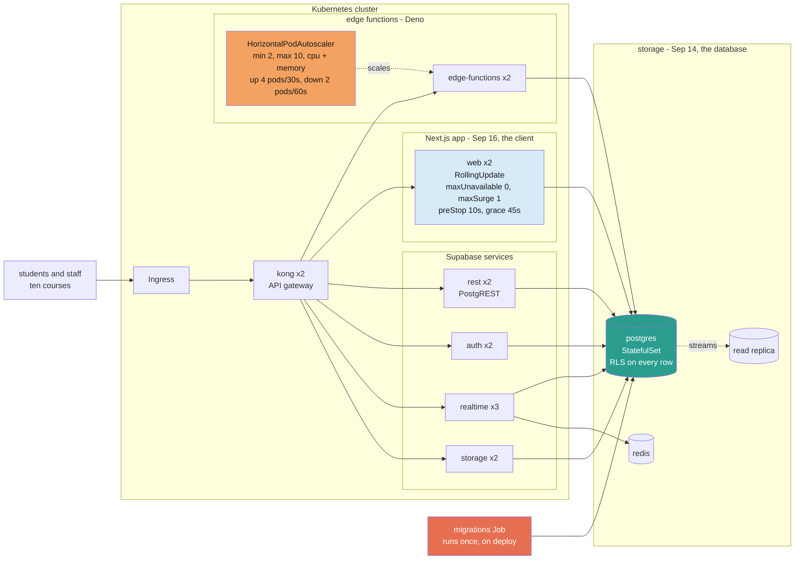
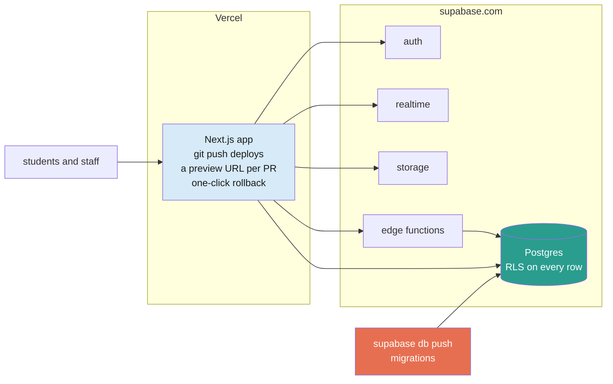
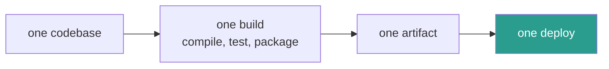

import RevealJS, { Slide } from '@site/src/components/RevealJS';
import Img from '@site/src/components/Img';

<RevealJS transition="slide">

{/* ============================================ */}
{/* COVER IMAGE */}
{/* ============================================ */}

<Slide>

  

<aside className="notes">
**Session:** Thu Sep 17 · Architecture IV: Deployment · 65 min

**Structure, in order: vote on a real incident, find out why they survived it, learn what a release even is, break something, then fix the breaking.**
- Opening vote, by show of hands (~4 min) and its reveal (~3 min). The Alaska Airlines runway incident.
- Arc 1, Down Paths And What They Cost (~14 min, four slides, including a 3-minute pair beat). What went right at Alaska, Knight Capital as the other end, the three prices, and seven real changes to sort into those three boxes.
- **The architecture recap (~6 min, two slides).** The real cluster as a deployment diagram, then the same application on Vercel and supabase.com, and the claim that makes this Architecture IV.
- Arc 2, What Releasing Even Is (~9 min, three slides). Releases, environments, promotion, dogfooding, and the four parts of this system that reach users at four different speeds.
- Discussion 1, the migration that looks fine (~7 min working, ~4 min debrief).
- Arc 3, The Four-Step Migration (~8 min). The answer to Discussion 1.
- The Down Path (~4 min). No activity.
- **Where a defect gets caught, and what's coming (~6 min).** The detection stack, then Sep 23, Sep 24 and Oct 1 named in one line each.
- Takeaways and up next (~4 min).

**The spine:** every change needs a down path, and its price is decided when you build the thing, not at 4pm when you need it. Alaska had one that cost something. Knight had none. The second half of the session is techniques for buying yourself a cheap one before you need it.

**This is Architecture IV, and the claim that earns the title is on the recap slide.** s01, s03 and s04 each described the system standing still. None of them said anything about what the parts do while they are changing, and it turns out they change at four different speeds. That is an architectural property rather than a process one, which is why deployment is an architecture session here and not a tooling session.

**The honest trade, and it is the most interesting thing you will say today.** The decisions that make this architecture good are the same decisions that make releasing into it hard. The database being the application means the logic lives where you cannot put a flag on it. Authorization being a predicate on rows means a policy change is a schema change. The browser holding a live cache means the slowest client is one you do not control. Say that on the recap slide and let it sit.

**Treat the marks below as a floor rather than a script.** Several of these slides can be delivered much faster than they are written. If you are ahead, the places worth spending it are the report-out on "Which of These Can You Take Back?" and the detection-stack slide, in that order.

**What this session deliberately does not cover, and where it went.** Feature flags, dark launch, ramps, continuous delivery versus continuous deployment, errors per exposed user, and the Knight Capital deployment failure all moved to Sep 23, which is the session whose stated topics they are. Trying to carry them here made a 75-minute session. Say once, at the objectives slide, that they are scheduled rather than skipped.

**Assume no prerequisites, because there are none.** Most of this room has never deployed anything, never seen a staging environment, never used a feature flag, and has no reason to know what "release" means for software that lives on a server. Arc 1 is six slides and fifteen minutes for exactly that reason, and every one of those minutes is new material for most of the room. If you find yourself using a term that has not been defined on a slide, you have found a bug in the deck.

**Narrative spine:** you do not get to stop the world. Ten courses are mid-semester on this system, and every change you ship lands under people who are already using it. Deploy and release are separate events, and everything today is about keeping them separate on purpose.

**Interaction is front-loaded and frequent, which is the change from s04.** A live vote at minute two, a three-minute sorting exercise at minute twenty-one, two shows of hands in the twenties, the main pair activity at minute thirty-four, and a predict-before-reveal at minute forty-five. The last eight minutes are taught, so if the room runs long, what gets compressed is a conclusion rather than an exercise.

**Three show-of-hands beats are written into the notes and cost twenty seconds each.** They are not optional color. In a room with no background they are how you find out whether the last three minutes landed. They are marked in the notes of the slides they belong to.

**Three design rules for the activities in this session.**
1. *Ran out of time.* The session is budgeted at 48 minutes in a 65-minute room. Nothing has to be rushed and the pair block can run long without costing anything.
2. *Vocabulary that had not been taught.* The opening vote needs no vocabulary at all, which is why it is a story about aeroplanes. Discussion 1 now sits after the component-speeds slide rather than cold at the top, so its bottom row is four minutes old when they need it.
3. *Instructions were not clear enough.* The vote and the pair activity each ask exactly one question, and print the time, the deliverable and the report-out before anybody starts.

**The vote opens the session, and that is deliberate.** It sets the framing, it requires nothing, and it produces a split you can teach off. The cost is latecomers: people arriving three minutes in miss it. That is a much cheaper loss than missing a pair activity, which is part of why the vote goes first and the pairs go later.

**No technology, on purpose.** It is a show of hands with fingers on a count of three, so there is nothing to set up, nothing to fail, and no minute spent watching people find a link.

**Everything on these slides is real.** `gradebook-what-if` and `discord-student-join` are actual course flags in `lib/courseFeatures.ts`, Sentry is actually wired into this app, and the what-if path really does handle `score_override` and `score` nullability. The incidents themselves are invented. Say that once, at the top of Discussion 2, so nobody goes looking for the outage in Sentry.

**Keep it about this system rather than about industry.** Everything on these slides is Pawtograder: its database, its clients, its migrations, and the assignment due on the 24th. This is not a survey of how large companies deploy, and the two outside stories are here because they are the clearest available examples of having a down path and not having one.

**Run sheet for 65 minutes.**

| Mark | What should be happening |
|---|---|
| 0:00 | Reminders. Bids close tonight |
| 0:02 | **Show of hands.** Alaska Airlines |
| 0:06 | The reveal. C in twenty minutes, B in five hours |
| 0:09 | Title and objectives. Name what moved to Sep 23 |
| 0:12 | Arc 1. What went right, then Knight, then the three prices |
| 0:21 | **Pair beat**, 3 min. Blast radius on their own migration |
| 0:26 | **The architecture recap.** Cluster, then managed, then the trade |
| 0:29 | Arc 2, three slides. **Hands up** on two of them |
| 0:37 | **Discussion 1**: the migration that looks fine (7 min, pairs) |
| 0:44 | Debrief. Tie it back to the opening vote |
| 0:48 | Arc 3. The four-step pattern, and the rename staged |
| 0:56 | The down path. Callback to the sorting exercise |
| 1:00 | Where a defect gets caught, then what's coming |
| 1:06 | Takeaways, up next |

**These timings total more than 65 and that is deliberate.** Several of these slides can be delivered far faster than they are written, and which ones depends on the room. The marks are a running order, not a schedule. What actually has to happen: the poll and its reveal, the three-prices slide, the pair beat, the discussion and its debrief, the four-step diagram, the down path, and the detection stack. Everything else can be a sentence.

**If you are genuinely short at 0:48**, drop "The Rename, Staged" entirely, since the four-step diagram carries the pattern without it. Do not buy time out of the pair beat or the discussion.

**Never cut:** the vote's reveal, "What Went Right", the three-prices slide, the recap slide's closing trade, Discussion 1's debrief, the down-path slide (deliverable 6, due in seven days), and the detection stack.

**Cheapest cuts, in order:** "The Rename, Staged" in full, then the second hands-up on the environments slide, then the takeaways compressed to the fragment alone.

**One borrowing from CS 3100 worth knowing about.** The three-prices slide is L35's fail-safe, fail-operational and fail-dangerous under different names, and the notes there tell you to say so in one sentence for the students who took it. It is not a prerequisite and the slide stands alone.

**Two forward pointers, and where they live.** Sep 23 is the whole session on software process, flags and monitoring, so the objectives slide names it explicitly. Oct 1 is Operations, where logs, metrics and traces come from, and the Up Next slide points at it. Say both out loud. A student who knows a topic is coming stops worrying that they missed it.

**Preparation:** none beyond reading the two cards closely enough to run the arithmetic in your head while circulating. There is no live demo in this session.

> **Transition:** Reminders, then straight into a decision.
</aside>

</Slide>


{/* ============================================ */}
{/* REMINDERS                                    */}
{/* ============================================ */}

<Slide>

## Reminders

<div style={{fontSize: '0.8em', textAlign: 'left'}}>

- **Office hours:** on Discord, or by appointment
- **DUE TONIGHT, Thu Sep 17:** Project Bids
- **TODAY:** the `cs4535-first-ticket` pool is published
- **DUE Thu Sep 24:** Onboarding: Gradebook Column Groups

</div>

<aside className="notes">
Ninety seconds, and no questions about specific assignments. Discord or clinic.

**Bids close tonight and this is the last session before they do.** Anyone still undecided should talk to you on the way out rather than at 23:00.

**The pool publishes today**, built out of what the class filed and triaged on Wednesday. Worth ten seconds: what they wrote on Tuesday night became somebody else's October, and they cannot claim their own.

> **Transition:** Now. Before I tell you anything, get your phone out.
</aside>

</Slide>
{/* ============================================ */}
{/* OPENING VOTE: ALASKA AIRLINES (~4 min)       */}
{/* Show of hands. No technology.                */}
{/* ============================================ */}

<Slide>

## What Do You Do in the Next 20 Minutes?

<div style={{fontSize: '0.54em', textAlign: 'left', marginTop: '0.2em'}}>

**January 2023.** Two Alaska Airlines jets take off underpowered and scrape the runway on rotation.

A software update to the tool that computes aircraft weight is reporting planes **20,000 to 30,000 lb lighter** than they are, so the crews are setting thrust and speed for a plane that doesn't exist. The update had been **tested for weeks**. Flights are departing right now.

</div>

<div style={{fontSize: '0.56em', textAlign: 'left', marginTop: '0.6em'}}>

**A.** Ground the fleet until it's fixed

**B.** Push a fix to the weight tool

**C.** Turn off the automatic weight feed; crews request weights by hand

**D.** Write a load test and re-run the whole suite

</div>


<aside className="notes">
**Run it as a simultaneous show of hands, and the simultaneity is the whole design.** If you call the options one at a time and count hands for each, the first count anchors the room and you measure conformity rather than opinion. Fingers on a count of three means everybody commits before anybody sees anyone else.

**The sequence, and it takes about ninety seconds.** Read the scenario. Say "pick one, don't put a hand up yet" and give them fifteen seconds of quiet, which is what makes the vote real. Then count down from three and look at the room. Say the distribution out loud so it exists as a fact: four of you said B, six said C, and so on.

**Do not preview the answer, do not hint, and do not explain the options.** The value is the split, and the split is interesting because all four options are defensible and people pick different ones for good reasons.

**Then ask two people who voted differently to say why, in one sentence each, and do not adjudicate.** The next slide adjudicates. If the room splits nearly evenly between B and C, that is the ideal outcome and worth naming as such.

**Why this story and not a software one:** nobody in this room has deployed anything, but everybody understands a plane taking off too slowly. The judgment being exercised is exactly the judgment this session is about, and it requires no vocabulary at all. That is the point of opening with it.

**Expect B to do well**, because fixing the bug is what engineers are trained to want. Expect D to do well among the careful. Both are right answers to a different question than the one asked, and the next slide is where that lands.

**If almost everybody picks C**, do not treat that as the exercise failing. Ask the room what it costs to be wrong about C, and the discussion still gets where it needs to go.

**A note on why this is hands rather than the in-app poll.** The polls feature does not currently surface results to the room, which is the only part of a poll that matters for teaching. That is worth a ticket, and it is a genuinely good example of a feature that works in the sense that it accepts input and fails in the sense that nobody can use it. Mention it in one sentence if you want the dogfooding point; skip it if the room is cold.

> **Transition:** Here's what they actually did.
</aside>

</Slide>


<Slide>

## They Turned It Off

<div style={{fontSize: '0.58em', textAlign: 'left', marginTop: '0.3em'}}>

<div style={{backgroundColor: 'rgba(42,157,143,0.12)', padding: '0.55em', borderRadius: '8px', marginBottom: '0.4em'}}>

**C, in 20 minutes.** Operations switched off the automatic uplink. Crews requested weights manually. *"We didn't have the bug anymore."*

</div>

<div style={{backgroundColor: 'rgba(100,150,255,0.12)', padding: '0.55em', borderRadius: '8px', marginBottom: '0.4em'}}>

**B, five hours later.** The software was permanently repaired that afternoon.

</div>

<div style={{backgroundColor: 'rgba(255,180,0,0.15)', padding: '0.55em', borderRadius: '8px'}}>

**D, afterwards.** The update *had* been tested for weeks. It only failed when many aircraft used the system at once, so a high-demand test was written after the fact.

</div>

</div>

<p className="fragment" style={{fontSize: '0.7em', marginTop: '0.7em', fontWeight: 'bold', color: '#e76f51'}}>
The best long-term answer was the wrong 20-minute answer. Today is about having a 20-minute answer.
</p>

<aside className="notes">
**Go in the order C, B, D, because that is the order of the clock**, and the clock is the argument.

**C is the one to dwell on.** They did not fix the software to stop the bleeding. They turned off the thing that was wrong and accepted a slower manual process for the afternoon. Twenty minutes, and the planes were safe. That is rollback as a first response, in an industry where nobody is casual about procedure.

**B is what everybody in the room wanted to do**, and it was correct, and it took five hours. Five hours is a lot of departures. B was not wrong. B and C answer different questions, and only one of those questions can be answered in twenty minutes.

**D is the sharpest detail in the whole story and it is worth slowing down for.** They tested it. For weeks. Testing did not fail because they were sloppy, it failed because the bug needed concurrency to appear and their tests ran one aircraft at a time. Anybody who leaves this session believing that enough testing removes the need for a fast undo has missed the thing the story is actually about. And note what they did afterwards: they wrote the load test. The long-term fix was real, it just could not be the first move.

**Name the two ideas now, because the rest of the session is both of them:**
1. Catching problems earlier is worth a great deal, and it has a ceiling. Some bugs only exist in production conditions.
2. So you also need to be able to make a change stop mattering, quickly, without fixing it.

**Say that the second one is what today is about**, and that the first one is Sep 23. That division is real and it is worth stating so people know nothing is being skipped.

**Source, if anyone asks:** Anchorage Daily News, Feb 2023, on the January incident. The quotes are from their reporting.

> **Transition:** That's the shape of today. Here's what you'll be able to do with it.
</aside>

</Slide>


{/* ============================================ */}
{/* TITLE                                        */}
{/* ============================================ */}

<Slide>

# CS 4535: Software Design & Delivery

## Architecture IV: Deployment

<p style={{marginTop: '2em', fontSize: '0.8em', color: '#666'}}>
  &copy;2026 Jonathan Bell, CC-BY-SA
</p>

<aside className="notes">
**Framing, in one sentence:** ten courses are using this system right now, nobody gets to stop the world while you ship, and the whole discipline of releasing safely is what you do about that.

**Connect it to them and not to industry.** Every example today is this codebase, and the migration they hand in on the 24th is the thing all of it is for. This is not a survey of how large companies deploy.

> **Transition:** Four things you'll be able to do.
</aside>

</Slide>


{/* ============================================ */}
{/* LEARNING OBJECTIVES                          */}
{/* ============================================ */}

<Slide>

## Learning Objectives

<p style={{fontSize: '0.85em', textAlign: 'left'}}>
After this session, you'll be able to:
</p>

<ol style={{fontSize: '0.74em', textAlign: 'left'}}>
  <li>Name the down path for a change, and say what it costs to take</li>
  <li>Say what a release is, and where code lives before users get it</li>
  <li>Say why a schema change can't be made atomic against a running client</li>
  <li>Apply the four-step pattern for a safe database migration</li>
  <li>Say what your change does to data that was written while it was live</li>
</ol>

<aside className="notes">
**This session owns one of the three learning objectives from the CS 4530 continuous development module, and it is worth knowing which.**

- *Quality assurance on software as and after it is delivered* is today. Environments, promotion, dogfooding, staged migrations, the down path.
- *Catching errors sooner in the lifecycle* is Sep 23. Pipelines, CI at scale, what automation buys you.
- *Continuous delivery compared with test-driven development* is Sep 23 as well, pointing at testing on Sep 24.

**Say that split out loud in one sentence**, because the Alaska story raised both halves and students should know the other half is scheduled rather than skipped.

**Time allocation:**
- The vote and its reveal (~7 min). The framing for everything else
- Arc 1, down paths and what they cost (~14 min, including a 3-minute pair beat). Objective 1
- Arc 2, the basics (~9 min). Objective 2
- Discussion 1 and its debrief (~11 min). Objective 3, and they derive it themselves
- Arc 3, the four-step pattern and the rename staged (~8 min). Objective 4
- The down path (~4 min). Objective 5, graded on the 24th

**Objective 1 is new and it is the spine.** Everything else in the session is either an example of a down path or a technique for buying yourself a cheaper one. If a student can look at a change and say "if this goes wrong, here is what I reach for and here is what it costs me", the session worked.

**Objective 4 is the one that is graded this month.** The migration due on the 24th has to run against ten courses that already have gradebooks, and the backfill is the whole assignment.

**Objective 5 is the one students most reliably skip**, because a down migration that drops a table looks complete and passes CI. It is four sentences of thinking and it is where the marks are. Arc 1's pair beat is a rehearsal for it.

**The fragment is the accommodation and it is worth ten seconds.** Nobody in this room is expected to have deployed anything. This session builds every term from nothing, on purpose, and saying so up front stops the people with no background from spending the next fifteen minutes worrying that they are behind.

> **Transition:** Before the vocabulary, one more thing about that vote.
</aside>

</Slide>

{/* ============================================ */}
{/* ARC 1: DOWN PATHS AND WHAT THEY COST (~13m)  */}
{/* The spine of the session. Alaska had one,    */}
{/* Knight did not, and the price is chosen at   */}
{/* build time rather than at 4pm.               */}
{/* ============================================ */}

<Slide>

## What Went Right

<div style={{fontSize: '0.62em', textAlign: 'left', marginTop: '0.3em'}}>

The bug was real, it was in production, and it had been through weeks of testing. None of that is the interesting part.

</div>

<div style={{backgroundColor: 'rgba(42,157,143,0.12)', padding: '0.7em', borderRadius: '8px', fontSize: '0.64em', textAlign: 'left', marginTop: '0.7em'}}>

**There was a way to run the airline without that software.**

Crews could request weights by hand. Somebody had built that path, it still worked, and operations could reach for it in twenty minutes.

</div>

<p className="fragment" style={{fontSize: '0.68em', marginTop: '0.8em', fontWeight: 'bold', color: '#e76f51'}}>
They didn't need to fix the bug. They needed to make it stop mattering.
</p>

<aside className="notes">
**This is the slide the whole session hangs on, so do not rush it.** The vote was about what you do. This slide is about what makes that answer *available*. Twenty minutes was only possible because somebody, years earlier, had kept a manual path alive.

**Make the cost visible rather than pretending it was free.** Manual weight requests are slower. They add workload to dispatchers and crews in the middle of an operating day. They probably delayed departures. That path was not free and it was not pleasant, and it was sitting there anyway, and it saved them.

**The fragment is the reframe and it is worth saying twice.** Engineers hear "production bug" and reach for "fix the bug." The move that actually worked was to make the broken thing irrelevant for the afternoon. Fixing came later, unhurried, by people who were not panicking.

**Ask the room the question rather than asserting it:** who built the manual process, and when? Nobody knows, and that is the point. It was built long before it was needed, by somebody who was not having an emergency.

**Do not say the word rollback yet.** Two slides from now they will see what it looks like when this path is missing, and the vocabulary lands much harder after the contrast than before it.

> **Transition:** Here's the same morning at a company that didn't have one.
</aside>

</Slide>

<Slide>

## 45 Minutes, $460 Million

<div style={{fontSize: '0.54em', textAlign: 'left', marginTop: '0.2em'}}>

**Knight Capital, August 1 2012.** New trading code deployed to eight servers.

</div>

<div style={{fontSize: '0.52em', textAlign: 'left', marginTop: '0.4em'}}>

- Seven took the new code. The eighth **failed silently**.
- The new code **reused an old feature flag**. On seven servers it meant the new logic. On the eighth it woke `Power Peg`, dead test code left in production since 2003.
- Market opened. **45 minutes.** 4 million executions, 154 stocks, 397 million shares.
- Roughly **$460 million**. The firm never recovered.

</div>

<p className="fragment" style={{fontSize: '0.66em', marginTop: '0.7em', fontWeight: 'bold', color: '#e76f51'}}>
There was no manual mode. No switch. No way to run the business with that software turned off. So it ran for 45 minutes.
</p>

<aside className="notes">
**Tell it in ninety seconds and let the fragment do the work.** Do not moralize, and do not use it to frighten anybody. It is here as the other end of a spectrum, and the spectrum is the next slide.

**Three details worth naming because each one comes back later today:**
1. **Seven of eight is not "deployed".** It is two versions of your system running at once with no alarm saying so. That is version skew, and it is the same shape as four hundred browser tabs, which is where this session ends up.
2. **A reused flag is a live grenade.** The name had meant something else years earlier and nobody had deleted the code behind it. Dead code behind a live switch is waiting rather than dormant.
3. **Forty-five minutes.** Alaska took twenty minutes to make their problem stop mattering. Knight took forty-five to stop at all, and by then it was over.

**The comparison is the teaching, so put the two numbers next to each other out loud.** Twenty minutes and a slower afternoon. Forty-five minutes and the end of a company. Neither skill nor luck explains the gap. One of them had a down path and the other did not.

**Primary source if anyone asks:** the SEC's administrative proceeding against Knight Capital Americas is public, and the firm settled for twelve million over the market access rule.

> **Transition:** So down paths have prices, and there are roughly three of them.
</aside>

</Slide>

<Slide>

## Three Prices for a Down Path

<div style={{fontSize: '0.58em', textAlign: 'left', marginTop: '0.2em'}}>

<div style={{backgroundColor: 'rgba(42,157,143,0.12)', padding: '0.5em', borderRadius: '8px', marginBottom: '0.35em'}}>

**Free.** Flip a switch, everything else keeps working. Seconds. *A feature flag.*

</div>

<div style={{backgroundColor: 'rgba(255,180,0,0.15)', padding: '0.5em', borderRadius: '8px', marginBottom: '0.35em'}}>

**Not free, but survivable.** Degraded mode. Slower, more manual, somebody's day is worse, and the business keeps running. *Alaska's manual weights.*

</div>

<div style={{backgroundColor: 'rgba(231,111,81,0.15)', padding: '0.5em', borderRadius: '8px'}}>

**There isn't one.** Nothing to reach for. You fix it while it burns. *Knight Capital. CrowdStrike, where the machines couldn't boot to receive the rollback.*

</div>

</div>

<p className="fragment" style={{fontSize: '0.68em', marginTop: '0.7em', fontWeight: 'bold', color: '#e76f51'}}>
You don't pick which one you have at 4pm. You picked it when you built the thing.
</p>

<aside className="notes">
**If you took PDI2 you have seen this with different names, and it is worth saying so in one sentence.** L35 called these fail-safe, fail-operational and fail-dangerous. Fail-safe is do nothing harmful. Fail-operational is continue in degraded mode, which is what Alaska did. Fail-dangerous is keep going and do not tell anybody, which is what MCAS did and what Knight's eighth server did. Same three boxes, and today they are about releases rather than about devices.

**The middle box is the one students undervalue and it is the reason for this slide.** A down path that costs something still counts. People skip building one because it would be ugly, or slow, or manual, and then at 4pm they have nothing. Ugly and available beats elegant and imaginary.

**CrowdStrike is the sharpest version of the bottom box** and most of the room will remember it. July 2024, a content update to a kernel driver, 8.5 million Windows machines in a boot loop, hospitals and airlines and 911 dispatch. The rollback existed. The machines could not boot far enough to receive it. A down path you cannot reach is not a down path.

**The fragment is the sentence that connects the story half of the session to the engineering half.** Every technique in the second half of today is a way of buying yourself the top or middle box before you need it.

**If somebody argues the free box is always achievable:** it is not, and the last third of today is the counterexample. A schema change has no flag.

> **Transition:** So how do you work out, in advance, how much down path you need?
</aside>

</Slide>

<Slide>

## Which of These Can You Take Back?

<div style={{fontSize: '0.5em', textAlign: 'left', marginTop: '0.2em'}}>

| The change | Undo it? |
|---|---|
| Add a nullable column to `gradebook_columns` | |
| Create the `gradebook_column_groups` table | |
| Turn a feature on for one course | |
| Backfill: set a group on every column in ten courses | |
| Drop a column | |
| Rename a column | |
| Loosen an RLS policy for an hour | |

</div>

<div style={{backgroundColor: 'rgba(231,111,81,0.15)', padding: '0.5em', borderRadius: '8px', fontSize: '0.58em', textAlign: 'left', marginTop: '0.5em'}}>

**3 minutes, in pairs.** Put each one in a box from the last slide: **free · costs something · there isn't one.**

I'll take the ones you disagreed about.

</div>

<aside className="notes">
**This asks them to recognize, not to design, and the distinction is the whole point.** Asking what their down path would be for a failure mode of their own migration is a design question. It needs judgment they have not been given yet, and it produces silence. Sorting seven named changes into three boxes they saw ninety seconds ago is something every pair can do.

**The answers, and the interesting ones are the bottom four:**
- **Add a nullable column.** Free. Nothing reads it, so dropping it again costs nothing. This is step 1 of the pattern they are about to see, and the reason it is step 1.
- **Create a table.** Free, on the same reasoning.
- **Turn a feature on for one course.** Free. Flip it back, seconds.
- **Backfill ten courses.** Costs something. You can run a corrected backfill, but only if you still know what was there before. If you overwrote a value rather than filling in a blank, it is gone.
- **Drop a column.** There isn't one. The data left with the column. A backup is a different kind of down path with a different price, and if somebody raises it, that is a good answer worth crediting.
- **Rename a column.** Costs something, and the cost is not in the database. The SQL reverses in one statement. What it cannot reverse is the fifteen minutes when every open tab was wrong, which is the exercise they are about to do.
- **Loosen an RLS policy for an hour.** There isn't one, and this is the sharpest row on the slide. You can tighten the policy back. You cannot un-show somebody a grade. That is Monday's session arriving from a new direction, and it is worth ten seconds on its own.

**Take the disagreements rather than going row by row.** Ask which rows pairs split on. It will be the backfill and the rename, and both splits are productive: the backfill because it depends on whether you overwrote or filled in, and the rename because people disagree about whether "the SQL reverses" counts as reversible.

**Correct one misconception explicitly if it comes up, because it matters for their assignment and it is easy to get wrong.** A migration that fails partway does not leave half of itself applied. Postgres has transactional DDL and the migration runner wraps each file, so a failed migration rolls back and you are where you started. The exception is a statement that cannot run inside a transaction, and there are three of those in this repository using `CREATE INDEX CONCURRENTLY`. So within one migration you get atomicity for free. Between one migration and the next, and between a migration and the deploy that reads it, you get none, which is exactly where the next arc lives.

**The punchline, and say it as the transition:** the first three rows are the shape you want, and the four-step pattern is a technique for turning the bottom rows into rows that look like the top ones.

> **Transition:** Right. Let's define the words, then look at the system.
</aside>

</Slide>


{/* ============================================ */}
{/* ARC 1: WHAT RELEASING EVEN IS (~15 min)      */}
{/* Assumes no prerequisites. Builds every term  */}
{/* Discussion 2 needs, from nothing.            */}
{/* ============================================ */}

<Slide>

## What Is a Release?

<div style={{display: 'grid', gridTemplateColumns: '1fr 1fr', gap: '1em', fontSize: '0.6em', marginTop: '0.5em'}}>

<div style={{backgroundColor: 'rgba(255,180,0,0.15)', padding: '0.7em', borderRadius: '8px'}}>

**Software as a thing**

A version number. A disc. A date. You built it, tested it, shipped it, and then you could not change it.

A bug waited for the next one.

</div>

<div style={{backgroundColor: 'rgba(42,157,143,0.12)', padding: '0.7em', borderRadius: '8px'}}>

**Software as a website**

No version number the user can see. No disc. Users get whatever is on the server the moment they load the page.

You can change it in a minute. So you do.

</div>

</div>

<p className="fragment" style={{fontSize: '0.72em', marginTop: '0.9em', fontWeight: 'bold', color: '#e76f51'}}>
A release is the moment a user's experience changes. Everything today is about controlling that moment.
</p>

<aside className="notes">
**Start here, and do not skip it because it sounds obvious.** It is not obvious to anybody who has only ever written coursework. Their entire experience of "shipping" is pushing to a repository that a grader reads later, and nothing in that experience contains a user whose Tuesday you can ruin.

**The left box is worth sixty seconds of history** because it explains why all the vocabulary exists. Release engineering as a discipline was invented when getting it wrong meant pressing a million CDs. Version numbers, release candidates, code freezes, long QA cycles: all of that is a response to a change you could not take back.

**The right box is the world they live in and have never had named.** There is no version of Pawtograder. There is whatever is running right now. If a student asks what version they are using, the honest answer is "whatever I deployed most recently," and that should feel slightly alarming.

**The fragment is the definition to write on the board and keep.** Not "a release is a deploy," not "a release is a tag." A release is the moment a user's experience changes. Defining it that way is what makes the next slide possible, because it separates the moment from the mechanism.

**Hands up, twenty seconds, and do it here:** who has ever shipped something that a stranger then used? Not coursework, not a demo. Something a person you had never met relied on. In this room that will be a small number of hands, and both halves of the answer are useful: the people with hands up have a reference point for the next ten minutes, and everybody else now knows they are in the majority rather than behind.

**Do not let this become a history lecture.** Two minutes. The payoff is the fragment.

> **Transition:** So if a release is a moment, where does the code live before it?
</aside>

</Slide>


<Slide>

## Where Code Lives Before Users See It


<div style={{fontSize: '0.6em', textAlign: 'left', marginTop: '0.5em'}}>

**Promotion** is moving the *same build* forward, not rebuilding it. What you tested is what ships.

**Dogfooding** is using your own product. This course runs on Pawtograder, so you are your own first users.

</div>

<p className="fragment" style={{fontSize: '0.68em', marginTop: '0.6em', fontWeight: 'bold', color: '#e76f51'}}>
Your migration has to survive the right-hand box. That's what the rest of today is about.
</p>

<aside className="notes">
**Nobody in this room has used a staging environment and most have not heard the word.** Define all three, slowly, and use the seeded local instance they already built in week one as the anchor for the left box, because that one they do know.

**The package riding both arrows is the whole diagram.** It is the same package in both positions, drawn identically on purpose. If somebody notices that before you say it, let them say it.

**Production is the one to make concrete rather than abstract.** Ten courses. Real students. Real grades that count toward real degrees. That is a plain description of the system they are merging into in eleven days, offered as fact rather than as a warning.

**Promotion is the word worth dwelling on**, because the intuitive alternative is wrong in an interesting way. You do not rebuild for production. You take the artifact that passed on staging and move it forward unchanged, because a rebuild is a different artifact and everything you learned on staging was about the other one. If someone asks why that matters, the answer is that it is the only way "we tested it" means anything.

**Dogfooding lands better here than anywhere else in the deck.** They are students in a course that runs on the product they are modifying, which is an unusually pure case. If the gradebook breaks, their grades are in it. Say that plainly once and move on. It does not need a moral.

**The fragment is the payoff.** Point at the right-hand box. Everything after this slide is about getting a change into that box without hurting anybody in it.

**If you want a second hands-up here and have the time:** who has ever used software before it was finished, knowingly? Betas, early access, an insider build. Most of the room will have, which makes dogfooding land as something they have been on the receiving end of rather than a new practice.

> **Transition:** So that is this system. It is not the only way to build one.
</aside>

</Slide>

{/* ============================================ */}
{/* ARCHITECTURE RECAP (~3 min)                  */}
{/* Closes s01/s03/s04 and opens the fourth cut. */}
{/* ============================================ */}

<Slide>

## The System You've Spent Two Weeks Inside

<div style={{fontSize: '0.38em'}}>



</div>

<p className="fragment" style={{fontSize: '0.6em', marginTop: '0.2em', fontWeight: 'bold', color: '#e76f51'}}>
Three sessions, three snapshots, all of them the system standing still. Today is the same picture while it's changing.
</p>

<aside className="notes">
**Two minutes on the diagram, thirty seconds on the fragment, and spend longer here if you are ahead.** They have seen every box. The job is to put them back in one frame so the rest of the session has somewhere to attach, and to give you something concrete to point at when you talk about rollouts.

**Walk it in the order they learned it.** Sep 9 was the map, which is the whole picture. Sep 14 is the teal box at the bottom, a predicate on every row. Sep 16 is the pale blue box, `web`, the Next.js pods serving the client that then talks to Postgres through Kong.

**Things worth talking to, in rough order of how much they buy you:**

- **`maxUnavailable: 0, maxSurge: 1` on `web`.** A staged rollout in two numbers. Never drop below the current replica count, and bring up at most one extra pod at a time. With two replicas that means start a third pod, wait for it to pass readiness, retire an old one, repeat. There is a window, by design, where both versions serve live traffic, which is the app-server row of the table two slides from now.
- **`preStopSleepSeconds: 10` and `terminationGracePeriodSeconds: 45`.** A pod being retired stops taking new work, waits, then gets killed. That is what makes "no downtime" true rather than aspirational, and nobody thinks about it until a deploy drops requests.
- **The HPA on the edge functions**, in amber. Between two and ten pods, driven by CPU and memory, scaling up four pods every thirty seconds and down two every sixty. Note the asymmetry and say why: add capacity faster than you remove it, because being slow to scale up costs users and being slow to scale down costs money.
- **There is a good war story in the chart comments if you want it.** The memory target was set at 100%, and the HPA controller applies a 10% tolerance, so the real behavior was a dead band from 90 to 110%. The fleet sat at max replicas permanently: it could not scale down, which needs under 90, and under load at 109% it still would not scale up, which needs over 110. Both directions wedged by the same band. The fix was to move the target to 80. A control loop that looks configured and is doing nothing.
- **`realtime` runs three replicas** where most tiers run two, which is a concrete instance of sizing a tier to its own load rather than uniformly.
- **The migrations Job, in red.** It runs once per deploy, before the new pods take traffic. One shot, everybody, no ramp, no percentage. That is the row with no safety mechanism available, and it is why the next arc exists.

**Then the fragment, which is why this is Architecture IV rather than a recap.** Every one of those sessions described the system at rest. None of them said what the parts do while they are changing, and the diagram now shows they do not change together: pods roll one at a time, the HPA changes the count underneath you, and the migrations Job changes the database for everybody at once.

**Say the honest trade out loud, because it is the most interesting thing on this slide.** The choices that make this architecture good are the same ones that make releasing into it hard. The database being the application means the logic lives somewhere you cannot put a feature flag on. Authorization being a predicate on rows means a policy change is a schema change. The browser holding a live cache means your slowest client is one you do not control. None of that is a mistake. It is a trade, and today is the bill.

**If the room is with you and you have time, the best question to ask here is:** which box can you change without anybody noticing, and which one changes for everybody at once? They should be able to point at `web` and at Postgres.

> **Transition:** Before we go on: you do not need most of that.
</aside>

</Slide>

<Slide>

## You Don't Have to Own Any of That

<div style={{fontSize: '0.46em'}}>



</div>

<p className="fragment" style={{fontSize: '0.58em', marginTop: '0.2em', textAlign: 'left'}}>
Same architecture. The pods, the autoscaler and the rolling deploy all still exist. <strong>You just aren't the one responsible for them</strong>, and what you get back is a rollout story that's already good: a preview URL per pull request, and rollback as a button.
</p>

<p className="fragment" style={{fontSize: '0.6em', marginTop: '0.4em', fontWeight: 'bold', color: '#e76f51'}}>
That buys you the free box for your app code. Nobody sells you the free box for your schema.
</p>

<aside className="notes">
**Put this up right after the cluster diagram and let the size difference do the talking.** Same application, same boxes, roughly a third of the picture. This is what most of them would reach for if they built this themselves, and it is a completely reasonable thing to reach for.

**Say that both of these are real for this codebase, because they are.** There is a `vercel.json` in the platform repo, and `package.json` generates types against a hosted supabase.com project. Running it this way is not hypothetical.

**Be precise about what changed, because the sloppy version of this claim is wrong.** None of it went away. Vercel is running pods behind that box, and rolling them, and scaling them. Supabase is running Postgres on a machine with a disk that can fill up. Every mechanism on the previous slide still exists and still has to work. What changed is who is responsible when it does not, and that is a genuinely different thing from it not being there.

**What you get back is the part worth wanting, so name it as a feature rather than as an absence.** Vercel gives you a preview URL per pull request, which means every PR is reviewable as a running application rather than as a diff. And rollback is a button, which in the vocabulary from twenty minutes ago is the free box, available by default, for your application code. Most teams never build that for themselves and it is most of the value of the platform.

**Then the second fragment, which is the one that matters for their assignment.** That free box covers your app code and stops exactly there. No platform sells you a free undo for a schema change, because there is not one to sell: the migration has run, the rows have changed, and every client is now talking to a database that does not match what some of them expect. Vercel rolling your app back to yesterday's build does not roll the database back to yesterday, and if anything it makes things worse, because now yesterday's code is talking to today's schema.

**That last sentence is worth saying slowly**, because it is the sharpest practical consequence in the session and it is the thing that will actually bite somebody in this room in October.

**Then the honest bit about why we do not run it that way**, in one sentence and without turning it into a lecture: cost at this size, control over student data, and wanting the whole thing reproducible for a course. It is a choice with reasons, and neither answer is the grown-up one.

**The fragment is the point of putting this slide in the deck at all.** Look at what did not go away. The migration Job is still there in red, still running once for everybody with no ramp. The browser is still a client you do not control. Authorization is still a predicate on rows, so a policy change is still a schema change. You can buy your way out of Kubernetes. You cannot buy your way out of the fact that a schema change reaches every user at once and cannot be flagged.

**Say plainly that today is not a Kubernetes session.** Nobody is being assessed on any of the last slide. It is there because it is what this system actually is, and because staged rollouts and autoscalers are easier to point at when they are on the screen. The material that matters for their migration on the 24th is identical under both diagrams.

**If somebody asks which they should use for a side project:** this one, almost always, and it is worth saying without hedging.

> **Transition:** So let's talk about how a change actually gets into either of those pictures.
</aside>

</Slide>

<Slide>

## The Other Way to Build This

<div style={{fontSize: '0.62em', textAlign: 'left', marginTop: '0.2em'}}>

A **monolith** is a system deployed as a single unit. One codebase, one build, one artifact, one deploy.

</div>

<div style={{fontSize: '0.5em', marginTop: '0.5em'}}>



</div>

<div style={{fontSize: '0.56em', textAlign: 'left', marginTop: '0.6em'}}>

**Bottlenose**, the course tool most of you used before Pawtograder, is one of these.

Fix a typo in the grading page, redeploy the whole thing. A broken test in course management blocks your grading fix. Deployment frequency is set by the slowest-moving part of the app.

</div>

<p className="fragment" style={{fontSize: '0.64em', marginTop: '0.5em', fontWeight: 'bold', color: '#e76f51'}}>
And everything in it arrives at the same instant. There is exactly one thing to roll back.
</p>

<aside className="notes">
**Assume this is new material.** Most students have used a monolith without ever hearing the word defined this way, and only a minority will have met it in a prior course. Treat it as new rather than as a callback, and do not ask who has seen it before.

**Open with the reassuring version, because "monolith" sounds like an insult and is not one.** Every Java project they have written is a monolith. Every Python script. The word only means anything in contrast to something that is not one, and plenty of large successful systems are monoliths on purpose.

**Bottlenose is the example to use because they lived in it.** They submitted to it, got grades from it, and were annoyed by it. Whatever they remember about using it, they were using a single deployable unit, and that shaped what its maintainers could and could not do quickly.

**Make the consequence concrete rather than abstract.** A one-line fix to how a grade displays has to go out with everything else that has been merged since the last deploy. If somebody else broke a test in an unrelated part of the app, the one-line fix waits. That is not bad engineering; it is the direct consequence of one artifact.

**The fragment is the part that matters for today, and it is the thing the next two slides are about.** A monolith has terrible deployability and exactly one release speed. Everything in it moves at once, so none of its parts can disagree with each other about what version they are. Hold that thought for ninety seconds.

**Do not let this become an argument about microservices.** It is not that debate and there is no time for it. The point is narrow: one deployable unit means one release, and that has an upside worth naming.

> **Transition:** So what did we buy by not doing that?
</aside>

</Slide>

<Slide>

## Deployability: What We Bought, and What It Cost

<div style={{display: 'grid', gridTemplateColumns: '1fr 1fr', gap: '0.8em', fontSize: '0.54em', marginTop: '0.3em'}}>

<div style={{backgroundColor: 'rgba(255,180,0,0.15)', padding: '0.7em', borderRadius: '8px'}}>

**Bottlenose, the monolith**

*Deployability:* poor. Every deploy is all-or-nothing, and a bug anywhere blocks everything.

*Release speeds:* **one.** Nothing in it can disagree with anything else in it about what version it is.

</div>

<div style={{backgroundColor: 'rgba(42,157,143,0.12)', padding: '0.7em', borderRadius: '8px'}}>

**Pawtograder**

*Deployability:* good. Ship the web tier without touching edge functions. Scale the functions without touching the database.

*Release speeds:* **four**, fast to slow: database, edge functions, app server, browser.

</div>

</div>

<p className="fragment" style={{fontSize: '0.64em', marginTop: '0.7em', fontWeight: 'bold', color: '#e76f51'}}>
Deployability is a quality attribute you trade for, like performance. We bought it, and we paid in version skew and operational complexity.
</p>

<aside className="notes">
**Define the word properly, because it is the one they should take away from this pair of slides.** Deployability is how easily you can release a change to production. High deployability means independent deploys, a small blast radius, and a quick rollback. Low deployability means all-or-nothing releases and coordination across teams before anything ships.

**It is a quality attribute, which is a category worth naming even in passing.** Performance, security, testability, scalability, deployability. These are the things an architecture is good and bad at, they trade against each other, and you do not get to maximize all of them. Most of the room will not have this vocabulary, so define it plainly and move.

**The trade in this specific case, and this is the honest version.** Pawtograder can ship the Next.js app without redeploying anything else, and can scale edge functions independently, which the cluster diagram showed. That is real and valuable and it is why the architecture looks the way it does. The price is that the system now has parts that are on different versions at the same time, routinely, by design. Bottlenose never had that problem because it never had that ability.

**Say the general principle in one sentence**, because it transfers well past this course: you do not get deployability for free, you buy it with coordination problems, and the coordination problem you buy is called version skew.

**If somebody asks which is better:** neither, and the question is not well formed. For a system with four maintainers and a weekly release, the monolith's simplicity is worth more than independent deploys. Pawtograder serves ten courses across a semester with contributors who come and go, and the calculation comes out differently. The architecture follows the constraints.

**Then hand straight into the next slide**, which is the four release speeds spelled out. That table is the invoice for this slide.

> **Transition:** So here are the four.
</aside>

</Slide>


<Slide>

## Not Everything Releases at the Same Speed

<table style={{fontSize: '0.5em', marginTop: '0.2em'}}>
<thead>
<tr><th>Part</th><th>When a user gets the new version</th><th>Undo?</th></tr>
</thead>
<tbody>
<tr className="fragment"><td><strong>Database migration</strong></td><td>instantly, everyone, at once</td><td>only with another migration</td></tr>
<tr className="fragment"><td><strong>Edge function</strong></td><td>next time it's called</td><td>redeploy the old one</td></tr>
<tr className="fragment"><td><strong>App server</strong></td><td>rolling restart, 2 replicas, both live for a minute</td><td>redeploy the old image</td></tr>
<tr className="fragment"><td><strong>Browser bundle</strong></td><td><strong>when they reload.</strong> Could be never</td><td>you can't. They have it</td></tr>
</tbody>
</table>

<p className="fragment" style={{fontSize: '0.66em', marginTop: '0.8em', fontWeight: 'bold', color: '#e76f51'}}>
The database is the fastest and least reversible. The browser is the slowest and you don't control it. Every migration has to survive both ends at once.
</p>

<aside className="notes">
**This slide is the missing piece between the opening activity and the four-step pattern, and it is worth taking slowly.** They already discovered the browser row the hard way at minute two. This names it and puts it next to its three neighbors, and the fragment is what makes the next arc feel inevitable rather than fussy.

**The table builds a row at a time, so ask before you advance.** Four clicks, four rows, and the value is in the pause before each one. After the migration row, ask what the opposite extreme would be. After the app-server row, ask which one they think is slowest. Somebody will say the browser before you show it, and that is worth much more than reading it to them.

**Hands up before you reveal the last row, and this one is the best twenty seconds in the session:** who has a browser tab open right now that has been open since Monday? Most hands go up. Then: whatever code was in that tab on Monday is the code it is still running. That is the bottom row of this table, proved on their own laptops, before you have claimed anything.

**Go row by row. Four rows, four different meanings of the word "released".**
- **Migration.** One statement, and every reader in the world is now on the new schema. No ramp, no percentage, no dogfooding. This is the row with no safety mechanism available, which is why the pattern that makes it safe is the pattern you have to apply by hand.
- **Edge function.** There are a couple of hundred of these under `supabase/functions`. A caller gets whichever version is deployed when it calls, so the window is short and going back is cheap.
- **App server.** Two replicas behind a rolling restart, so for a minute the old version and the new version are both serving. That is how you deploy without downtime, and it means every server deploy briefly runs two versions of your code at once.
- **Browser.** The slowest and the only one you cannot reach. A student with the gradebook open on a second monitor since Monday is running Monday's code, and will keep running it until something makes them reload.

**Say the Knight Capital connection now if you want it to land later**, in one sentence: two versions running at once is normal and expected in the app server row, and it is precisely what destroyed a company when it happened by accident. You will come back to it.

**The fragment is the design constraint the whole session is about.** The two ends of that table pull in opposite directions. The database changes for everyone immediately and cannot be taken back; the browser changes for each person whenever they happen to reload and cannot be reached. A change that touches both has to be correct for every combination in between, and there is no moment when you can assume they match.

**If somebody asks how you would ever know what versions are out there:** you mostly cannot, for browsers. That is an honest and slightly uncomfortable answer and it is the right one. The response is to design changes that do not need that information in the first place.

> **Transition:** Here's a migration. It applied cleanly and CI is green.
</aside>

</Slide>


{/* ============================================ */}
{/* DISCUSSION 1 (~7 min working, pairs)         */}
{/* Runs before the title slide, on purpose      */}
{/* ============================================ */}

<Slide>

## It Applied Cleanly. CI Is Green.

<div style={{fontSize: '0.56em', textAlign: 'left', marginTop: '0.2em'}}>

```sql
alter table gradebook_columns
  rename column sort_order to display_order;
```

</div>

<div style={{fontSize: '0.68em', textAlign: 'left', marginTop: '0.8em'}}>

It's **2pm on a Tuesday**. Four hundred students have the gradebook open right now.

</div>

<div style={{backgroundColor: 'rgba(231,111,81,0.15)', padding: '0.7em', borderRadius: '8px', fontSize: '0.64em', textAlign: 'left', marginTop: '0.7em'}}>

**7 minutes, in pairs. What happens, and to whom?**

Write **one sentence**. I'll take one from every pair.

</div>

<aside className="notes">
**Start the clock and stop talking.** The slide says everything the exercise needs. Resist adding a hint, because the first thirty seconds of confusion is pairs working out that the question is about the browsers rather than about the SQL.

**This sits here, after the component-speeds slide, rather than cold at the top.** That is a deliberate change. Run cold it was a discovery exercise that half the room could not enter; run here it is an application of the bottom row of the table they just read, and every pair has a way in. They have also just watched Alaska turn something off in twenty minutes, so the question of what you would do about it is already live.

**What they already have that makes this answerable:** a migration is s03. `gradebook_columns` and `sort_order` are s03. That every open tab is holding a `TableController` full of rows selected with `*`, and that `groupedColumns` sorts on `sort_order`, is yesterday. And the browser row of the previous slide is four minutes old.

**Circulate and listen for who has got to the tabs.** Six pairs, seven minutes, you can hear all of them. The split you are listening for is between pairs reasoning about the database and pairs reasoning about the four hundred browsers. The second group has the session's point already.

**If a pair finishes early**, ask them the follow-up rather than giving them the answer: how would you undo it, and does undoing it fix the four hundred tabs? The honest answer is no, and that is the difference between this and the Alaska case, where turning one thing off really did stop the bleeding.

**Report-out: one sentence per pair, take all six, no commentary between them.** Write the distinct failures on the board as they come. The debrief slide is next and it is much better if the board is already half full of their words.

> **Transition:** Let's put those together.
</aside>

</Slide>


{/* ============================================ */}
{/* DEBRIEF 1 (~5 min)                           */}
{/* ============================================ */}

<Slide>

## What Actually Happens

<div style={{fontSize: '0.62em', textAlign: 'left', marginTop: '0.3em'}}>

<div style={{backgroundColor: 'rgba(42,157,143,0.12)', padding: '0.5em', borderRadius: '8px', marginBottom: '0.4em'}}>

**New page loads are fine.** Fresh client, fresh query, new column name.

</div>

<div style={{backgroundColor: 'rgba(255,180,0,0.15)', padding: '0.5em', borderRadius: '8px', marginBottom: '0.4em'}}>

**Every open tab is broken.** It holds rows with `sort_order` and sorts by a field that no longer arrives. Nobody reloads a gradebook they're already looking at.

</div>

<div style={{backgroundColor: 'rgba(100,150,255,0.12)', padding: '0.5em', borderRadius: '8px', marginBottom: '0.4em'}}>

**The deployed client's types disagree with the database.** One of them is lying, and it isn't the database.

</div>

<div style={{backgroundColor: 'rgba(231,111,81,0.15)', padding: '0.5em', borderRadius: '8px'}}>

**Rolling back is a second migration**, and tabs opened in between break the other way.

</div>

</div>

<p className="fragment" style={{fontSize: '0.74em', marginTop: '0.7em', fontWeight: 'bold', color: '#e76f51'}}>
There is no instant where the client and the database agree. You can't make a schema change atomic against a client you don't control.
</p>

<aside className="notes">
**Take these in the order the board fills, not the order on the slide.** Point at their words while you say each one. The slide is a checklist for you, so that nothing important goes unsaid, rather than a list to read out.

**The second box is the one worth dwelling on** because it is the least intuitive and it is entirely yesterday's material. Calling the tab stale undersells what is happening. It is live, subscribed, and still receiving realtime patches, and those patches now carry a field it has never heard of. It will keep working and keep being wrong, which is worse than crashing.

**The fourth box kills the instinct everybody arrives with**, which is to undo it quickly. There is no undo here. There is only a second change, applied to a population of clients that is now in three states rather than two.

**The fragment is the spine of the session, so say it slowly and leave it up.** Every technique in the next forty minutes exists because of it. If a student can only remember one sentence from today, this is a better one than any of the patterns.

**Do not correct anything a pair said that turned out to be wrong.** Let the slide do it. A pair that guessed the new tabs would break too has still reasoned about the right thing.

**If somebody asks whether you would ever really rename a column:** no, and that is the point of the rest of the session. The version of this they will actually write is a new table and a backfill, due in seven days, and it has the same shape.

**Tie it back to the opening vote while it is still fresh.** Alaska had a twenty-minute answer available: turn off the feed. Ask the room what the twenty-minute answer is here. There isn't one, because the schema has already changed for everybody and the tabs are already wrong. That is what makes schema changes different from every other kind of change, and it is why the next slide exists.

> **Transition:** So here's how you do that migration without breaking anybody.
</aside>

</Slide>


{/* ============================================ */}
{/* ARC 2: THE FOUR-STEP MIGRATION (~7 min)      */}
{/* ============================================ */}

<Slide>

## The Four-Step Migration


<aside className="notes">
**Predict before you reveal, and it costs sixty seconds.** Show the diagram, cover the third panel, and read out steps 1, 2 and 4: add the new column nullable, write to both, and much later drop the old one. Then ask what step 3 has to be. Somebody will get it, and a room that has derived the read step understands why it is dangerous far better than a room that was shown it. If nobody gets it, ask what has to happen before you are allowed to delete the old column.

**The whole pattern in one sentence: never let the client and the database need to change at the same instant.** Every step is safe on its own, and at no point is there a version of the client that cannot run against the database in front of it.

**Step by step, and the reason each one exists:**
1. **Add, nullable.** Nothing reads it, nothing writes it. A client that has never heard of the column is entirely fine, which is every client currently open.
2. **Write both.** Now new rows have both fields. This step may have bugs and it does not matter yet, because nothing reads what it writes. That is the point of doing it alone.
3. **Read the new one.** This is where it bites. Every row written before step 2 has a null in it, so the read path has to handle nulls or you have shipped a crash to exactly the users with the oldest data. Behind a flag, so you can ramp it.
4. **Drop the old one.** Only after 100%, and only after enough time that you are confident you will not need to go back.

**Say where atomicity stops, because this is the precise reason the pattern exists.** Each of these four steps is atomic on its own: Postgres has transactional DDL, the runner wraps each migration file, and a step that fails rolls back cleanly. What is not atomic is the gap between the steps, and the deploys that sit in those gaps. So the pattern is not protecting you from a half-applied migration, which cannot happen. It is protecting you from the minutes, hours or weeks during which step 2 has shipped and step 3 has not.

**Name the cost honestly.** That is four migrations and two deploys instead of one migration. Nobody does this for a change nobody depends on. You do it when the table is live, which for them is every table.

**"Weeks, not minutes" is the part students resist.** Step 4 might be a month after step 1. There is no prize for compressing it and the entire safety of the pattern comes from the gap.

**The rollback story is why this is worth it, and it previews Arc 3.** At steps 1 through 3 you can go backwards for free, because the old column is still there and still correct. After step 4 you cannot. Step 4 is the moment the change stops being reversible, which is why it waits.

> **Transition:** Here's the one you broke, staged.
</aside>

</Slide>


<Slide>

## The Rename, Staged

<div style={{fontSize: '0.5em', textAlign: 'left', marginTop: '0.2em'}}>

```text
1.  add display_order, nullable            migration    nobody notices
2.  write both on every update             deploy       old tabs still fine
3.  read display_order ?? sort_order       deploy+flag  ramp it, watch the rate
4.  drop sort_order                        migration    only after 100% + a wait
```

</div>

<div style={{fontSize: '0.62em', textAlign: 'left', marginTop: '0.7em'}}>

Four changes over weeks, instead of one that broke four hundred tabs at 2pm on a Tuesday.

</div>

<p className="fragment" style={{fontSize: '0.68em', marginTop: '0.6em', fontWeight: 'bold', color: '#e76f51'}}>
Your column-groups migration is this shape: a new table, a backfill, and a client that reads from it.
</p>

<aside className="notes">
**Point at step 3 and say it is the whole trick.** `display_order ?? sort_order` is yesterday's nullish coalescing, and it is what lets one deployed client work correctly against rows written before the migration and rows written after it. The old tabs from the opening activity read `sort_order` and keep working the entire time.

**The fragment is the reason this arc is in the session at all.** Deliverable 1 is a migration, deliverable 2 is a backfill over courses that already exist, and deliverable 3 is a client that reads from the new data. That is steps 1 through 3, and they are writing all three at once because the assignment is a bake-off rather than a live rollout. But the ordering question is the same one, and the writeup asks what they would do about ambiguous rows, which is the null-handling question wearing different clothes.

**If a student says they cannot ramp their assignment because it never merges:** correct, and deliverable 6 is where the equivalent thinking goes. What happens if this has to be undone after it has already run once. That is the last slide of Arc 3.

**Cut the second half of this slide if you are behind**, meaning everything after the code block, and keep the fragment. The fragment is the part that pays rent next week.

> **Transition:** Which is the part of your assignment nobody writes down.
</aside>

</Slide>


<Slide>

## The Down Path

<div style={{fontSize: '0.66em', textAlign: 'left'}}>

Not "does my migration have a down script."

</div>

<div style={{fontSize: '0.66em', textAlign: 'left', marginTop: '0.4em'}}>

**What happens to the data that was written while it was live?**

</div>

<div style={{fontSize: '0.58em', textAlign: 'left', marginTop: '0.7em'}}>

For column groups, concretely:

- You created group rows and set `group_id` on existing columns.
- Undo drops the groups. Do the columns keep a dangling `group_id`?
- Does the gradebook render ungrouped, or does it crash?
- A course added a group *after* your migration ran. Where does it go?

</div>

<p className="fragment" style={{fontSize: '0.68em', marginTop: '0.6em', fontWeight: 'bold', color: '#e76f51'}}>
Deliverable 6, due Thu Sep 24. What you tested against, and what happens if this has to be undone after it has already run once.
</p>

<aside className="notes">
**Never cut this slide.** It is a graded deliverable due in seven days and it is the one students most reliably skip, because a down script that drops a table looks complete and passes CI.

**Open by pointing back at the sorting exercise.** They put "backfill ten courses" in the middle box and "drop a column" in the bottom one. This slide is what those two answers mean for the thing they hand in next Thursday. The session closes on the question it opened with, which is what makes it one session rather than two.

**The distinction at the top is the whole content.** Almost everyone writes a down migration that reverses the schema and stops. The question that matters is what happens to the rows, and the four bullets are four versions of the same question.

**The fourth bullet is the sharpest and it is the one that makes it real.** Your migration ran on Monday. On Wednesday an instructor created a new group through the UI, because your feature works. On Thursday you roll back. That instructor's work is now in a table you are about to drop, and there was no version of it before your migration to restore it to. There is no clean answer, which is exactly why it belongs in the writeup rather than in the code.

**Connect it to the assignment in plain terms.** Deliverable 6 asks which courses, which columns, what they actually ran, and what happens if this has to be undone after it has run once. Most submissions answer the first three. The fourth is where the marks are and it is four sentences of thinking rather than any code.

**And name which of the three prices their migration has**, because that is the whole session landing. It is not the free one: there is no flag on a schema change. The honest answer for most submissions is the middle box, a corrected backfill that costs somebody an afternoon, and a submission that says so in the writeup has understood today.

**If time is short this can be two bullets and the fragment**, but the fragment stays.

> **Transition:** So how do you catch one of these before a student does?
</aside>

</Slide>


{/* ============================================ */}
{/* THE PROCEDURE: WHERE DEFECTS GET CAUGHT      */}
{/* (~4 min). Sets up s06, s07 and s10.          */}
{/* ============================================ */}

<Slide>

## Where a Defect Gets Caught

<div style={{fontSize: '0.5em', textAlign: 'left', marginTop: '0.2em'}}>

| Layer | Catches | Costs | The hole |
|---|---|---|---|
| **Your editor** | type errors, typos | seconds | only what types can express |
| **`lint`, `deno-unit-tests`** | style, unit-level logic | minutes | passes on code that's wrong |
| **`gradebook-e2e`** | migration won't apply, types drift, nothing groups | minutes | one browser, one seeded class |
| **Code review** | design, missing constraint, RLS hole | hours | a tired human on a Tuesday |
| **Staging** | it doesn't work against real shapes | days | fake data, no load |
| **Sentry in production** | what everything above missed | live | you find out from users |
| **The down path** | nothing. It makes it stop mattering | 20 min, or nothing | you have to have built one |

</div>

<p className="fragment" style={{fontSize: '0.66em', marginTop: '0.5em', fontWeight: 'bold', color: '#e76f51'}}>
Every layer has a hole. Alaska's testing was real and its hole was concurrency. You don't get to skip a layer because you did the one before it well.
</p>

<aside className="notes">
**This is the "procedure" slide and it is the one that answers the question a student should be asking by now:** fine, things break, so what is the actual system for catching them?

**Read it top to bottom as a cost ladder.** Seconds, minutes, minutes, hours, days, live. That is shift left as an economic argument rather than a slogan: the same defect gets more expensive the further down the table it is found, so you push detection upward wherever you can.

**Then read the last column, which is the point.** Every layer has a hole. That framing is L35's Swiss cheese model and it is worth naming if the room took CS 3100: harm requires the holes to line up. No single layer is the defense; the stack is.

**Alaska is the worked example and it is right there in the fragment.** Their testing was real, extended, and competent. Its hole was that the tests ran one aircraft at a time and the bug needed many at once. Every other layer they had also missed it. What saved them was the bottom row.

**Knight is the counter-example and worth ten seconds.** No automated check on the deploy, no second reviewer on it, and no bottom row. Several holes, lined up, on the same morning.

**Point at the three rows that are course sessions rather than slides**, because this is where the rest of the term gets introduced:
- Rows 2 and 3 are Wednesday. How you make these run automatically on every change, every time, is the software process session.
- Row 3 in detail is Sep 24. What an end-to-end test actually catches, and what it cannot, is the testing session. Alaska's missing load test lives there.
- Row 6 is Oct 1. Sentry, logs, metrics and traces, and what you do at 4:15pm when the graph moves, is the Operations session.

**The bottom row is today**, and it is the only row that is not about detection at all. Everything above it finds the defect. The down path is what you do when it is already out.

**Do not linger on any single row.** The slide is a map, not a syllabus, and the next slide is where the forward pointers get said properly.

> **Transition:** Three of those rows are the next three sessions.
</aside>

</Slide>

<Slide>

## What You Don't Have Yet

<div style={{fontSize: '0.58em', textAlign: 'left', marginTop: '0.3em'}}>

<div style={{backgroundColor: 'rgba(100,150,255,0.12)', padding: '0.5em', borderRadius: '8px', marginBottom: '0.35em'}}>

**Software process** · Wed Sep 23. Today you turned a flag by hand. Wednesday is the machine: pipelines, trunk-based development, feature flags and ramps, and why Facebook can't have somebody pressing a button.

</div>

<div style={{backgroundColor: 'rgba(42,157,143,0.12)', padding: '0.5em', borderRadius: '8px', marginBottom: '0.35em'}}>

**Testing** · Thu Sep 24. `gradebook-e2e` is already running on your PRs. What it catches, what it can't, and why Alaska's test suite was competent and still had a hole.

</div>

<div style={{backgroundColor: 'rgba(255,180,0,0.15)', padding: '0.5em', borderRadius: '8px'}}>

**Monitoring and observability** · Thu Oct 1. A dashboard is a thing somebody built. Logs, metrics, traces, and what you actually do at 4:15pm when the graph moves.

</div>

</div>

<p className="fragment" style={{fontSize: '0.66em', marginTop: '0.6em', fontWeight: 'bold', color: '#e76f51'}}>
All three help you find out sooner. None of them replaces a down path.
</p>

<aside className="notes">
**Ninety seconds, and the purpose is to stop people worrying that something was skipped.** A room with no background cannot tell the difference between "not covered" and "not covered yet", and the previous slide has just shown them six layers of which today covered one.

**One sentence each, no more.** The detail is deliberately thin because each of these is a whole session. What they need is the name, the date, and the sentence that says why it exists.

**The testing line is the one with the hook in it.** They are already being graded by an end-to-end test they did not write, on a pull request due in seven days. Saying that Sep 24 explains what it can and cannot catch makes that session feel owed to them rather than scheduled.

**The observability line should land as slightly surprising.** Most students assume dashboards come with the server. Saying plainly that somebody builds them, and that Oct 1 is where that happens, is worth the five seconds.

**The fragment is the session refusing to be undercut by its own forward pointers, and it is worth spelling out rather than leaving as a slogan.** Every one of these three sessions makes you find out about a defect earlier. None of them does anything about a defect that is already in front of users. Alaska is the proof: their testing was competent and extended, and the bug still reached two aircraft, and what saved them was being able to turn the feature off. Better process shortens the list of things that get through. It never empties it.

**Say the term rather than a metaphor.** "Down path" is the vocabulary this session built, it is on two slides, and it is what deliverable 6 asks for. Do not swap in a looser synonym here at the end; the whole point is that they leave with the term.

> **Transition:** Three things to take away.
</aside>

</Slide>

{/* ============================================ */}
{/* TAKEAWAYS                                    */}
{/* ============================================ */}

<Slide>

## Key Takeaways

<div style={{fontSize: '0.64em', textAlign: 'left', marginTop: '0.4em'}}>

<div style={{backgroundColor: 'rgba(100,150,255,0.12)', padding: '0.55em', borderRadius: '8px', marginBottom: '0.45em'}}>

**A release is the moment a user's experience changes.** Deploying is a different event, and the flag is what holds them apart. You can't make a schema change atomic against a client you don't control, so you stage it instead: add nullable, write both, read the new one, drop the old one, weeks apart.

</div>

<div style={{backgroundColor: 'rgba(42,157,143,0.12)', padding: '0.55em', borderRadius: '8px', marginBottom: '0.45em'}}>

**Every change needs a down path**, and its price is free, survivable, or nonexistent. You choose which when you build it, not at 4pm when you need it.

</div>

<div style={{backgroundColor: 'rgba(231,111,81,0.15)', padding: '0.55em', borderRadius: '8px'}}>

**The architecture decides the price.** The database being the application, authorization living in the rows, and the browser holding a live cache are what make this system good, and they're why its parts change at four different speeds and why a schema change can't be atomic.

</div>

</div>

<p className="fragment" style={{fontSize: '0.72em', marginTop: '0.7em', fontWeight: 'bold', color: '#e76f51'}}>
Testing for weeks didn't save Alaska. Having a down path did.
</p>

<aside className="notes">
**Three takeaways, mapping onto the three things the room did today:** the opening vote, the sorting exercise, and the pair activity.

**The third one is theirs**, and say so. They derived the non-atomic part themselves, with a migration in front of them, rather than being told it.

**Then the fragment, which is the opening vote closing the loop.** It generalizes past this codebase and past this course, and it is the one that is hardest to believe until you have had a bad Wednesday. If they remember one thing, this is a better one than any of the patterns.

**Point at the reading in one sentence** if anyone wants the longer version: Meiklejohn's *Reliably Releasing Software* from CMU 313 is where the four-step pattern comes from, and it goes further into deployment strategies and version skew than we did.

> **Transition:** Next week, and what's due.
</aside>

</Slide>


{/* ============================================ */}
{/* UP NEXT                                      */}
{/* ============================================ */}

<Slide>

## Up Next

<div style={{fontSize: '0.8em', textAlign: 'left'}}>

**Wed Sep 23: Software Processes & Continuous Delivery**

</div>

<div style={{fontSize: '0.68em', textAlign: 'left', marginTop: '0.5em'}}>

Today was getting one change into a live system without hurting anybody, and the architecture that makes that hard. Wednesday is the machine that does it every day: pipelines, trunk-based development, feature flags, dark launch and ramps.

</div>

<div style={{fontSize: '0.62em', textAlign: 'left', marginTop: '0.5em'}}>

**Thu Oct 1: Operations.** Today you read numbers off a dashboard. That session is where the dashboard comes from: logs, metrics, traces, and what you actually do during an incident.

</div>

<div style={{fontSize: '0.66em', textAlign: 'left', marginTop: '1em'}}>

**Before then:**

- **Project Bids**, tonight 23:59
- **Onboarding: Gradebook Column Groups**, due Thu Sep 24. Seven days

</div>

<aside className="notes">
**Close on the transition rather than the reminders.**

**The link to Wednesday is real and you should be explicit that material moved there rather than being dropped.** Feature flags, dark launch, ramps, continuous delivery against continuous deployment, and the Knight Capital deployment failure are all Wednesday. Today was the half you need in order to ship a migration on the 24th; Wednesday is the half about doing it every day.

**Name Oct 1 as well, and say why it is separate.** Wednesday will end with numbers on a dashboard. Instrumenting a system so those numbers exist, and knowing what to do at 4:15pm when they move, is the Operations session. A room with no background needs to hear that a dashboard is a thing somebody built, not a thing that comes with the server.

**Then bids, once, on the way out.** Tonight, and this was the last session before they close.

**And column groups.** Seven days. Deliverable 6 is the one today was about, and it is four sentences that most people will not write unless reminded twice.
</aside>

</Slide>

</RevealJS>
